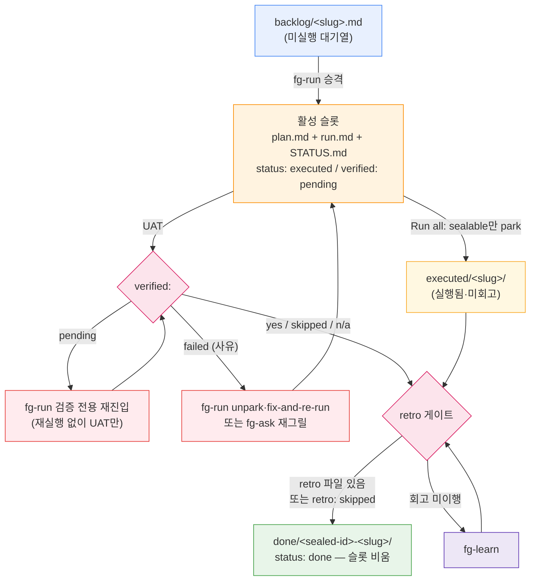

# ARCHITECTURE

> 이 문서는 **구현 사실**만 담는다. 도메인 용어의 뜻은 `.forge/CONTEXT.md` 소관이며 여기서 정의하지 않는다.
> 검증 기준: 문서(`CLAUDE.md`·`README`·`docs/`)와 트리가 어긋나면 **트리를 믿고 어긋난 지점을 명시**했다.

## 0. 한 줄 요약

forge는 **애플리케이션 코드가 없는 Claude Code 플러그인**이다. 산출물은 Markdown(스킬 산문·형식 문서), JSON(매니페스트·훅 선언), 그리고 bash/node 결정론 스크립트 쌍뿐이다. 빌드 시스템·패키지 매니저·CI 파이프라인이 리포에 없다(`package.json`·`Makefile`·`.github/workflows/` 모두 부재 — `docs/examples/github-actions-forge-check.yml`은 **사용자 프로젝트용 예제 파일**이지 이 리포의 CI가 아니다).

**실행 엔진은 이 리포가 아니라 Claude Code 하네스다.** forge가 제공하는 것은 (a) 하네스가 자동 탐색하는 자산(`skills/`, `hooks/hooks.json`), (b) 그 자산이 읽고 쓰는 파일 상태 계약(`.forge/`), (c) 기계적 작업을 LLM 대신 처리하는 결정론 스크립트(`scripts/`)다.

## 1. 아키텍처 패턴 — "산문 판단 + 결정론 스크립트 + 파일 기반 상태 기계"

세 가지가 겹쳐 하나의 시스템을 이룬다.

| 축 | 무엇이 | 어디에 | 실행 주체 |
| --- | --- | --- | --- |
| **판단(judgment)** | 무엇을 할지 결정, 사용자와의 대화, 라우팅 | `skills/*/SKILL.md` 산문 | LLM |
| **기계(mechanics)** | 파일 이동·필드 파싱·게이트 검사·표 렌더 | `scripts/forge-*.{sh,js}` | 셸/노드 |
| **상태(state)** | 단계 간 전달, 재실행 방지, 봉인 이력 | `.forge/` 파일·디렉터리 위치 | 파일시스템 |

핵심 분리 규칙: **결정론 스크립트는 절대 라우팅하지 않고, 산문 스킬은 절대 기계 작업을 손으로 하지 않는다.** 스크립트는 exit code만 뱉고, 스킬이 그 code로 분기한다(§5). 근거는 `.forge/adr/0020-fg-status-deterministic-script.md`, `.forge/adr/0030-fg-done-deterministic-seal-script.md`, `.forge/adr/0031-script-backing-convention-for-mechanical-skill-work.md`.

## 2. 레이어

아래로 갈수록 결정론적이고, 위로 갈수록 LLM 판단이 개입한다.

| 레이어 | 구성 | 성격 |
| --- | --- | --- |
| **L0 패키징·디스커버리** | `.claude-plugin/plugin.json`, `.claude-plugin/marketplace.json` | 하네스가 읽는 매니페스트. `skills`·`hooks` 필드는 **없음**(자동 탐색) |
| **L1 진입점** | `skills/*/SKILL.md` frontmatter, `hooks/hooks.json`, `scripts/*` 직접 호출 | 시스템에 들어오는 3종 경로(§3) |
| **L2 산문 판단** | 19개 `SKILL.md` | 대화·게이트 판단·핸드오프·라우팅 |
| **L3 공유 정의** | `skills/fg-run/{FORGE-ROOT,PLAN-FORMAT,RUN-ALL}.md`, `skills/fg-ask/{CONTEXT,ADR}-FORMAT.md`, `skills/fg-learn/RETRO-FORMAT.md`, `skills/fg-next/DRIVE.md`, `skills/fg-eco/ECO.md`, `skills/fg-visual/VISUAL.md` | 단일 정의·참조 전용(§6) |
| **L4 결정론 스크립트** | `scripts/forge-*.sh` + `.js` 트윈, `scripts/resolve-forge-root.{sh,js}` | exit code 계약, AI 없이 실행 가능 |
| **L5 상태** | `.forge/` (휘발 + git 추적 영속) | 파일 위치가 곧 상태 |

## 3. 진입점 (Entry points) — 3종

### 3-A. 스킬 진입점 (사용자 트리거)

`skills/<dir>/SKILL.md`가 **자동 탐색**된다. `plugin.json`에 `skills` 필드가 없음을 확인했다(키 목록: `name`, `description`, `version`, `author`, `homepage`, `repository`, `license`, `keywords`).

**스킬 식별자는 디렉터리명이 아니라 frontmatter의 `name`이다.** 트리 확인 결과 현재 19개 스킬 모두 디렉터리명 == `name`으로 일치한다:

```
fg-adversarial-review  fg-agents  fg-ask     fg-cleanup  fg-doctor
fg-done                fg-drop    fg-eco     fg-learn    fg-loop
fg-map                 fg-merge   fg-next    fg-quick    fg-run
fg-status              fg-statusline         fg-tdd      fg-visual
```

**개수는 19다** (직접 셈: `ls -1d skills/*/ | wc -l` → 19, `docs/skills.md` 카탈로그 행 수도 19). `.claude/agents/manifest-doc-syncer.md`의 `description`은 아직 "18-스킬 카탈로그"라고 적혀 있다 — **문서 드리프트**이며 트리가 정답이다.

frontmatter `description`은 이중 용도다 — 하네스의 트리거 매칭 문구이자 사람이 읽는 설명(`.forge/adr/260716-22a-skill-description-dual-use-trigger-core.md`). 한/영 트리거 문구를 함께 담는 것이 관례다.

### 3-B. 훅 진입점 (하네스 자동 발화) — **신규**

`hooks/hooks.json`도 `skills/`처럼 **자동 탐색**되므로, 사용자가 `settings.json`을 편집하지 않아도 플러그인 설치만으로 걸린다. 현재 훅은 정확히 하나다.

`hooks/hooks.json` 실제 내용:

```json
{ "hooks": { "SessionStart": [ { "matcher": "startup|resume|clear|compact",
  "hooks": [ { "type": "command",
    "command": "\"${CLAUDE_PLUGIN_ROOT}/hooks/run-hook.cmd\" session-start",
    "shell": "bash", "async": false } ] } ] } }
```

디스패치 체인은 다음과 같다. 하네스가 래퍼를 호출하고, 래퍼가 런타임을 골라 본체를 실행하며, 본체의 **stdout이 그대로 에이전트 컨텍스트로 주입**된다.

```
Claude Code 하네스 (SessionStart: startup|resume|clear|compact, async:false)
   │
   ▼
hooks/run-hook.cmd  ← polyglot 래퍼 (batch 블록 + Unix 셸 블록 한 파일)
   │  · CLAUDE_PROJECT_DIR 있으면 그 디렉터리로 cd (상속 cwd 신뢰 안 함)
   │  · 인자 <name> → scripts/forge-hook-<name>.{sh,js} 로 이름 해석
   │
   ├── bash 있음 ──▶ scripts/forge-hook-session-start.sh   (1순위)
   ├── bash 없음·node 있음 ──▶ scripts/forge-hook-session-start.js  (트윈 폴백)
   └── 둘 다 없음 ──▶ exit 0 침묵 (훅 실패로 세션 시작을 깨뜨리지 않음)
   │
   ▼
stdout <forge-state>…</forge-state> 블록 → 에이전트 컨텍스트에 주입
```

`hooks/run-hook.cmd`의 polyglot 트릭: 파일 첫 줄이 `: << 'CMDBLOCK'`이라 Unix 셸은 batch 블록 전체를 히어독으로 삼켜 무시하고, Windows `cmd.exe`는 `@echo off` 이후를 배치로 실행한다. 이 패턴은 obra/superpowers(`hooks/run-hook.cmd`, MIT)에서 차용했다고 파일 주석에 귀속돼 있으며, forge는 여기에 **node 폴백**을 덧붙였다.

본체(`scripts/forge-hook-session-start.sh`)의 계약:

- **부채가 있을 때만 발화**한다. 부채 = ① 활성 슬롯이 `run.md`를 가졌고 `STATUS.md`의 `status`가 `done`이 아님, ② `executed/<slug>/` park 존재, ③ `loop.md` 존재. **백로그만 쌓인 상태는 부채가 아니라 정상 대기열**이므로 완전 침묵한다.
- 출력은 `<forge-state>` 블록 — 최대 3건(`MAX_ITEMS=3`, 활성 슬롯 먼저, 그다음 park를 이름순) + `(+N more parked …)` + 선택적 goal 루프 줄 + 선택적 백로그 개수 + 고정 "약한 지시" 문단(사용자에게 한 줄로 알리고 확인받되 **자동 실행·자동 봉인 금지**, `/forge:fg-next` 안내).
- **항상 exit 0.** 훅이 세션 시작을 실패시켜서는 안 된다.
- `export LC_ALL=C` — `executed/` 글로브 정렬을 로케일 독립(바이트 순)으로 고정해 node 트윈(`Buffer.compare`)과 패리티를 맞춘다.
- 출력 언어는 **영문 고정**이다. 에이전트가 읽고 사용자 언어로 옮기는, 스킬 본문과 동형인 분리다.

**중요한 시점 제약: 훅은 세션 시작 시 로드된다.** 따라서 `hooks/hooks.json`이나 훅 본체를 추가·수정해도 **다음 세션부터** 적용된다. `.claude/agents/` 카드와 같은 성질이다(`.forge/adr/0024-fg-agents-and-domain-agent-execution.md`, `.forge/adr/260727-201031-forge-ships-session-start-hook.md`).

이 훅은 forge가 **모든 사용자 세션에 개입하는 자산을 배포한 최초 사례**다(해당 ADR의 Consequences에 명시).

### 3-C. 스크립트 직접 호출 진입점 (AI 없이)

`scripts/forge-doctor.{sh,js}`와 `scripts/forge-merge.{sh,js}`는 LLM 없이 실행되어 exit code로 판정하도록 설계됐다 — CI 게이트로 쓸 수 있다(`.forge/adr/260716-16a-scriptify-fg-merge-fg-doctor-for-ci.md`). 사용자 프로젝트에 붙이는 예제가 `docs/examples/github-actions-forge-check.yml`에 있다.

`scripts/resolve-forge-root.js`는 CLI이자 모듈이다 — `resolveForgeRoot()`를 export해 `forge-status.js` 등이 `require`한다(언어당 구현 1개 보장).

### 3-D. (부수) statusline 호출 경로

`fg-statusline`이 설치를 마치면 하네스가 `~/.claude/`에 복사된 스크립트를 statusline 갱신 때마다 호출한다. 표시 전용이며 `.forge/`에 쓰지 않는다. 두 설치 모드가 있다:

- **방법 1(append)** — `scripts/forge-statusline-wrapper.sh`가 사용자의 원본 statusline 명령(`forge-statusline-orig.sh`로 보존)을 먼저 실행해 출력하고, 그 아래 별도 줄로 `scripts/forge-statusline.sh` fragment를 덧붙인다. fragment가 비면 빈 줄도 안 낸다.
- **방법 2(merge)** — `scripts/forge-statusline-full.sh`가 시스템 정보 + forge 진행을 한 명령으로 렌더하되, **forge 부분은 fragment에 위임**한다(`FORGE_SL_SEP="|"`, `FORGE_SL_DENSITY` 환경변수로 구분자·밀도를 넘김). 단계 로직 3중 복제를 막는 구조다.

근거: `.forge/adr/0017-statusline-integration.md`, `.forge/adr/0029-fg-statusline-combined-daleseo-dual-mode.md`.

## 4. 데이터 흐름 — 루프와 상태 전이

### 4-A. 4단계 루프

```
fg-ask ① 질의·그릴링 → fg-run ② 실행 → fg-learn ③ 회고 → fg-done ④ 봉인 → (새 작업) fg-ask
```

스킬끼리 직접 호출하지 않는다. **각 스킬은 독립 실행되고, 오직 `.forge/` 파일로만 상태를 주고받는다.** 유일한 오케스트레이터는 `fg-next`(1단계 위임)와 `fg-loop`(goal 주도 주행)다.

### 4-B. 파일 계약 (생산자 → 소비자)

| 파일/디렉터리 | 생산자 | 주 소비자 |
| --- | --- | --- |
| `.forge/ask.md` | fg-ask (그릴링 시작 마커) | fg-statusline (표시 전용) |
| `.forge/backlog/<slug>.md` | fg-ask | fg-run (승격) |
| `.forge/plan.md` (활성 슬롯) | fg-run (백로그에서 승격) | fg-run, fg-learn |
| `.forge/run.md` | fg-run | fg-learn |
| `.forge/review.md` | fg-adversarial-review | fg-learn, fg-done(아카이브) |
| `.forge/STATUS.md` | fg-run | fg-run·fg-learn·fg-done·fg-status·훅 |
| `.forge/executed/<slug>/` | fg-run (Run all park) | fg-learn, fg-done |
| `.forge/done/<sealed-id>-<slug>/` | fg-done | fg-ask(충돌 검출)·fg-run·fg-status |
| `.forge/loop.md` | fg-loop | fg-loop·fg-status·fg-ask·fg-next·fg-merge·훅 |
| `.forge/quick/LOG.md` | fg-quick | (자체 완결) |

### 4-C. 상태 기계 — 파일 **위치**가 상태다

`STATUS.md`는 이중 장부가 아니라 **plan/run과 함께 이동하는 동반 마커**다. 상태의 원천은 디렉터리 위치이고, STATUS의 필드는 그 위치에 붙는 부가 정보다. 활성 슬롯은 항상 **1개**(한 `plan.md` = 한 `run.md` = 한 봉인)이며, plan 첫 줄의 `<!-- forge-slug: … -->` 주석이 파일이 옮겨 다녀도 유지되는 짝 맞춤 식별자다.

봉인 전 게이트는 두 개이고 **검증 게이트가 회고 게이트보다 먼저** 검사된다(no-seal-without-verification, `.forge/adr/0009-verification-gate-before-seal.md`).



**활성 슬롯·`backlog/`·`executed/`가 전부 비어 있으면 = 진행 중 작업 없음.** fg-run은 빈 상태에서 실행하지 않는다(재실행 방지). 봉인만이 슬롯을 비운다.

현재 리포 상태(매핑 시점): `backlog/` 1건(`session-start-hook-hardening-fix.md`), 활성 슬롯 비어 있음, `executed/` 비어 있음, `done/` 107건.

### 4-D. 실행 위임 흐름 (fg-run 내부)

fg-run은 직접 코드를 고치기보다 **Claude Code Dynamic Workflow**를 조립해 서브에이전트에 위임한다. 작업 단위는 plan의 `## Work slices`이며, `depends:` 표기로 직렬/병렬 파도를 나눈다.

```
plan.md의 Work slices → 워크플로 스크립트 조립 → 사용자 승인 → 백그라운드 병렬 실행
   │                                                        │
   │ eco=true면: 서브에이전트 model=sonnet 캡 + ECO.md prepend │
   │ .claude/agents/ 카드 있으면: agentType:'<role>' 매핑      │
   ▼                                                        ▼
계획↔실제 교차검증 → run.md 기록 → STATUS.md 작성 → 핸드오프 UAT
```

`agentType` 매핑은 plan의 마커가 아니라 **역할 카드 `description`의 "언제 쓰이나"** 로 이뤄진다. 카드가 없으면 기본 서브에이전트로 종전과 동일하게 돈다(graceful, 하드 의존 없음).

## 5. 결정론 스크립트 레이어와 exit-code 라우팅

기계적 작업은 bash 원본 + node 트윈 **쌍**으로 존재한다(`.forge/adr/0022-forge-scripts-convention-cross-platform-dual-dispatch.md`). 호출자는 bash → node 순으로 디스패치한다. 두 구현의 동치는 `*.parity.test.sh`가 지킨다.

| 스크립트 쌍 | 소비 스킬 | 성격 | exit code |
| --- | --- | --- | --- |
| `forge-status.{sh,js}` | fg-status | 읽기 전용 조사 + 6열 표 | (라우팅 없음) |
| `forge-done.{sh,js}` | fg-done | **변경** — 게이트-우선 봉인 | `0` 봉인 / `2` 봉인 대상 없음 / `3` 검증 게이트 / `4` 회고 게이트 / `5` 이미 봉인됨 |
| `forge-doctor.{sh,js}` | fg-doctor | 읽기 전용 무결성 검사 | `0` clean / `1` 경고만 / `2` 오류 이상 |
| `forge-merge.{sh,js}` | fg-merge | **변경** — 브랜치 forge 통합(git 미조작) | `0` 통합 / `2` 대상 없음 / `3` in-flight / `4` 진짜 충돌 / `6` 모호(다중 루트) |
| `forge-hook-session-start.{sh,js}` | (훅 래퍼) | 읽기 전용 컨텍스트 주입 | 항상 `0` |
| `forge-statusline.{sh,js}` | fg-statusline | 표시 전용 fragment | — |
| `forge-statusline-full.{sh,js}` | fg-statusline | 표시 전용 통합 렌더 | — |
| `resolve-forge-root.{sh,js}` | 모든 스크립트 | 브랜치 → forge 루트 해석 | — |
| `forge-statusline-wrapper.sh` | fg-statusline | 원본 statusline 합성 | **sh 단독**(트윈 없음 — bash 전용 경로라 의도적) |

두 가지 안전 성질이 변경 스크립트에 공통으로 박혀 있다(각 파일 헤더에 명문화):

- **GATE-FIRST, NON-DESTRUCTIVE-ON-REFUSE** — 모든 사전점검·게이트가 통과하기 전에는 아무것도 건드리지 않는다. 게이트 실패 시 "nothing moved".
- **스크립트는 라우팅하지 않는다** — 게이트 실패를 어떻게 처리할지(재실행/재그릴/사용자 확인)는 전적으로 스킬 산문의 몫이다.

`forge-done.sh`의 `--completed` / `--sealed-id` 인자는 테스트 결정성을 위한 것이다(현재 시각 대신 주입).

또 하나 공통 관례: STATUS 필드 파서가 `field:`와 dash-list 레거시 `- field:`를 **둘 다** 받고 CRLF의 `\r`을 제거한다(각 스크립트 주석에 "the fg-doctor lesson"으로 기록).

## 6. 핵심 추상화

### 6-A. 단일 정의 · 복붙 금지

같은 규칙이 두 곳에 존재하면 반드시 어긋난다는 전제로, 공유 규칙은 **소유 스킬 디렉터리에 1벌**만 두고 나머지는 `${CLAUDE_PLUGIN_ROOT}/skills/<owner>/<file>` 또는 상대경로(`../fg-run/FORGE-ROOT.md`)로 참조한다. 트리에서 확인한 실제 소유·소비 관계:

| 파일 | 소유 | 소비자 (grep 실측) |
| --- | --- | --- |
| `skills/fg-run/FORGE-ROOT.md` | fg-run | fg-adversarial-review·fg-agents·fg-ask·fg-cleanup·fg-doctor·fg-done·fg-drop·fg-eco·fg-learn·fg-loop·fg-map·fg-merge·fg-next(+DRIVE.md)·fg-quick·fg-run·fg-status·fg-tdd·fg-visual **(18)** |
| `skills/fg-run/PLAN-FORMAT.md` | fg-run(소비자 쪽 보관) | fg-ask(생산자)·fg-loop·fg-run·fg-status |
| `skills/fg-run/RUN-ALL.md` | fg-run | fg-run 단독 — "Run all" 선택 시에만 읽는 **progressive disclosure** 분리 |
| `skills/fg-ask/CONTEXT-FORMAT.md` | fg-ask | fg-ask·fg-done·fg-learn(+RETRO-FORMAT)·fg-merge·fg-run |
| `skills/fg-ask/ADR-FORMAT.md` | fg-ask | fg-ask·fg-cleanup·fg-doctor·fg-done·fg-learn·fg-merge·fg-run(+FORGE-ROOT) |
| `skills/fg-learn/RETRO-FORMAT.md` | fg-learn | fg-done·fg-learn |
| `skills/fg-next/DRIVE.md` | fg-next | fg-done·fg-loop·fg-next |
| `skills/fg-eco/ECO.md` | fg-eco | fg-ask·fg-eco·fg-run·fg-visual |
| `skills/fg-visual/VISUAL.md` | fg-visual | fg-ask·fg-visual |

**`skills/fg-run/RUN-ALL.md`는 `CLAUDE.md`의 공유 정의 목록에 빠져 있다**(grep 실측: `CLAUDE.md`에 "RUN-ALL" 0회). 트리에 실재하고 fg-run이 참조하므로 목록의 누락이다.

`PLAN-FORMAT.md`가 소유 스킬(fg-ask)이 아닌 소비 스킬(fg-run) 아래 있는 이유: `skills/fg-ask/`는 grill-with-docs 원문 verbatim 영역이라 새 파일을 넣지 않는다(§8).

### 6-B. 브랜치별 forge 루트 (단일 정의: `skills/fg-run/FORGE-ROOT.md`)

모든 `.forge/...` 경로는 **해석된 루트 기준**이다.

```
branch = git rev-parse --abbrev-ref HEAD
default = .forge/config.json 의 defaultBranch (없으면 "main")
   │
   ├── branch == default ────▶ 루트 = .forge/
   ├── branch != default ────▶ 루트 = .forge/branch/<branch>/   (루트 통째로 git 추적)
   └── detached / 비-git ────▶ 루트 = .forge/  + 경고 한 줄
```

- **전역 예외 2개** — `.forge/config.json`(부트스트랩 역설 회피: 이 파일이 `defaultBranch`를 담는다)과 `.forge/codebase/`(브랜치마다 지도가 비면 context rot 이득이 사라진다)는 **모든 브랜치에서 항상 최상위 `.forge/`**.
- **영속 문서 읽기 오버레이** — 비-기본 브랜치에서 `CONTEXT.md`·`adr/`·`retro/` **읽기**는 브랜치 루트를 최상위 `.forge/` 위에 겹쳐 읽는다(충돌 시 브랜치 우선). **쓰기는 브랜치 루트 단독**이며, 새 ADR ID는 시계 기반이라 병렬 브랜치가 공유 카운터에서 충돌하지 않는다. 휘발 상태는 오버레이하지 않는다.
- 브랜치명의 `/`는 중첩 디렉터리가 된다(`feature/x` → `.forge/branch/feature/x/`).
- 경로가 브랜치명으로 네임스페이스되므로 **두 브랜치가 같은 파일을 쓰는 일이 없고 → git merge 충돌이 구조적으로 발생하지 않는다.** `git merge` 이후 `fg-merge`가 내용을 `.forge/`로 통합한다.
- 이 규칙의 **결정론 구현**은 `scripts/resolve-forge-root.{sh,js}` 하나뿐이다.

### 6-C. 두 기둥 (설계 불변식)

1. **그릴링은 절대 Dynamic Workflow 안에 넣지 않는다** — 워크플로는 실행 중 사용자 입력을 못 받는다. 대화형 그릴링(fg-ask, fg-learn, fg-agents)은 반드시 워크플로 밖.
2. **문서는 산출물이 아니라 루프의 연료다** — 계획에서 다듬은 용어가 실행의 기준이 되고, 회고의 학습이 다음 계획의 출발점이 된다.

의도적 완화가 두 건 있다: `fg-quick`(기둥 2를 trivial 작업에 한해 완화 — 형식 산출물 없이 `.forge/quick/LOG.md` 한 줄), `fg-loop`(기둥 1을 goal 주도 무인 주행에 한해 완화 — 벽에서만 멈춤).

### 6-D. 핸드오프는 진술형

각 스킬은 끝에서 "방금 한 것 / 다음 단계 / 시작하는 법"을 대화체 **진술**로 전하고 멈춘다. "진행할까요?"로 묻지 않는다. 자동 체이닝은 `fg-next` 전담이며, 유일한 예외는 fg-next 내부에서 회고가 재그릴 권고 없이 끝났을 때 같은 호출에서 봉인까지 잇는 경로다(`.forge/adr/0026-fg-next-learn-done-autochain.md`). 근거·이력: `.forge/adr/0015-fg-run-handoff-menu-others-stated.md`.

## 7. 영속 문서 모델 (루프의 연료)

휘발 상태와 같은 `.forge/` 지붕 아래 있지만 **git 추적**되며, `.gitignore`가 `.forge/*`로 전부 제외한 뒤 화이트리스트로 되살린다.

```gitignore
.forge/*
!.forge/CONTEXT.md
!.forge/adr/
!.forge/retro/
!.forge/codebase/
!.forge/config.json
!.forge/branch/
```

전부 **lazy 생성**(쓸 내용이 생길 때만). 매핑 시점 실측: `adr/` 40개(`retired/` 없음), `retro/` 52개, `codebase/` 비어 있음(이 매핑이 채우는 중), `CONTEXT.md` 존재, `config.json`은 `{"eco": false}`.

## 8. 알려진 구조적 예외 / 문서-트리 불일치

- **`skills/fg-ask/`는 grill-with-docs 원본의 자기완결 3파일**(`SKILL.md` + `CONTEXT-FORMAT.md` + `ADR-FORMAT.md`)이고 SKILL.md 본문은 영문 verbatim이다. forge 루프 연결은 맨 아래 "Forge integration (minimal)" 섹션에만 둔다. verbatim 본문과 그 섹션이 따로 움직이므로 한쪽만 고치면 계약이 깨진다.
- **스킬 개수 드리프트** — 트리 19, `.claude/agents/manifest-doc-syncer.md`의 description은 "18-스킬". 트리가 정답.
- **`RUN-ALL.md` 누락** — `CLAUDE.md`의 공유 정의 목록에 없음(§6-A).
- **테스트 커버리지 비대칭** — `scripts/forge-status.*`와 `scripts/resolve-forge-root.*`에는 `*.parity.test.sh`만 있고 behavior 테스트(`*.test.sh`)가 없다. 나머지 변경 스크립트는 둘 다 갖고 있다.
- **`.claude/`는 forge 플러그인 자산이 아니다** — 이 리포를 개발할 때 쓰는 프로젝트 자산이다(에이전트 카드 3장 + 로컬 스킬 1개). 배포 대상이 아니다.
- **`.forge/codebase/`(이 문서 포함)는 fg-map이 생성하는 지도**이며 루프 밖 유틸리티의 산물이다. 구현 사실만 담고, 도메인 용어 정의는 `.forge/CONTEXT.md`가 맡는다.
