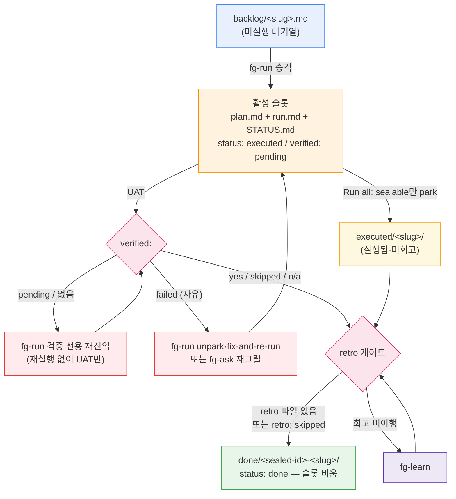

# ARCHITECTURE

> 이 문서는 **구현 사실**만 담는다. 도메인 용어의 뜻은 `.forge/CONTEXT.md` 소관이며 여기서 정의하지 않는다.
> 모든 개수·크기는 작업 트리에서 직접 측정했다. 문서(`CLAUDE.md`·`README`·`docs/`)와 트리가 어긋나면 **트리를 믿고 어긋난 지점을 §8에 명시**했다.
> 매핑 대상은 HEAD(`bb54e277`, v0.6.0)가 아니라 **미커밋 변경을 포함한 작업 트리**다.

## 0. 한 줄 요약

forge는 **애플리케이션 코드가 없는 Claude Code 플러그인**이다. 산출물은 Markdown(스킬 산문·형식 문서), JSON(매니페스트·훅 선언), 그리고 bash/node 결정론 스크립트 쌍뿐이다. 빌드 시스템·패키지 매니저·CI 파이프라인이 리포에 없다(`package.json`·`Makefile`·`.github/workflows/` 모두 부재 — `docs/examples/github-actions-forge-check.yml`(59행)은 **사용자 프로젝트에 붙이는 예제**이지 이 리포의 CI가 아니다).

**실행 엔진은 이 리포가 아니라 Claude Code 하네스다.** forge가 제공하는 것은 (a) 하네스가 자동 탐색하는 자산(`skills/`, `hooks/hooks.json`), (b) 그 자산이 읽고 쓰는 파일 상태 계약(`.forge/`), (c) 기계적 작업을 LLM 대신 처리하는 결정론 스크립트(`scripts/`)다.

규모(실측): 스킬 마크다운 28파일 3,072행 · 스크립트 구현 17파일 3,124행 + 셸 테스트 15파일 2,448행 · 훅 3파일 · 사용자 문서 `docs/` 6문서 + 랜딩 1파일.

## 1. 아키텍처 패턴 — "산문 판단 + 결정론 스크립트 + 파일 기반 상태 기계"

세 가지가 겹쳐 하나의 시스템을 이룬다.

| 축 | 무엇이 | 어디에 | 실행 주체 |
| --- | --- | --- | --- |
| **판단(judgment)** | 무엇을 할지 결정, 사용자와의 대화, 게이트 실패 라우팅 | `skills/*/SKILL.md` 산문 | LLM |
| **기계(mechanics)** | 파일 이동·필드 파싱·게이트 검사·표 렌더 | `scripts/forge-*.{sh,js}` | 셸/노드 |
| **상태(state)** | 단계 간 전달, 재실행 방지, 봉인 이력 | `.forge/` 파일·디렉터리 **위치** | 파일시스템 |

핵심 분리 규칙: **결정론 스크립트는 절대 라우팅하지 않고, 산문 스킬은 절대 기계 작업을 손으로 하지 않는다.** 스크립트는 exit code만 뱉고 스킬이 그 code로 분기한다(§5). `scripts/forge-done.sh` 헤더가 이 경계를 명문화한다 — "The JUDGMENT (gate-failure routing, fg-map offer, issue-linked commit, handoff, all-mode confirmation) stays in fg-done's prose — this script never routes." 근거 ADR: `.forge/adr/0020-fg-status-deterministic-script.md`, `.forge/adr/0030-fg-done-deterministic-seal-script.md`, `.forge/adr/0031-script-backing-convention-for-mechanical-skill-work.md`.

## 2. 레이어

아래로 갈수록 결정론적이고, 위로 갈수록 LLM 판단이 개입한다.

| 레이어 | 구성 | 성격 |
| --- | --- | --- |
| **L0 패키징·디스커버리** | `.claude-plugin/plugin.json`, `.claude-plugin/marketplace.json` | 하네스가 읽는 매니페스트. `skills`·`hooks` 필드는 **없음**(자동 탐색) |
| **L1 진입점** | `skills/*/SKILL.md` frontmatter, `hooks/hooks.json`, `scripts/*` 직접 호출 | 시스템에 들어오는 3종 경로(§3) |
| **L2 산문 판단** | 19개 `SKILL.md` | 대화·게이트 판단·핸드오프·라우팅 |
| **L3 공유 정의** | `skills/fg-run/{FORGE-ROOT,PLAN-FORMAT,RUN-ALL}.md`, `skills/fg-ask/{CONTEXT,ADR}-FORMAT.md`, `skills/fg-learn/RETRO-FORMAT.md`, `skills/fg-next/DRIVE.md`, `skills/fg-eco/ECO.md`, `skills/fg-visual/VISUAL.md` | 단일 정의·참조 전용(§6-A) |
| **L4 결정론 스크립트** | `scripts/forge-*.sh` + `.js` 트윈, `scripts/resolve-forge-root.{sh,js}` | exit code 계약, AI 없이 실행 가능 |
| **L5 상태** | `.forge/` (휘발 + git 추적 영속) | 파일 위치가 곧 상태 |

`skills/fg-visual/scripts/`(벤더링된 Node 서버 5파일, 1,442행)는 이 레이어 밖의 **독립 런타임**이다 — 루트 `scripts/`와 성격·계약이 전혀 다르다(§6-C 각주).

## 3. 진입점 (Entry points) — 3종 + 부수 1

### 3-A. 스킬 진입점 (사용자 트리거)

`skills/<dir>/SKILL.md`가 **자동 탐색**된다. `plugin.json`의 키는 `name`·`description`·`version`·`author`·`homepage`·`repository`·`license`·`keywords`뿐이고 **`skills`·`hooks` 필드가 없음**을 확인했다.

**스킬 식별자는 디렉터리명이 아니라 frontmatter의 `name`이다.** 19개 전부 디렉터리명 == `name`으로 일치한다(`awk '/^name:/'` 실측):

```
fg-adversarial-review  fg-agents  fg-ask     fg-cleanup  fg-doctor
fg-done                fg-drop    fg-eco     fg-learn    fg-loop
fg-map                 fg-merge   fg-next    fg-quick    fg-run
fg-status              fg-statusline         fg-tdd      fg-visual
```

**개수는 19다**(`ls -1d skills/*/ | wc -l` → 19, `docs/skills.md` 카탈로그 행 수 → 19, `marketplace.json`의 "Nineteen fg-* skills"와 일치). `.claude/agents/manifest-doc-syncer.md`의 `description`만 아직 "18-스킬"이다 — **문서 드리프트**이며 트리가 정답이다(§8).

frontmatter `description`은 이중 용도다 — 하네스의 자동 호출 트리거 문구이자 `/fg` 메뉴에 보이는 사람용 설명(`.forge/adr/260716-22a-skill-description-dual-use-trigger-core.md`). 한/영 트리거 문구를 함께 담는 것이 관례이고, 길이 상한(600 코드포인트)은 `forge-doctor.sh`의 B16 린트가 감시한다.

### 3-B. 훅 진입점 (하네스 자동 발화)

`hooks/hooks.json`도 `skills/`처럼 **자동 탐색**되므로, 사용자가 `settings.json`을 편집하지 않아도 플러그인 설치만으로 걸린다. 훅은 정확히 하나다.

`hooks/hooks.json` 실제 내용:

```json
{ "hooks": { "SessionStart": [ { "matcher": "startup|resume|clear|compact",
  "hooks": [ { "type": "command",
    "command": "\"${CLAUDE_PLUGIN_ROOT}/hooks/run-hook.cmd\" session-start",
    "shell": "bash", "async": false } ] } ] } }
```

디스패치 체인 — 하네스가 래퍼를 호출하고, 래퍼가 런타임을 골라 본체를 실행하며, 본체의 **stdout이 그대로 에이전트 컨텍스트로 주입**된다.

```
Claude Code 하네스 (SessionStart: startup|resume|clear|compact, async:false)
   │
   ▼
hooks/run-hook.cmd  ← polyglot 래퍼 (batch 블록 + Unix 셸 블록 한 파일, 89행)
   │  · CLAUDE_PROJECT_DIR 있으면 그 디렉터리로 cd (상속 cwd 신뢰 안 함)
   │  · 인자 <name> → scripts/forge-hook-<name>.{sh,js} 로 이름 해석
   │
   ├── bash 있음 ──▶ scripts/forge-hook-session-start.sh   (1순위, exec)
   ├── bash 없음·node 있음 ──▶ scripts/forge-hook-session-start.js  (트윈 폴백)
   └── 둘 다 없음 ──▶ exit 0 침묵 (훅 실패로 세션 시작을 깨뜨리지 않음)
   │
   ▼
stdout <forge-state>…</forge-state> 블록 → 에이전트 컨텍스트에 주입
```

`hooks/run-hook.cmd`의 polyglot 트릭: 첫 줄이 `: << 'CMDBLOCK'`이라 Unix 셸은 batch 블록 전체를 히어독으로 삼켜 무시하고, Windows `cmd.exe`는 `@echo off` 이후를 배치로 실행한다. Windows 경로는 `C:\Program Files\Git\bin\bash.exe` → `(x86)` → PATH의 `bash` → `node` 순으로 탐색한다. 이 패턴은 obra/superpowers(`hooks/run-hook.cmd`, MIT, Copyright (c) Jesse Vincent)에서 차용했다고 파일 주석에 귀속돼 있으며, forge는 여기에 **node 폴백**을 덧붙였다.

본체(`scripts/forge-hook-session-start.sh`, 233행)의 계약:

- **갚을 것이 있을 때만 발화**한다. 조건 = ① 활성 슬롯이 `run.md`를 가졌고 `STATUS.md`의 `status`가 `done`이 아님, ② `executed/<slug>/` park 존재, ③ `loop.md` 존재. **백로그만 쌓인 상태는 갚을 것이 아니라 정상 대기열**이라 완전 침묵한다(승격됐지만 미실행인 plan도 마찬가지).
- 출력은 `<forge-state>` 블록 — `Unsealed tail (ran, not sealed):` 목록 + 선택적 goal 루프 줄 + 선택적 park 개수 줄 + 선택적 백로그 개수 + 고정 "약한 지시" 문단(한 줄로 알리고 확인받되 **자동 실행·자동 봉인 금지**, `/forge:fg-next` 안내, fg-ask STEP 0 auto-close만 예외).
- **항목 상한(`MAX_ITEMS`)과 `(+N more parked …)` 줄은 제거됐다.** park을 목록 항목이 아니라 **자체 개수 줄**로 옮긴 결과다 — 목록에 남는 것이 활성 슬롯 1건뿐이라 상한이 도달 불가해졌고, 개수 줄이 총계를 담아 `+N more`보다 정보가 많다. park 중 `verified: failed`가 섞이면 그 개수와 fg-run 회수 안내를 같은 줄에 덧붙인다.
- **주입 텍스트 살균(`sanitize()`)이 단일 초크포인트다.** 블록에 들어가는 모든 repo 유래 값(STATUS 필드 값·slug·goal 줄·park 디렉터리명·표시 경로)이 이 함수 하나를 통과한다 — 제어문자(CR/LF 포함) 제거, 태그 구분자 `<`·`>` 제거, `SAN_MAX=200` **바이트** 하드 절단(+`…`). 근거는 실측된 실패다: `verified:` 값이 `</forge-state>`를 품으면 블록이 조기에 닫혀 스크립트 자신의 지시 문단이 블록 **밖으로** 밀려났고, 값의 명령문이 진짜 지시와 구분되지 않았다. 절단이 멀티바이트 문자 중간에 걸리면 invalid UTF-8이 나와 하류 도구가 깨지므로(BSD `sed`가 "illegal byte sequence"로 거부한 실측) 뒤쪽 non-ASCII 바이트를 떨어내 항상 ASCII 경계에서 끊고, 전부 멀티바이트인 값은 `(value suppressed: N bytes)`로 대체한다. `task:` 숫자는 소스에서도 한 번 제한된다(`TASK_DIGITS_MAX=9` 초과면 없는 것으로 취급 → slug만 렌더 — 상한 없이 두었을 때 100,553바이트 블록이 나온 실측 때문). 즉 이 블록은 **데이터 채널이 지시 채널과 맞닿는 지점**으로 취급된다(`.forge/retro/260730-233816-session-start-hook-hardening-fix.md`).
- **항상 exit 0.** 훅이 세션 시작을 실패시켜서는 안 된다.
- `export LC_ALL=C` — `executed/` 글로브 정렬을 로케일 독립(바이트 순)으로 고정해 node 트윈(`Buffer.compare`)과 패리티를 맞춘다. 살균의 바이트 절단도 같은 바이트 관점(node 트윈은 latin1)이라 두 트윈이 동일 바이트를 낸다.
- 출력 언어는 **영문 고정**이다. 에이전트가 읽고 사용자 언어로 옮기는, 스킬 본문과 동형인 분리다.

**중요한 시점 제약: 훅은 세션 시작 시 로드된다.** 따라서 `hooks/hooks.json`이나 훅 본체를 고쳐도 **다음 세션부터** 적용된다. `.claude/agents/` 카드와 같은 성질이다(`.forge/adr/0024-fg-agents-and-domain-agent-execution.md`, `.forge/adr/260727-201031-forge-ships-session-start-hook.md`). 이 훅은 forge가 **모든 사용자 세션에 개입하는 자산을 배포한 최초 사례**다(해당 ADR의 Consequences).

### 3-C. 스크립트 직접 호출 진입점 (AI 없이)

`scripts/forge-doctor.{sh,js}`와 `scripts/forge-merge.{sh,js}`는 LLM 없이 실행되어 exit code로 판정하도록 설계됐다 — CI 게이트로 쓸 수 있다(`.forge/adr/260716-16a-scriptify-fg-merge-fg-doctor-for-ci.md`). `forge-merge`의 **git-free 성질**이 그 전제다: 코어 스크립트는 `git merge`를 돌리지 않고 이미 머지된 트리만 정리한다(대화형 `fg-merge <branch>`만 스킬 계층에서 git을 대신 돌린다 — ADR `260717-10a`). 매핑 시점에 `bash scripts/forge-doctor.sh`는 `0 errors, 0 warnings, 0 info` / exit 0이다.

`scripts/resolve-forge-root.js`는 CLI이자 모듈이다 — `resolveForgeRoot()`를 export해 `forge-status.js` 등이 `require`한다(언어당 구현 1개 보장).

### 3-D. (부수) statusline 호출 경로

`fg-statusline`이 설치를 마치면 하네스가 `~/.claude/`에 복사된 스크립트를 statusline 갱신 때마다 호출한다. 표시 전용이며 `.forge/`에 쓰지 않고, stdin으로 들어오는 세션 JSON을 jq 없이(방어적 `sed`) 파싱한다. 두 설치 모드가 있다:

- **방법 1(append)** — `scripts/forge-statusline-wrapper.sh`(46행)가 사용자의 원본 statusline 명령(`forge-statusline-orig.sh`로 보존)을 먼저 실행해 출력하고, 그 아래 별도 줄로 `scripts/forge-statusline.sh` fragment를 덧붙인다. fragment가 비면 빈 줄도 안 낸다. 동반 파일은 `$CLAUDE_CONFIG_DIR`이 아니라 **자기 설치 디렉터리**(`BASH_SOURCE`)에서 해석한다 — statusLine 프로세스가 그 환경변수를 export하지 않을 수 있어 런타임 의존이 statusline 전체를 조용히 비우는 사고를 막는다.
- **방법 2(merge)** — `scripts/forge-statusline-full.sh`(213행)가 시스템 정보(모델·추론강도·디렉터리·`⎇` git 브랜치·Context/usage 그라디언트 바·`⏱` 경과·`$`비용·±라인)와 forge 진행을 **의미 단위 그룹 대괄호 `[...]`** 로 한 명령에 렌더하되, **forge 부분은 fragment에 위임**한다(`FORGE_SL_SEP="|"`·`FORGE_SL_DENSITY`를 환경변수로 넘김). 단계 로직 3중 복제를 막는 구조다. 밀도(compact/full)는 새 config 키 없이 **wired command의 위치 인자**로 저장한다.

fragment의 단계 판정은 파일 존재만 보지 않고 **게이트를 반영**한다(`forge-statusline.sh` 헤더): `run.md` + `verified: pending|failed` → 여전히 run 단계(회고 게이트가 거부하므로), `verified: yes|skipped|n/a` → learn 단계. `done`은 결코 현재 단계가 되지 않는다(봉인되면 `plan.md`가 사라진다). 모드 지시자는 `🧪`(plan의 `<!-- tdd: on -->`)·`♻️`(최상위 `config.json`의 `eco`)다. 근거: `.forge/adr/0017-statusline-integration.md`, `.forge/adr/0029-fg-statusline-combined-daleseo-dual-mode.md`.

## 4. 데이터 흐름 — 루프와 상태 전이

### 4-A. 4단계 루프

```
fg-ask ① 질의·그릴링 → fg-run ② 실행 → fg-learn ③ 회고 → fg-done ④ 봉인 → (새 작업) fg-ask
```

스킬끼리 직접 호출하지 않는다. **각 스킬은 독립 실행되고, 오직 `.forge/` 파일로만 상태를 주고받는다.** 오케스트레이터는 `fg-next`(1단계 위임)와 `fg-loop`(goal 주도 주행) 둘뿐이다.

### 4-B. 파일 계약 (생산자 → 소비자)

| 파일/디렉터리 | 생산자 | 주 소비자 |
| --- | --- | --- |
| `.forge/ask.md` | fg-ask (그릴링 시작 마커) | fg-statusline (표시 전용) · fg-doctor(A7 stale 경고) |
| `.forge/backlog/<slug>.md` | fg-ask | fg-run (승격) |
| `.forge/plan.md` (활성 슬롯) | fg-run (백로그에서 승격) | fg-run(정답 기준), fg-learn |
| `.forge/run.md` | fg-run | fg-learn |
| `.forge/review.md` | fg-adversarial-review | fg-learn, fg-done(봉인 시 아카이브) |
| `.forge/STATUS.md` | fg-run | fg-run·fg-learn·fg-done·fg-status·SessionStart 훅 |
| `.forge/executed/<slug>/` | fg-run (Run all park) | fg-learn, fg-done |
| `.forge/done/<sealed-id>-<slug>/` | fg-done | fg-ask(충돌 검출)·fg-run(완료 판별)·fg-status |
| `.forge/loop.md` | fg-loop | fg-loop·fg-status·fg-ask·fg-next·fg-merge·훅 |
| `.forge/quick/LOG.md` | fg-quick | (자체 완결) |

### 4-C. 상태 기계 — 파일 **위치**가 상태다

`STATUS.md`는 이중 장부가 아니라 **plan/run과 함께 이동하는 동반 마커**다. 상태의 원천은 디렉터리 위치이고 STATUS 필드는 그 위치에 붙는 부가 정보다. 활성 슬롯은 항상 **1개**(한 `plan.md` = 한 `run.md` = 한 봉인)이며, plan 첫 줄의 `<!-- forge-slug: … -->` 주석이 파일이 옮겨 다녀도 유지되는 짝 맞춤 식별자다.

봉인 전 게이트는 두 개이고 **검증 게이트가 회고 게이트보다 먼저** 검사된다(no-seal-without-verification — `forge-done.sh`가 exit 3(검증)을 exit 4(회고)보다 먼저 낸다, `.forge/adr/0009-verification-gate-before-seal.md`).



**활성 슬롯·`backlog/`·`executed/`가 전부 비어 있으면 = 진행 중 작업 없음.** fg-run은 빈 상태에서 실행하지 않는다(재실행 방지). 봉인만이 슬롯을 비운다. `failed`에는 봉인시키는 waiver가 없다 — fresh re-run으로 봉인 가능 값에 **재검증**될 때만 봉인되고, `skipped`로 바꿔 통과시키는 것이 금지돼 있다. `failed` park의 회수(unpark)는 **fg-run이 단일 소유자**다(fg-learn·fg-done은 둘 다 차단만 한다).

매핑 시점 실측 상태: `backlog/` 0건, **활성 슬롯 1건**(slug `fg-map-diff-incremental-update`·`status: executed`·`verified: yes (…)`·`retro: pending` → 상태 기계상 "회고 게이트 앞"), `executed/` 0건, `done/` 114건, `dropped/` 1건, `visual/` 세션 2건.

### 4-D. 실행 위임 흐름 (fg-run 내부)

fg-run은 직접 코드를 고치기보다 **Claude Code Dynamic Workflow**를 조립해 서브에이전트에 위임한다. 작업 단위는 plan의 `## Work slices`이며 `depends: S1` 표기로 직렬/병렬 파도를 나눈다.

```
plan.md의 Work slices → 워크플로 스크립트 조립 → 사용자 승인 → 백그라운드 병렬 실행
   │                                                        │
   │ eco=true면: 서브에이전트 model=sonnet 캡 + ECO.md prepend │
   │ tdd: on이면: 슬라이스별 실패 테스트 먼저(test-first)      │
   │ .claude/agents/ 카드 있으면: agentType:'<role>' 매핑      │
   ▼                                                        ▼
계획↔실제 교차검증(+위험 영역이면 조건부 리뷰) → run.md 기록 → STATUS.md 작성 → 핸드오프 UAT
```

- `agentType` 매핑은 plan의 마커가 아니라 **역할 카드 `description`의 "언제 쓰이나"** 로 이뤄진다. 카드가 없으면 기본 서브에이전트로 종전과 동일하게 돈다(graceful, 하드 의존 없음). 카드가 `model:`을 선언하면 eco의 sonnet 캡보다 그 선언이 이긴다(eco는 내리기만).
- 시작 직전 **같은 영역의 최근 회고 3–5건만** 골라 "다르게 할 것"·"차이"를 훑어 슬라이스 분해·파도 배치에 접는다(전부 읽지 않는다 — fg-ask와 동일한 선택 규칙). 회고는 참고이고 정답 기준은 plan/CONTEXT/ADR이다.
- 위험 영역(auth·데이터 변경·공개 API·마이그레이션)이나 큰 변경은 구현 뒤 `run.md` 기록 **전에** 워크플로 자체의 적대적 검증 서브에이전트로 **조건부 코드 리뷰**를 붙인다(`.forge/adr/0007-fg-run-conditional-code-review.md`). 사소한 변경은 건너뛴다.
- `run.md`에는 산문과 함께 **슬라이스별 한 줄 결과**를 반드시 기록한다(`- S1 {한 일} — ✅ as planned` / `- S2 {한 일} — ⚠ {차이}`). eco 여부와 무관한 상시 규정이며, 봉인이 **다른 세션**에서 일어나면 run.md 산문만 남기 때문에 하위 소비자(fg-done 봉인 요약 ADR-0032, eco 요약 표)의 **재료 보장**이다 — `run.md`에는 형식 문서가 없어(`RUN-FORMAT.md` 부재) 이 지점이 약한 고리였다(`.forge/retro/2026-07-06-fg-done-seal-summary.md`).
- 배치 경로(`Run all`)는 본문에서 빠져 `skills/fg-run/RUN-ALL.md`(16행)로 분리됐다 — "Run all"이 실제로 선택될 때만 읽는 **progressive disclosure**이고 동작은 인라인 시절과 동일하다.

## 5. 결정론 스크립트 레이어와 exit-code 라우팅

기계적 작업은 bash 원본 + node 트윈 **쌍**으로 존재한다(`.forge/adr/0022-forge-scripts-convention-cross-platform-dual-dispatch.md`). 호출자는 bash → node 순으로 디스패치하며(스킬 산문에 두 명령이 나란히 적혀 있다), 두 구현의 동치는 `*.parity.test.sh`가 지킨다.

| 스크립트 쌍 | 소비 스킬 | 성격 | exit code |
| --- | --- | --- | --- |
| `forge-status.{sh,js}` | fg-status | 읽기 전용 조사 + 6열 표(`--table`로 표만) | (라우팅 없음) |
| `forge-done.{sh,js}` | fg-done | **변경** — 게이트-우선 봉인 | `0` 봉인(half-sealed 멱등 완료 포함) / `2` 봉인 대상 없음 / `3` 검증 게이트 / `4` 회고 게이트 / `5` 이미 봉인됨 |
| `forge-doctor.{sh,js}` | fg-doctor | 읽기 전용 무결성 검사 | `0` clean / `1` 경고만 / `2` 오류 이상 |
| `forge-merge.{sh,js}` | fg-merge | **변경** — 브랜치 forge 통합(git 미조작) | `0` 통합 / `2` 대상 없음 / `3` in-flight / `4` 진짜 충돌 / `6` 모호(다중 루트) |
| `forge-hook-session-start.{sh,js}` | (훅 래퍼) | 읽기 전용 컨텍스트 주입 | 항상 `0` |
| `forge-statusline.{sh,js}` | fg-statusline | 표시 전용 fragment | — |
| `forge-statusline-full.{sh,js}` | fg-statusline | 표시 전용 통합 렌더 | — |
| `resolve-forge-root.{sh,js}` | 모든 스크립트·스킬 | 브랜치 → forge 루트 해석 | 항상 `0` |
| `forge-statusline-wrapper.sh` | fg-statusline | 원본 statusline 합성 | **sh 단독**(트윈 없음 — bash 전용 경로라 의도적, doctor B15가 `*-wrapper.sh`를 명시 제외) |

두 가지 안전 성질이 변경 스크립트에 공통으로 박혀 있다(각 파일 헤더에 명문화):

- **GATE-FIRST, NON-DESTRUCTIVE-ON-REFUSE** — 모든 사전점검·게이트가 통과하기 전에는 아무것도 건드리지 않는다. 게이트 실패 시 "nothing moved"(부분 상태 불가).
- **스크립트는 라우팅하지 않는다** — 게이트 실패를 어떻게 처리할지(재실행/재그릴/사용자 확인)는 전적으로 스킬 산문의 몫이다. `fg-done`은 사전 스캔 없이 그냥 스크립트를 돌리고 exit code로 분기한다.

`forge-done.sh`의 `--completed` / `--sealed-id` 인자는 테스트 결정성을 위한 것이다(현재 시각 대신 주입). `--skip-retro "<사유>"`를 넘기는 것 자체가 **판단**이므로 스크립트는 기록만 하고 결정하지 않는다.

또 하나 공통 관례: STATUS 필드 파서가 `field:`와 dash-list 레거시 `- field:`를 **둘 다** 받고 CRLF의 `\r`을 제거한다(각 스크립트 주석에 "the fg-doctor lesson"으로 기록). `forge-hook-session-start.sh`의 `field()`는 첫 토큰이 아니라 **콜론 뒤 전체 값**을 읽는다 — `failed (button dead)`의 사유가 곧 알림을 실행 가능하게 만드는 부분이기 때문이다.

`forge-doctor.sh`의 검사는 두 그룹으로 나뉜다 — **Group A(해석된 루트의 상태 계약)**: A1 활성 슬롯 고아, A2 STATUS `status`/`verified` 값 유효성, A3 slug 페어링·dangling retro·done의 retro pending, A4 half-sealed `done/`, A5 `executed/` 3파일·status, A6 backlog 마커·task 번호 중복, A7 stale `ask.md`(1일 초과), A8 고아 브랜치 루트(fg-merge 잊음). **Group B(리포 루트의 문서·매니페스트 정합)**: B8 버전 3곳 드리프트, B9 매니페스트 JSON 파싱, B10 SKILL frontmatter `name:` 누락, B12 `CLAUDE.md` 스킬 목록 누락, B13 README 이중언어 스킬 행 수 불일치, B14 시간ID 중복·NNNN 갭, B15 트윈 누락, B16 description 길이(>600 코드포인트).

`forge-merge`의 CONTEXT 병합 **단위는 `**Term**:` 항목**이며 `## X`는 선택적 그룹 소제목일 뿐 용어가 아니다(`skills/fg-ask/CONTEXT-FORMAT.md` 준수). 그룹을 용어로 읽던 이전 구현은 두 정본 글로서리가 공유하는 `## Language`에서 **항상 거짓 충돌**(exit 4)을 냈고, 그 거짓 게이트가 우연히 incoming 용어의 소실을 막고 있었다. 지금은 용어 단위로 비교·병합하고 소속 그룹 소제목 아래에 삽입하되, **`## ` 소제목만 있고 `**Term**:` 항목이 0개인 미인식 형태**는 조용히 아무것도 안 하는 대신 `context-unrecognized-shape`로 exit 4해 사람에게 넘긴다. ADR 이동은 시간ID를 그대로 옮기고 정확한 ID 충돌 시에만 **다음 글자**를 쓴다(cascade 재번호 없음); incoming grandfathered `NNNN`이 동결된 `NNNN`과 충돌하면 exit 4로 멈춘다.

## 6. 핵심 추상화

### 6-A. 단일 정의 · 복붙 금지

같은 규칙이 두 곳에 존재하면 반드시 어긋난다는 전제로, 공유 규칙은 **소유 스킬 디렉터리에 1벌**만 두고 나머지는 `${CLAUDE_PLUGIN_ROOT}/skills/<owner>/<file>` 또는 상대경로(`../fg-run/FORGE-ROOT.md`)로 참조한다. 실측(`grep -rl <파일명> skills/`, 소유자 자기 참조 포함):

| 파일 | 행 | 소유 | 언급 파일 수 / 스킬 디렉터리 수 |
| --- | --: | --- | --- |
| `skills/fg-run/FORGE-ROOT.md` | 62 | fg-run | **20 파일 / 18 디렉터리** — `fg-statusline`만 참조하지 않는다(표시 전용이고 루트 해석을 스크립트가 한다) |
| `skills/fg-run/PLAN-FORMAT.md` | 70 | fg-run(소비자 쪽 보관) | 4 / 4 — fg-ask(생산자)·fg-loop·fg-run·fg-status |
| `skills/fg-run/RUN-ALL.md` | 16 | fg-run | 1 / 1 — fg-run 단독, "Run all" 선택 시에만 읽는 progressive disclosure |
| `skills/fg-ask/CONTEXT-FORMAT.md` | 60 | fg-ask | 6 / 5 — fg-ask·fg-done·fg-learn(SKILL+RETRO-FORMAT)·fg-merge·fg-run |
| `skills/fg-ask/ADR-FORMAT.md` | 63 | fg-ask | 9 / 7 — fg-ask·fg-cleanup·fg-doctor·fg-done·fg-learn·fg-merge·fg-run(SKILL+FORGE-ROOT) |
| `skills/fg-learn/RETRO-FORMAT.md` | 47 | fg-learn | 2 / 2 — fg-done·fg-learn |
| `skills/fg-next/DRIVE.md` | 38 | fg-next | 5 / 4 — fg-done·fg-eco(SKILL+ECO)·fg-loop·fg-next |
| `skills/fg-eco/ECO.md` | 156 | fg-eco | 8 / 6 — fg-ask·fg-done·fg-eco·fg-next(SKILL+DRIVE)·fg-run(SKILL+RUN-ALL)·fg-visual |
| `skills/fg-visual/VISUAL.md` | 312 | fg-visual | 2 / 2 — fg-ask·fg-visual |

`PLAN-FORMAT.md`가 생산자(fg-ask)가 아닌 소비자(fg-run) 아래 있는 이유: `skills/fg-ask/`는 grill-with-docs 원문 verbatim 영역이라 새 파일을 넣지 않는다(§8). 루트 `references/` 디렉터리는 폐지됐다(트리에 없음 — 확인).

`DRIVE.md`는 **무인 주행 규율**의 단일 정의다. 두 부분으로 나뉘는데, Part 1은 "턴 안에서 계속"(위임 스킬의 진술형 정지를 턴 경계로 착각하지 말 것 — 봉인 하나는 정지점이 아님, 위임 스킬의 "fg-learn 돌려라" 권고를 사용자에게 중계하지 말 것)이고 Part 2는 "진짜 턴 경계 넘기"(`/goal` 페어링 — 스킬은 `/goal`을 스스로 걸 수 없으므로 붙여넣기용 한 줄을 주 경로로 제시하고 재개마다 재출력, 조건은 "언제 멈춰도 되는가"로 표현해 벽에서 풀리게). **벽 집합은 각 레인이 채운다**(fg-next all / fg-loop이 다르다). Part 1은 "보장이 아니라 감소"라고 정직하게 명시한다(ADR-0028).

### 6-B. 브랜치별 forge 루트 (단일 정의: `skills/fg-run/FORGE-ROOT.md`)

모든 `.forge/...` 경로는 **해석된 루트 기준**이다.

```
branch = git rev-parse --abbrev-ref HEAD
default = .forge/config.json 의 defaultBranch (없으면 "main")
   │
   ├── branch == default ────▶ 루트 = .forge/
   ├── branch != default ────▶ 루트 = .forge/branch/<branch>/   (루트 통째로 git 추적)
   └── detached / 비-git ────▶ 루트 = .forge/  + 경고 한 줄(stderr)
```

- **전역 예외 2개** — `.forge/config.json`(부트스트랩 역설 회피: 이 파일이 `defaultBranch`를 담는다)과 `.forge/codebase/`(브랜치마다 지도가 비면 context rot 이득이 사라진다)는 **모든 브랜치에서 항상 최상위 `.forge/`**. `.forge/visual/`도 실질적으로 같은 전역 예외다(휘발·gitignore).
- **영속 문서 읽기 오버레이** — 비-기본 브랜치에서 `CONTEXT.md`·`adr/`·`retro/` **읽기**는 브랜치 루트를 최상위 `.forge/` 위에 겹쳐 읽는다(충돌 시 브랜치 우선, `adr/retired/`는 양쪽 다 제외). **쓰기는 브랜치 루트 단독**이며, 새 ADR ID는 시계 기반이라 병렬 브랜치가 공유 카운터에서 충돌하지 않는다(이 점이 ADR-0011의 "브랜치 max+1" 전제를 개정했다). 휘발 상태는 오버레이하지 않는다.
- 브랜치명의 `/`는 중첩 디렉터리가 된다(`feature/x` → `.forge/branch/feature/x/`).
- 경로가 브랜치명으로 네임스페이스되므로 **두 브랜치가 같은 파일을 쓰는 일이 없고 → git merge 충돌이 구조적으로 발생하지 않는다.** 대신 브랜치 forge 상태는 **브랜치에서 커밋돼야** 기본 브랜치로 넘어오고, `git merge` 이후 `fg-merge`가 내용을 `.forge/`로 통합한다.
- 이 규칙의 **결정론 구현**은 `scripts/resolve-forge-root.{sh,js}` 하나뿐이다. bash판은 `git rev-parse --show-toplevel`로 리포 루트에 앵커해 서브디렉터리에서 실행해도 정확히 해석하고(리포 안에서는 절대경로 출력), 비-git에서는 CWD 상대 `.forge`로 떨어진다.

### 6-C. 두 기둥 (설계 불변식)

1. **그릴링은 절대 Dynamic Workflow 안에 넣지 않는다** — 워크플로는 실행 중 사용자 입력을 못 받는다. 대화형 그릴링(fg-ask, fg-learn, fg-agents, fg-loop의 초기 질의)은 반드시 워크플로 밖. 이 제약이 **작업 분할 규칙까지 결정한다**: 중간에 사람 사인오프가 필요하면 그건 작업이 둘이라는 신호이므로 plan을 쪼갠다(`PLAN-FORMAT.md`).
2. **문서는 산출물이 아니라 루프의 연료다** — 계획에서 다듬은 용어가 실행의 기준이 되고, 회고의 학습이 다음 계획의 출발점이 된다.

의도적 완화가 두 건 있다: `fg-quick`(기둥 2를 trivial 작업에 한해 완화 — 형식 산출물 없이 `.forge/quick/LOG.md` 한 줄, 활성 슬롯·backlog·done을 일절 건드리지 않아 상태 계약과 격리), `fg-loop`(기둥 1을 goal 주도 무인 주행에 한해 완화 — 벽에서만 멈춤).

기둥 1에 대한 **완화가 아닌 확장**이 하나 더 있다: `fg-visual` 컴패니언은 표시 전용이 아니라 **보조 답변 채널**이다 — 선택형 질문에서 브라우저 클릭이 답으로 인정되고, 화면이 명시적 전송 버튼을 갖춘 텍스트 입력 위젯을 담을 수 있다(두 채널의 답은 병합하고, 실질적으로 모순될 때만 한 줄로 되묻는다). 대화를 깨우는 턴은 여전히 터미널이고 브라우저는 Dynamic Workflow의 런타임 입력이 아니므로 기둥 1은 온전하다. 구현 제약: `skills/fg-visual/scripts/server.cjs`(677행)가 467행의 `if (event && event.choice)` 가드 아래에서만 이벤트를 파일에 기록하므로 **텍스트 이벤트도 `choice: "text:<field>"`를 함께 실어야** 도달한다(그래서 벤더링된 5파일은 무변경으로 유지됐다). 근거: `.forge/adr/260730-224259-visual-companion-answer-channel.md`.

### 6-D. 핸드오프는 진술형

각 스킬은 끝에서 "방금 한 것 / 다음 단계 / 시작하는 법"을 대화체 **진술**로 전하고 멈춘다. "진행할까요?"로 묻지 않는다. 자동 체이닝은 `fg-next` 전담이며, 유일한 예외는 fg-next 내부에서 회고가 재그릴 권고 없이 끝났을 때 같은 호출에서 봉인까지 잇는 경로다(`.forge/adr/0026-fg-next-learn-done-autochain.md`). 과거 fg-run 종료의 4지 `AskUserQuestion` 메뉴는 **영속 상태 + 멱등 가드 부재로 같은 메뉴가 반복되는 버그** 때문에 폐지됐다(`.forge/adr/0015-fg-run-handoff-menu-others-stated.md`, 2026-06-15 개정). 단 fg-run *시작* 시 백로그 선택 메뉴는 별개로 유지된다 — 2–3건은 `AskUserQuestion`(최대 4옵션 제약 때문), 4건 이상은 번호 텍스트 목록이며 선택→실행으로 전진하므로 반복이 없다.

**eco의 세 번째 활성화 — 작업 종료 출력을 표로 교체.** 최상위 `.forge/config.json`(전역 예외, 현재 `{"eco": true}`)의 `eco`가 참이면 (1) fg-run 서브에이전트 sonnet 캡, (2) `ECO.md` 규율 prepend·fg-ask 그릴링 YAGNI 렌즈·현 세션 적용에 더해 (3) **작업이 끝나는 지점의 산문 핸드오프가 "eco 요약 표"로 교체**된다(추가가 아니라 교체 — 덧붙이면 출력이 더 길어져 목적에 반한다). 적용 지점은 fg-run 단일작업 핸드오프·fg-done 명시적 단일 봉인(헤더 한 줄 + `▸ Request` / `▸ Done`(슬라이스 표) / `▸ Next`)과 배치·무인 경로(Run all·`fg-done all`·fg-next 위임 봉인·`fg-next all`·fg-loop — 작업당 1행)다. 헤더는 `verified:`를 반드시 실어야 하고(ADR-0009의 봉인 가능 여부가 그 값에 달려 있다), 단일 슬라이스 작업은 표 없이 한 줄로 낸다. 표의 **형태 정의는 `skills/fg-eco/ECO.md` 한 곳**이고 소비 스킬(`fg-run`·`fg-done`·`fg-next`+`DRIVE.md`·`fg-run/RUN-ALL.md`)은 레이아웃을 재진술하지 않고 참조만 한다. 표여도 **진술형은 불변**이고, 실행 *중* narration·fg-ask 그릴링·fg-learn 회고·생성되는 영속 문서·fg-quick은 제외다. eco off면 종전 산문 그대로. 근거: `.forge/adr/260730-230321-eco-summary-table.md`(ADR-0032의 "배치엔 요약 금지"를 *문구만* 개정 — 1행 표가 기존 산문 notice보다 짧아 금지의 *취지*는 이행한다).

`ECO.md`의 규율 자체는 6단 "ladder"(존재 필요? → stdlib → 플랫폼 기능 → 기존 의존성 → 한 줄 → 최소 코드)와 terse-communication(caveman 차용, JuliusBrussee/caveman MIT), 그리고 **게을러지지 말 것**의 명시적 예외(신뢰 경계 입력 검증·데이터 손실 방지·보안·접근성·명시 요청, 비자명 로직의 최소 런타임 체크 1개)로 구성된다.

## 7. 영속 문서 모델 (루프의 연료)

휘발 상태와 같은 `.forge/` 지붕 아래 있지만 **git 추적**되며, `.gitignore`가 `.forge/*`로 전부 제외한 뒤 화이트리스트로 되살린다.

```gitignore
.forge/*
!.forge/CONTEXT.md
!.forge/adr/
!.forge/retro/
!.forge/codebase/
!.forge/config.json
!.forge/branch/
```

전부 **lazy 생성**(쓸 내용이 생길 때만). 매핑 시점 실측: `adr/` 43개(순차 `NNNN` 32 + `YYMMDD-HH<letter>` 4 + `YYMMDD-HHMMSS` 7, `retired/` 미생성), `retro/` 54개(레거시 `YYYY-MM-DD` 49 + 시간ID 5), `codebase/` 7문서(이 갱신 대상), `CONTEXT.md` 존재, `config.json`은 `{"eco": true}`(`tdd`·`defaultBranch` 키 없음 → 각각 off·`main`).

## 8. 알려진 구조적 예외 / 문서-트리 불일치

- **`skills/fg-ask/`는 grill-with-docs 원본의 자기완결 3파일**(`SKILL.md` 136행 + `CONTEXT-FORMAT.md` + `ADR-FORMAT.md`)이고 SKILL.md 본문은 영문 verbatim이다. forge 루프 연결은 맨 아래 "Forge integration (minimal)" 섹션에만 둔다. verbatim 본문과 그 섹션이 따로 움직이므로 한쪽만 고치면 계약이 깨진다.
- **스킬 개수 드리프트** — 트리·`docs/skills.md`·`marketplace.json`은 19인데 `.claude/agents/manifest-doc-syncer.md`의 `description`만 "18-스킬"이다. 트리가 정답이며, 이 카드는 배포 자산이 아니라 리포 개발용이라 `forge-doctor`의 B12(CLAUDE.md 스킬 목록) 검사 범위 밖이어서 잡히지 않았다.
- **`RUN-ALL.md` 누락** — `CLAUDE.md`의 공유 정의 목록에 없다(`grep -c "RUN-ALL" CLAUDE.md` → 0). 트리에 실재하고 fg-run이 참조하므로 목록의 누락이다.
- **테스트 커버리지 비대칭** — `scripts/forge-status.*`와 `scripts/resolve-forge-root.*`에는 `*.parity.test.sh`만 있고 behavior 테스트(`*.test.sh`)가 없다. 나머지 7쌍은 둘 다 갖고 있다(§5 표).
- **`forge-statusline-wrapper.sh`만 트윈이 없다** — bash 전용 합성 경로라 의도된 예외이고, `forge-doctor.sh` B15가 `*-wrapper.sh`를 명시적으로 제외한다. 이 때문에 `fg-statusline`은 "Windows + 기존 statusline" 조합에서 방법 2만 제시한다.
- **`.claude/`는 forge 플러그인 자산이 아니다** — 이 리포를 개발할 때 쓰는 프로젝트 자산이다(에이전트 카드 3장 + 로컬 스킬 `issue-triage` 1개 + `settings.local.json`). 배포 대상이 아니다.
- **`.forge/codebase/`(이 문서 포함)는 fg-map이 생성하는 지도**이며 루프 밖 유틸리티의 산물이다. 구현 사실만 담고, 도메인 용어 정의는 `.forge/CONTEXT.md`가 맡는다. 각 문서 frontmatter의 `last_mapped_commit`은 신선도 신호일 뿐 아니라 **증분 갱신의 diff 기준점**이다 — 7문서가 같은 sha를 달고(패턴을 줄머리에 앵커해 검사) 그 sha가 HEAD의 조상일 때만 fg-map의 Update가 제자리 증분으로 돌고(변경 파일 = `git diff --name-status <stamp>..HEAD` ∪ `git status --porcelain`, `.forge/codebase/` 자신은 목록에서 제외), 조건이 깨지면 묻지 않고 전체 Refresh로 폴백한다. 사후 점검으로 7문서 스탬프 == HEAD와 `wc -l` 베이스라인 대비 −30% 초과 축소를 확인하고, 시크릿 스캔 뒤에만 커밋을 제안한다(`.forge/adr/260801-020258-fg-map-diff-incremental-update.md` — 작업 트리의 미커밋 변경).
