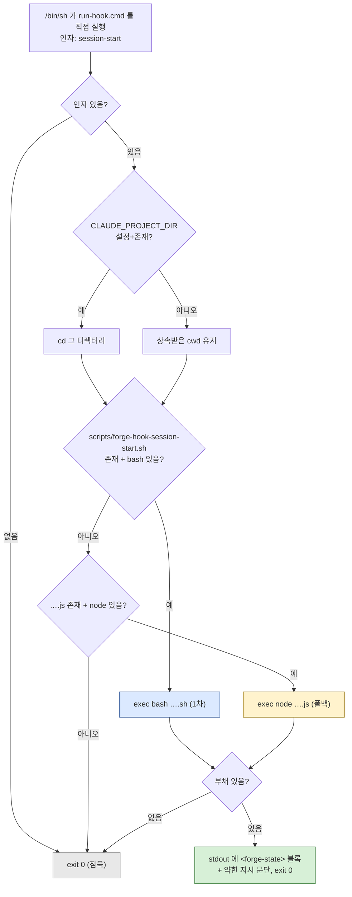

# STACK.md

## 한 줄 요약

forge는 **Claude Code 플러그인 리포**다. 컴파일되는 소스가 없고, 빌드·패키징·CI 파이프라인도 없다. 실행되는 코드는 `scripts/`의 bash+node 트윈과 `skills/fg-visual/scripts/`의 벤더링된 Node 서버뿐이며, 나머지는 전부 에이전트가 읽는 Markdown과 하네스가 읽는 JSON이다.

`git ls-files` 기준 추적 파일 **194개**. 그중 101개는 `.forge/`(영속 문서 — ADR 40, retro 52, codebase 7 등), 12개는 `docs/`, 나머지가 플러그인 페이로드다.

## 파일 인벤토리 (실측)

| 확장자 | 개수 | 무엇인가 |
| --- | --- | --- |
| `.md` | 141 | 스킬 본문·형식 문서(`skills/` 28개)·`.forge/` 영속 문서(99개)·루트 4개(`README.md`·`README.ko.md`·`CLAUDE.md`·`CHANGELOG.md`)·`docs/` |
| `.sh` | 27 | `scripts/` 25개(운영 스크립트 + 테스트) + `skills/fg-visual/scripts/` 2개 |
| `.js` | 9 | `scripts/` 8개(node 트윈) + `skills/fg-visual/scripts/helper.js`(브라우저 측) |
| `.json` | 4 | `.claude-plugin/plugin.json`·`.claude-plugin/marketplace.json`·`hooks/hooks.json`·`.forge/config.json` |
| `.cjs` | 1 | `skills/fg-visual/scripts/server.cjs` |
| `.cmd` | 1 | `hooks/run-hook.cmd` (polyglot — 아래 참조) |
| `.html` | 2 | `docs/index.html`(랜딩)·`skills/fg-visual/scripts/frame-template.html` |
| `.yml` | 1 | `docs/examples/github-actions-forge-check.yml` — **템플릿**(이 리포에서 실행되지 않음) |
| `.png` | 4 | `docs/` 이미지 |
| 기타 | 4 | `.gitignore`·`.gitattributes`·`docs/.nojekyll`·`skills/fg-visual/LICENSE` |

스킬 Markdown 총량은 2,904줄(`skills/**/*.md` 28개 파일). 최대 파일은 `skills/fg-visual/VISUAL.md`(278줄), `skills/fg-statusline/SKILL.md`(217줄).

## 런타임 요구사항 — 무엇이 무엇을 필요로 하는가

의존성은 넷뿐이고, **구성 요소별로 요구가 다르다**. 하나도 없어도 플러그인 설치·스킬 로드 자체는 된다(스킬은 Markdown이므로).

| 런타임 | 누가 필요로 하는가 | 없으면 |
| --- | --- | --- |
| **bash** | `scripts/*.sh` 전부(1차 구현), 스킬의 스크립트 호출 경로(`bash ${CLAUDE_PLUGIN_ROOT}/scripts/<name>.sh`), `scripts/forge-statusline-wrapper.sh`(방법 1 statusline — **bash 전용, node 트윈 없음**), `skills/fg-visual/scripts/start-server.sh`/`stop-server.sh` | 스크립트 백킹 스킬은 node 트윈으로 폴백(래퍼·statusline 설치 분기), 방법 1 statusline은 미지원(ADR-0022) |
| **node** | `scripts/*.js` 트윈 8개, `skills/fg-visual/scripts/server.cjs`, 매니페스트 JSON 유효성 검증(`node -e "JSON.parse(...)"`), `forge-doctor`의 B9 체크, `hooks/run-hook.test.sh`의 JSON 단언 | bash가 있으면 대부분 무영향. `fg-visual`은 완전 불가(서버가 node), 매니페스트 검증·B9만 조용히 skip |
| **git** | `resolve-forge-root.{sh,js}`(`rev-parse --show-toplevel`·`--abbrev-ref HEAD`), `forge-status`·`forge-doctor`·`forge-done`, 대화형 `fg-merge <branch>`의 `git merge` | forge 루트가 CWD 상대 `.forge`로 폴백(경고 1줄, exit 0). 비-git 디렉터리에서도 죽지 않음 |
| **coreutils / POSIX 도구** | `printf`(435회)·`mkdir`·`rm`·`sed`(78)·`mktemp`(60)·`head`·`grep`·`tr`·`dirname`·`date`·`ls`·`basename`·`wc`·`mv`·`sort`·`awk`·`find`·`cp`·`uniq`·`tail`·`od` | 해당 스크립트 동작 불가 |

`column`은 **의존하지 않는다** — Git Bash·최소 리눅스 호스트에 없을 수 있어 `forge-status.sh`는 표 정렬을 `awk`(POSIX)로 직접 한다(`scripts/forge-status.sh:148-150` 주석에 근거 기록). `python`·`realpath`·`jq` 의존도 없다(`jq`-free 파싱은 방어적 `sed`, node 트윈은 `JSON.parse`).

**bash 3.2 호환은 실측으로 확인됨.** bash-4 전용 기능(`declare -A`·`mapfile`/`readarray`·`${var,,}`/`${var^^}`·`&>>`)이 `scripts/`·`hooks/`·`skills/fg-visual/scripts/`에 하나도 없고, macOS 기본 `/bin/bash` 3.2.57로 다음이 exit 0으로 통과했다: `scripts/forge-hook-session-start.sh`(빈 상태 침묵 경로 + 부채 출력 경로 둘 다), `scripts/forge-status.sh`, `scripts/forge-doctor.sh`.

**node 하한**은 명시된 곳이 없다. 실제 호출 API에서 역산하면 `fs.rmSync`(`forge-done.js:169`, `forge-merge.js:273`)가 node **14.14+**, `Buffer.writeBigUInt64BE`(`server.cjs`)가 12+ 를 요구한다 → 사실상 **node 14.14 이상**. `?.`·`??`·private field 같은 최신 문법은 쓰지 않는다.

## 패키징 계약 — 매니페스트와 자동 탐색

리포 루트가 곧 플러그인 루트이자 마켓플레이스다(`plugins[].source` = `"./"`).

- `.claude-plugin/plugin.json` — `name`·`description`(전체 스킬 카탈로그를 담은 초장문 1개 필드)·`version`·`author`·`homepage`·`repository`·`license: MIT`·`keywords`. `skills` 필드는 없다(자동 탐색).
- `.claude-plugin/marketplace.json` — `name`·`owner`·`metadata.{description,version}`·`plugins[0].{name,source,description,version,category,tags}`.
- **버전은 3곳에 중복 기재**: `plugin.json.version`, `marketplace.json.metadata.version`, `marketplace.json.plugins[0].version`. 현재 전부 `0.5.20`. 드리프트는 `forge-doctor`의 B8이 error로 잡는다.
- **스킬 자동 탐색**: `skills/<dir>/SKILL.md`. 식별자는 디렉터리명이 아니라 frontmatter `name`. 현재 스킬 디렉터리 **19개**이고 19개 전부 frontmatter가 `name:`+`description:` **두 키만** 갖는다(`allowed-tools` 등 없음). `description`은 `/fg` 메뉴 표시와 자동 발동 트리거의 이중 용도라 `forge-doctor` B16이 600자 초과를 warning으로 lint한다.
- **훅 자동 탐색**: `hooks/hooks.json`(다음 절).

검증은 단일 명령뿐이다:

```bash
node -e "['.claude-plugin/plugin.json','.claude-plugin/marketplace.json'].forEach(f=>JSON.parse(require('fs').readFileSync(f,'utf8'))); console.log('OK')"
```

## 훅 (`hooks/`)

플러그인이 배포하는 훅은 하나다. 사용자 `settings.json` 편집이 필요 없고, `skills/`처럼 자동 탐색된다.

`hooks/hooks.json` 계약(실측):

```json
{ "hooks": { "SessionStart": [ { "matcher": "startup|resume|clear|compact",
  "hooks": [ { "type": "command",
    "command": "\"${CLAUDE_PLUGIN_ROOT}/hooks/run-hook.cmd\" session-start",
    "shell": "bash", "async": false } ] } ] } }
```

`hooks/run-hook.cmd`는 **polyglot 파일 — Unix 셸 스크립트이자 Windows 배치 파일**이다. 앞부분 `: << 'CMDBLOCK'`이 Unix 셸에서는 no-op + heredoc으로 배치 블록을 삼키고, `cmd.exe`에서는 `@echo off` 이후가 배치로 실행된다. obra/superpowers의 `hooks/run-hook.cmd` 패턴을 MIT 귀속으로 차용하고 node 폴백을 덧붙였다.

**이 파일은 실행 권한 비트를 반드시 가져야 한다.** `git ls-files -s hooks/`로 확인: `run-hook.cmd`만 `100755`이고 `hooks.json`·`run-hook.test.sh`는 `100644`다. 근거는 `hooks/run-hook.test.sh`에 주석으로 못 박혀 있다 — Claude Code는 `bash <wrapper>`로 부르지 않고 명령 문자열을 `/bin/sh`에 넘겨 **파일을 직접 실행**하므로, 비트가 없으면 "Permission denied"로 훅이 조용히 발화하지 않는다. 그래서 그 테스트는 `[ -x "$WRAPPER" ]`를 단언하고, 실제 호출 형태(`/bin/sh -c "\"$WRAPPER\" session-start"`)까지 재현해 검증한다.

디스패치와 폴백 규칙:



훅 본체(`scripts/forge-hook-session-start.sh`/`.js`)는 항상 exit 0이고, 부채가 없으면 stdout도 비운다. Windows 배치 경로는 `C:\Program Files\Git\bin\bash.exe` → `C:\Program Files (x86)\...` → PATH의 `bash` → PATH의 `node` 순으로 찾고, 전부 없으면 `exit /b 0`.

**훅은 세션 시작 시 로드된다** → 훅 추가·수정은 세션 재시작 후에 적용된다(`.claude/agents/` 카드와 동형).

## `scripts/` — sh + js 트윈 규약 (ADR-0022)

모든 운영 스크립트는 **`.sh`(bash, 1차) + `.js`(node, 폴백) 쌍**으로 존재하고, 두 쪽이 같은 출력을 낸다. `.ps1`은 의도적으로 배제됐다(대상 환경 하나가 보안 정책으로 PowerShell을 차단).

| 스크립트 | `.sh` | `.js` | `*.test.sh` (동작) | `*.parity.test.sh` (sh↔js) | 줄 수(sh/js) |
| --- | :-: | :-: | :-: | :-: | --- |
| `resolve-forge-root` | ✓ | ✓ | — | ✓ | 38 / 57 |
| `forge-status` | ✓ | ✓ | — | ✓ | 190 / 184 |
| `forge-done` | ✓ | ✓ | ✓ | ✓ | 185 / 171 |
| `forge-doctor` | ✓ | ✓ | ✓ | ✓ | 187 / 181 |
| `forge-merge` | ✓ | ✓ | ✓ | ✓ | 307 / 286 |
| `forge-hook-session-start` | ✓ | ✓ | ✓ | ✓ | 161 / 137 |
| `forge-statusline` | ✓ | ✓ | ✓ | ✓ | 212 / 186 |
| `forge-statusline-full` | ✓ | ✓ | ✓ | ✓ | 213 / 170 |
| `forge-statusline-wrapper` | ✓ | **없음(예외)** | ✓ | — | 46 |

`scripts/` 합계 5,052줄. 트윈 누락은 `forge-doctor` B15가 warning으로 잡되 `*.test.sh`·`*.parity.test.sh`·`*-wrapper.sh`는 **의도적으로 제외**한다 — 래퍼는 기존 statusline을 보존하는 bash 전용 합성기라 트윈이 없는 게 정상이다.

**이중 디스패치 규칙 — bash 우선, node 폴백:**

- **스킬 호출 경로**: Bash 도구가 bash를 보장하므로 스킬은 항상 `bash "${CLAUDE_PLUGIN_ROOT}/scripts/<name>.sh"`로 부른다(현재 5개 스킬이 `forge-status`·`forge-done`·`forge-doctor`·`forge-merge`·`resolve-forge-root`를 이 형태로 호출).
- **훅 경로**: `run-hook.cmd`가 런타임 유무를 보고 골라 `exec`한다(위 도표).
- **statusline 경로**: Bash 도구 밖 시스템 셸에서 돌므로 **설치 시점에 한 번 분기**해 단일 명령을 확정한다 — Unix면 `<CFG>/forge-statusline-full.sh`, Windows면 `node <CFG>/forge-statusline-full.js`. 런타임 위임이 아니다.
- node 트윈끼리는 서브프로세스 대신 `require`로 재사용한다(`resolve-forge-root.js`가 `resolve-forge-root()`를 export → `forge-status.js` 등이 사용).

**`*_IMPL` 환경 변수 오버라이드.** 동작 테스트 파일은 하나이고, 같은 파일을 두 구현에 돌릴 수 있게 대상 스크립트 경로를 env로 받는다:

| 테스트 | 변수 | 기본값 |
| --- | --- | --- |
| `forge-hook-session-start.test.sh` | `FGHOOK_IMPL` | 같은 디렉터리 `forge-hook-session-start.sh` |
| `forge-doctor.test.sh` | `FGDOCTOR_IMPL` | `forge-doctor.sh` |
| `forge-done.test.sh` | `FGDONE_IMPL` | `forge-done.sh` |
| `forge-merge.test.sh` | `FGMERGE_IMPL` | `forge-merge.sh` |
| `forge-statusline-full.test.sh` | `FGSL_FULL_IMPL` | `forge-statusline-full.sh` |

즉 `FGDOCTOR_IMPL=$PWD/scripts/forge-doctor.js bash scripts/forge-doctor.test.sh`로 node 트윈에 같은 동작 스위트를 돌린다. `*.parity.test.sh`는 별개로, **같은 fixture에 두 구현을 돌려 출력 동일성을 단언**한다(존재 검사보다 강한 진짜 동치 가드).

**`skills/fg-visual/scripts/`는 이 규약 밖이다.** obra/superpowers v6.1.1 벤더링이라 업스트림 형태를 유지하고, 트윈·패리티 대상이 아니다(`.claude/agents/script-twin-engineer.md`가 이 경계를 명시).

## 이식성 규칙 (실측 근거 있음)

- **shebang은 `#!/usr/bin/env bash`** — 27개 `.sh` 전부 확인. `/bin/bash` 하드코딩 없음(NixOS 등 대비). `.js`는 `#!/usr/bin/env node`.
- **호출은 `bash script.sh`**, `./script.sh` 금지 — NTFS에 POSIX exec 비트가 없기 때문. 실제로 `git ls-files -s scripts/`의 mode 비트는 **혼재**한다(`forge-done.sh`·`forge-status.sh`·`forge-statusline*.sh`·`resolve-forge-root.sh`는 `100755`, `forge-doctor.sh`·`forge-merge.sh`·`forge-hook-session-start.sh`는 `100644`). 호출 규약이 `bash <file>`이므로 비트는 load-bearing이 아니다 — **유일한 예외가 `hooks/run-hook.cmd`(반드시 755)**이고, statusline 설치는 복사본에 `chmod +x`를 직접 건다.
- **`.gitattributes`가 `*.sh text eol=lf`로 LF 강제** — CRLF가 shebang/인자에 `\r`을 남겨 bash를 깨뜨린다. Windows에서 `.sh`를 git-bash로 돌리는 경로가 있어 load-bearing.
- **CRLF 방어가 파서에도 있다** — 스크립트의 STATUS 필드 리더는 `tr -d '\r'`을 통과시킨다(Windows 체크아웃에서 `verified: yes\r`가 오판되던 문제).
- **로케일 고정** — `forge-hook-session-start.sh`는 `export LC_ALL=C`로 바이트 정렬을 고정한다(node 트윈이 `Buffer.compare`로 정렬하므로 한글 slug에서 패리티가 깨지는 것을 막기 위함).
- **레거시 형식 관용** — STATUS 필드는 `field:`와 `- field:`(대시 목록 레거시) 양쪽을 읽는다. ADR ID는 `NNNN`·`YYMMDD-HH`+글자·`YYMMDD-HHMMSS`의 세 세대를 모두 인식한다.
- **git 저장소 루트에 앵커** — `resolve-forge-root`는 `git rev-parse --show-toplevel`로 절대경로를 만들어, 하위 디렉터리에서 실행해도 상태를 찾는다.

## 테스트 — 실행 방법과 계약

테스트 러너·프레임워크가 없다. 테스트는 그냥 bash 스크립트이고, 직접 돌린다.

```bash
# 동작 테스트 8개 (scripts/ 7 + hooks/ 1)
for t in scripts/*.test.sh hooks/*.test.sh; do case "$t" in *.parity.test.sh) continue;; esac; bash "$t"; done

# 패리티 테스트 8개 (sh↔js 출력 동일성)
for t in scripts/*.parity.test.sh; do bash "$t"; done
```

주의: 글로브 `scripts/*.test.sh`는 `*.parity.test.sh`도 함께 매치한다(총 16개 파일 = 동작 8 + 패리티 8). `docs/examples/github-actions-forge-check.yml`은 `for t in scripts/*.test.sh; do bash "$t"; done`으로 둘을 한꺼번에 돈다.

각 테스트는 `mktemp -d` fixture를 만들고 `pass/fail` 카운터를 세어 실패 시 exit 1 한다. `forge-status`와 `resolve-forge-root`는 **동작 테스트가 없고 패리티 테스트만** 있으며, 그 패리티 테스트가 기대값까지 단언해 동작 검증을 겸한다(`resolve-forge-root.parity.test.sh`는 `set -euo pipefail`로 "둘 다 빈 출력 = 동일 = PASS" 위양성을 차단).

**exit code 계약**(스킬이 이걸로 라우팅하고, CI 게이트도 이걸로 판정한다):

| 스크립트 | 0 | 1 | 2 | 3 | 4 | 5 | 6 | 64 |
| --- | --- | --- | --- | --- | --- | --- | --- | --- |
| `forge-doctor` | clean | warning만 | error 1+ | | | | | |
| `forge-done` | 봉인 완료 | | 봉인 대상 없음 | verify 게이트 차단 | retro 게이트 차단 | 이미 봉인됨 | | 오염 slug 거부 |
| `forge-merge` | 통합 완료 | | 통합 대상 없음 | in-flight 상태 | 진짜 충돌 | | 브랜치 루트 모호 | |
| `forge-status`·`resolve-forge-root`·훅 본체 | 항상 0 | | | | | | | |

## 설정 표면

### `.forge/config.json` — 프로젝트 영속 설정 (git 추적)

lazy 생성이라 **키가 없으면 기본값**이다. 현재 이 리포의 실제 내용은 `{"eco": false}` 하나뿐 — `tdd`·`defaultBranch`는 아직 쓰인 적이 없다.

| 키 | 타입 | 없을 때 기본 | 읽는 쪽 | 쓰는 쪽 |
| --- | --- | --- | --- | --- |
| `tdd` | bool | `false` | fg-ask(작업별 질문의 기본 답), fg-run(test-first 실행) | `fg-tdd on`/`off` |
| `eco` | bool | `false` | fg-ask(YAGNI 렌즈), fg-run(서브에이전트 sonnet 캡 + `skills/fg-eco/ECO.md` prepend), `forge-statusline`(`♻️` 지시자) | `fg-eco on`/`off` |
| `defaultBranch` | string | `"main"` | `resolve-forge-root.{sh,js}` — 루트 해석의 입력 | 사람이 직접 |

**이 파일은 브랜치 루트 해석의 전역 예외다** — 모든 브랜치에서 항상 최상위 `.forge/config.json`이며 `.forge/branch/<branch>/config.json`이 되지 않는다. 이유는 순환이다: 루트 해석 규칙 자체가 `defaultBranch`를 먼저 읽어야 한다. 파싱은 정규식 한 줄(`sed -n 's/.*"defaultBranch"...'` / `.match(/"defaultBranch"\s*:\s*"([^"]*)"/)`)로, JSON 파서를 쓰지 않는다.

statusline **밀도**(compact/full)는 config 키가 아니라 wired command의 위치 인자에 저장된다(새 키를 만들지 않기 위한 결정 — ADR-0029).

### statusline 배선 (사용자 `~/.claude/settings.json`)

`fg-statusline`이 대화형으로 설치한다. `CFG` = `$CLAUDE_CONFIG_DIR` 또는 `$HOME/.claude`이고, **`settings.json`의 경로는 반드시 절대경로**(`~` 금지). Claude Code는 `statusLine`을 하나만 허용하므로 "추가"가 불가능하고, 두 모드로 갈린다.

```
쓰기 전 read-only preflight (settings 위치·기존 statusLine·모드/밀도/OS 드리프트 확인)
   ↓
fragment(.sh+.js) · wrapper(.sh) · full(.sh+.js) · resolve-forge-root.js → <CFG>/ 복사 + chmod +x
   ↓
STATUSLINE_CMD 확정: Unix → <CFG>/forge-statusline-full.sh [compact]
                     Windows → node <CFG>/forge-statusline-full.js [compact]
   ↓
기존 statusLine 없음      → 방법 2 자동 (command = STATUSLINE_CMD)
기존 forge wrapper 있음   → 방법 1 이미 배선 (refresh만)
기존 forge full 있음      → 방법 2 이미 배선 (refresh만)
기존 서드파티 있음        → 사용자에게 1/2 질문 (Windows는 2만 — wrapper가 bash 전용)
       ├ 방법 1 → 원본 명령을 <CFG>/forge-statusline-orig.sh에 verbatim 보존
       │          → command = <CFG>/forge-statusline-wrapper.sh
       └ 방법 2 → 원본 보존 후 command = STATUSLINE_CMD (복원 경로 안내)
```

- 배선되는 값은 `{"statusLine": {"type": "command", "command": "<절대경로>"}}` 형태 한 줄이다.
- OS 판정은 **호스트 OS 기준**(`uname -s`)이지 설치 세션의 `PATH`에 bash가 있는지가 아니다 — 설치는 Bash 도구 안에서 돌아 항상 bash가 있으므로 PATH 프로브는 Windows에서 오판한다.
- 복사된 스크립트는 동반 파일을 **자기 설치 디렉터리**에서 찾는다(`BASH_SOURCE`/`__dirname`) — `$CLAUDE_CONFIG_DIR`에 의존하면 statusLine 프로세스가 그 env를 export하지 않는 커스텀 config-dir 환경에서 전체 줄이 조용히 빈다.
- 세션 JSON은 stdin으로 들어온다. bash 트윈은 `jq` 없이 부모 객체 앵커 방식 `sed`로 leaf를 뽑고(`used_percentage`가 3곳, `resets_at`이 2곳에 나오므로 first-match 금지), node 트윈은 `JSON.parse`를 쓴다.

### 환경 변수

| 변수 | 누가 세팅 | 쓰는 쪽 |
| --- | --- | --- |
| `CLAUDE_PLUGIN_ROOT` | 하네스 | 스킬 52곳(스크립트·형식 문서 경로), `hooks.json`의 command |
| `CLAUDE_PROJECT_DIR` | 하네스 | `run-hook.cmd`가 여기로 `cd`(훅 본체는 cwd 기준으로 상태를 읽으므로 상속 cwd를 믿지 않는다) |
| `CLAUDE_CONFIG_DIR` | 사용자 | `fg-statusline`이 설치 시점에만 `CFG` 해석용으로 읽음(런타임 의존 금지) |
| `FORGE_SL_PREFIX` | — | fragment 1줄 접두, 기본 `⚒ ` |
| `FORGE_SL_SEP` | `forge-statusline-full` | 그룹 내 구분자, 기본 `·`(방법 2는 `\|` 전달) |
| `FORGE_SL_DENSITY` | `forge-statusline-full` | `full`(기본) / `compact` |
| `FORGE_SL_NOW` | 테스트 | epoch 초 주입 — 시간 humanize를 테스트 가능하게 |
| `FGHOOK_IMPL`·`FGDOCTOR_IMPL`·`FGDONE_IMPL`·`FGMERGE_IMPL`·`FGSL_FULL_IMPL` | 테스트 | 동작 테스트를 `.js` 트윈에 돌리는 오버라이드 |
| `BRAINSTORM_*` (12개: `DIR`·`HOST`·`URL_HOST`·`PORT`·`PORT_FILE`·`TOKEN`·`TOKEN_FILE`·`OWNER_PID`·`OPEN`·`OPEN_CMD`·`IDLE_TIMEOUT_MS`·`LIFECYCLE_CHECK_MS`) | `start-server.sh` | `server.cjs` (벤더링 원본 이름 유지) |

## git 추적 정책

`.gitignore`가 `.forge/*`로 통째 제외한 뒤 영속 문서만 화이트리스트로 되살린다: `!.forge/CONTEXT.md`·`!.forge/adr/`·`!.forge/retro/`·`!.forge/codebase/`·`!.forge/config.json`·`!.forge/branch/`. 즉 **위치는 `.forge/` 안, 구분은 추적 여부**다. 비-기본 브랜치의 forge 루트(`.forge/branch/<branch>/`)만 통째로 추적되는 의도된 비대칭이 있다. 기타 제외: `.claude/worktrees`·`.planning/`(단 `!.planning/codebase/`)·`.omx`·`.DS_Store`.

## 리포 로컬 개발 자산 (플러그인으로 배포되지 않음)

- `.claude/agents/` — 이 리포 작업용 도메인 에이전트 카드 3개(`manifest-doc-syncer`·`script-twin-engineer`·`skill-author`). frontmatter는 `name`+`description`(한국어). 세션 시작 시 로드되므로 추가 후 재시작 필요.
- `.claude/skills/issue-triage/SKILL.md` — 리포 로컬 스킬. `gh` CLI를 요구하는 유일한 자산.
- `.claude/settings.local.json` — `permissions.allow: ["Bash(git ls-tree *)"]` + `skillOverrides` 2건.
- `docs/examples/github-actions-forge-check.yml` — 팀이 **복사해 쓰는** CI 템플릿. 이 리포는 이걸 실행하지 않는다.

## 없는 것 (확인됨)

`package.json`·lockfile·`node_modules`·`Makefile`·`.github/workflows/`·린터/포매터 설정·타입 검사·`.ps1` 미러·`jq`/`python` 의존·MCP 서버 정의. `fg-visual` 서버도 zero-dependency(node 표준 모듈 `crypto`·`http`·`fs`·`path`·`os`·`child_process`만 `require`).
