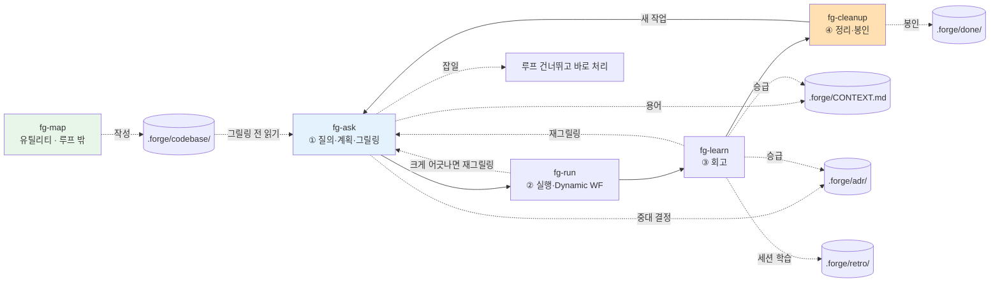

# forge

> 작업 하나를 **질의·계획 → 실행 → 회고 → 정리**의 한 바퀴로 돌리는 개발 루프.
> `fg-` 프리픽스 Claude Code 스킬로 구성된 루프형 워크플로우 플러그인 — 루프를 이루는 4개와, 루프 밖 유틸리티 `fg-map`.

[English](./README.md)

계획은 grill-with-docs식 대화형 그릴링으로, 실행은 Claude Code Dynamic Workflow로 수행하고, 회고는 학습을 프로젝트 문서(`CONTEXT.md` · ADR · 회고 로그)에 되돌린 뒤, 정리 단계에서 한 바퀴의 잔여물을 정리하며 작업을 봉인해 같은 작업이 두 번 실행되지 않게 한다.

## 스킬 카탈로그

| 스킬 | 단계 | 한 줄 역할 | 입력 | 출력 | 다음 |
| --- | --- | --- | --- | --- | --- |
| `fg-ask` | ① 질의·계획 | grill-with-docs 원문 그대로 — 계획을 도메인·용어·결정에 대고 그릴링 | 사용자 요청 | `.forge/backlog/<slug>.md` + CONTEXT/ADR | `fg-run` |
| `fg-run` | ② 실행 | 계획을 Dynamic Workflow로 실행 — 미실행 plan이 하나면 메뉴 없이 즉시 실행, 여럿이면 선택 메뉴 제시(마지막 옵션 "모두 실행") | `.forge/backlog/`, `plan.md` | 결과 + `.forge/run.md` + `STATUS.md` (또는 `executed/`) | `fg-learn` |
| `fg-learn` | ③ 회고 | 학습을 문서로 승급, 다음 질의 도출 | `.forge/run.md`, `plan.md`, `executed/` | `.forge/retro/*.md` + 승급 | `fg-cleanup` (크게 어긋났으면 `fg-ask`로 재그릴링) |
| `fg-cleanup` | ④ 정리 | 한 바퀴 정리 — 회고 확인, `STATUS.md`를 done으로 마감, 아카이브, 활성 상태 비우기, 루프 닫기 | `.forge/*` | `.forge/done/<날짜-slug>/` | `fg-ask` / 종료 |
| `fg-map` | 유틸리티(루프 밖) | 병렬 서브에이전트로 코드베이스를 `.forge/codebase/`에 매핑해, 그릴링이 코드를 다시 탐색하지 않고 지도를 읽게 한다(context rot 감소) | 코드베이스 | `.forge/codebase/*.md` (7개 문서) | — (`fg-ask`가 소비) |
| `fg-quick` | 경량 차선(루프 밖) | 사소한 작업용 — 가볍게 그릴링한 뒤 형식 산출물(ADR/plan/회고) 없이 바로 실행; 비-trivial로 드러나면 `fg-ask`로 bail | 사용자 요청 | `.forge/quick/LOG.md`에 항목 하나 | — (자체 완결) |
| `fg-status` | 리포터(루프 밖) | 읽기 전용 — `.forge/`를 조사해 모든 작업의 현황과 지금 필요한 다음 단계 하나를 출력; 아무것도 쓰지 않고 자동 실행도 안 함 | `.forge/*` (읽기 전용) | 출력 보고(파일 없음) | — (다음 단계 제안) |
| `fg-tdd` | 토글(루프 밖) | `.forge/config.json`의 TDD 모드를 켜고 끔 — 켜면 `fg-ask`가 기본으로 질문하고 `fg-run`이 test-first로 실행 | `on`/`off`/(없음) | `.forge/config.json`(`tdd`) | — (설정만) |

`fg-ask`가 루프의 진입점이다 — 질의·분류와 그릴링을 함께 맡는다(기존 별도 `fg-plan` 단계를 `fg-ask`로 통합). "forge 시작", "새 작업", "이거 작업하자", "계획 다듬자" 같은 발화에서 트리거된다. `fg-cleanup`은 "forge cleanup", "작업 정리", "이거 정리해줘"에서 트리거된다(기존 "forge complete"도 alias로 인식한다). `fg-map`은 **루프 단계가 아니다** — 코드베이스가 크게 바뀌어 지도가 낡았을 때 돌리는 온디맨드 유틸리티로, "코드베이스 분석", "코드베이스 지도" 같은 발화에서 트리거된다. `fg-quick`도 **루프 밖**이다 — 사소한 작업(오타·작은 rename·버전 범프)용 경량 차선으로, 그릴링은 하되 가볍게 하고 형식 산출물(ADR/plan/회고) 없이 바로 실행하며 `.forge/quick/LOG.md`에 한 줄 기록한다. 그릴링 중 비-trivial로 드러나면 `fg-ask`(정식 루프)로 bail한다. "forge quick", "이거 빨리 해줘" 같은 발화에서 트리거된다. `fg-status`도 **루프 밖 읽기 전용 리포터**다 — 아무 때나 돌려 모든 작업의 현황(active slot·backlog·회고 대기·완료 이력·빠른 작업 로그)과 지금 필요한 다음 단계 하나를 본다; 아무것도 쓰지 않고 자동 실행도 하지 않는다. "forge status", "어디까지 했지" 같은 발화에서 트리거된다. `fg-tdd`도 **루프 밖**이다 — `.forge/config.json`의 영속 TDD 모드 토글(`fg-tdd on|off`, 인자 없으면 상태 표시). 켜면 `fg-ask`가 기본으로 "이 작업 TDD로?"를 묻고 `fg-run`이 test-first로 실행한다. "forge tdd", "TDD 켜/꺼" 같은 발화에서 트리거된다.

## 전체 흐름

한 스킬이 끝나면 다음 스킬로 가는 길(무엇을 했고, 다음은 무엇이며, 어떻게 시작하는지)을 안내하고, 바로 이어갈지 물어 동의하면 그 자리에서 다음 스킬을 호출한다. 루프는 `fg-cleanup`이 작업을 봉인한 뒤, **새 작업**으로서만 `fg-ask`에서 다시 시작된다 — 같은 작업을 다시 실행하지 않는다.

```
fg-ask ───▶ fg-run ───▶ fg-learn ───▶ fg-cleanup
① 질의/계획     ② 실행          ③ 회고        ④ 정리
(그릴링·대화형) (Dynamic WF)   (문서 반영)    (봉인·재실행 방지)
```



## 설치

Claude Code 세션에서 GitHub 마켓플레이스로 추가한 뒤 플러그인을 설치한다.

```
/plugin marketplace add gyuha/forge
/plugin install forge@forge
```

로컬 클론에서 설치하려면(예: 개발 중) 리포 루트 경로를 넘긴다:

```
/plugin marketplace add /path/to/forge
/plugin install forge@forge
```

참고:

- GitHub 설치는 리포의 기본 브랜치(`main`)를 당긴다 — 변경을 설치로 테스트하려면 먼저 `main`에 push되어 있어야 한다.
- 스킬은 `skills/<name>/SKILL.md`에서 자동 탐색되므로 추가 설정이 필요 없다.
- 이후 업데이트는 `/plugin marketplace update forge`, 제거는 `/plugin uninstall forge@forge`.

설치 후 Claude Code 세션에서 `fg-ask`부터 트리거되거나, "forge로 시작" 같은 발화로 루프가 시작된다.

## 공유 상태와 디렉터리

단계를 독립적으로 호출해도 흐름이 이어지도록 상태를 파일로 넘긴다. 모든 것을 `.forge/` 한 디렉터리에 둔다 — 휘발 루프 상태와 git 추적되는 영속 문서가 함께 산다. `.gitignore`가 `.forge/`를 기본 제외하고 영속 문서만 화이트리스트로 추적하므로, **위치는 전부 `.forge/` 안이고 구분은 git 추적 여부**다.

```
repo/
├── CONTEXT-MAP.md             # 멀티 컨텍스트일 때만 (루트 유지)
└── .forge/                    # 모든 루프 문서가 여기 산다
    │                          # ── 영속 문서 (화이트리스트로 git 추적) ──
    ├── CONTEXT.md             # 글로서리 (단일 컨텍스트)
    ├── adr/0001-*.md          # 아키텍처 결정
    ├── retro/YYYY-MM-DD-*.md  # 회고 로그
    ├── codebase/*.md          # fg-map이 만든 코드베이스 지도
    │                          # ── 휘발 루프 상태 (gitignore) ──
    ├── backlog/<slug>.md      # ① fg-ask 그릴링 산출 — 미실행 plan 대기열
    ├── plan.md                # 활성 슬롯: 지금 도는 한 바퀴의 정답 기준 (fg-run가 백로그에서 승격)
    ├── run.md                 # ② fg-run 산출 = 계획 vs 실제
    ├── STATUS.md              # 활성 슬롯: fg-run가 실행 완료 시 작성 (status: executed, retro: pending) — retro 필드는 이후 경로 또는 "skipped"가 됨
    ├── executed/<slug>/       # "모두 실행" 후 회고 대기 (plan+run+STATUS, 미회고)
    └── done/<날짜-slug>/       # ④ fg-cleanup 봉인 아카이브 (plan+run+STATUS, status: done)
```

`.gitignore` 패턴:

```gitignore
.forge/*
!.forge/CONTEXT.md
!.forge/adr/
!.forge/retro/
!.forge/codebase/
```

- 각 스킬은 입력 파일을 `.forge/`에서 읽고 산출을 `.forge/`에 쓴다. `fg-run`만 따로 불러도 백로그·활성 슬롯을 찾아 이어간다.
- `fg-run`는 백로그에 작업이 여럿이면 미완료 목록을 선택 메뉴로 제시한다(마지막 옵션 "모두 실행"). 활성 슬롯은 항상 1개 — 한 plan.md = 한 run.md = 한 봉인.
- 입력 파일이 없으면 스킬은 앞 단계를 안내한다.
- 활성 슬롯·백로그·회고 대기열이 모두 비어 있으면 = 진행 중 작업 없음. `fg-run`는 빈 상태에서 실행하지 않는다(재실행 방지). 완료 판별은 `done/*/STATUS.md`(status: done)다.
- 회고는 사소한 **저-divergence** 작업에 한해 **건너뛸 수 있다**. fg-run가 핸드오프에서 명시 선택지로 제시한다 — 자동이 아니고, 계획과 크게 어긋난 실행에는 제시하지 않는다(그때야말로 배울 게 있다). 건너뛰면 STATUS.md에 `retro: skipped`를 기록하고 회고 파일은 만들지 않으며, fg-cleanup이 이를 봉인 가드 통과로 인정한다. 회고가 기본값이다 ([ADR-0002](./.forge/adr/0002-optional-retro-skip.md)).

## 두 기둥

1. **그릴링(계획)은 Dynamic Workflow 밖의 대화형으로.** Dynamic Workflow는 실행 중 사용자 입력을 못 받으므로, 한 질문씩 주고받는 그릴링을 워크플로우 안에 넣지 않는다.
2. **문서는 산출물이 아니라 루프의 연료.** 계획에서 다듬은 용어가 실행의 기준이 되고, 회고의 학습이 다음 계획의 출발점이 된다.

## 크레딧

`fg-ask`의 그릴링·문서화 패턴(원문 포함)과 `CONTEXT-FORMAT.md`/`ADR-FORMAT.md`는 [mattpocock/skills의 grill-with-docs](https://github.com/mattpocock/skills/tree/main/skills/engineering/grill-with-docs)를 계승했다.
