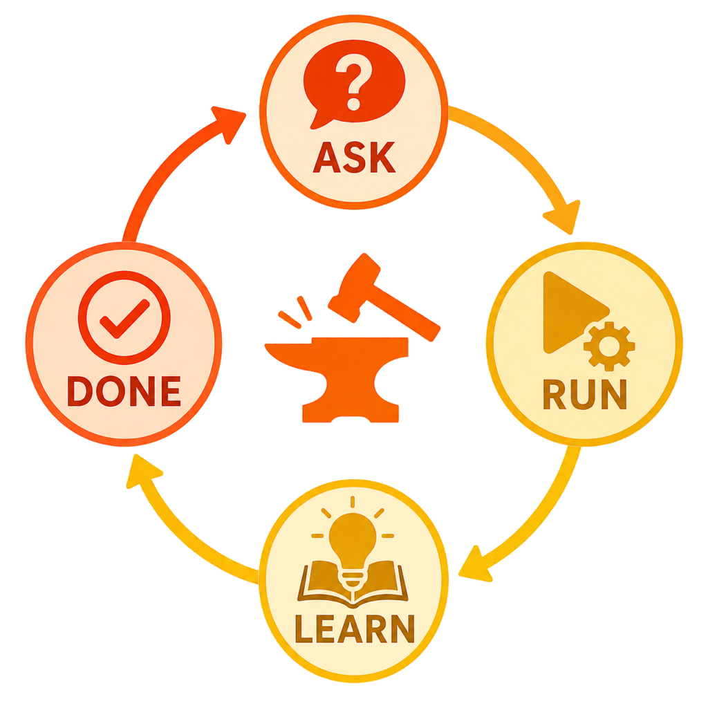

# forge



> A development loop that takes one task through a single cycle of **ask·plan → execute → retro → done**.
> A loop-style workflow plugin built from eighteen `fg-`-prefixed Claude Code skills — four that form the loop, plus fourteen utilities outside it.

[한국어](./README.ko.md)

Planning happens as grill-with-docs-style conversational grilling, execution runs as a Claude Code Dynamic Workflow, the retro feeds learnings back into project docs (`CONTEXT.md` · ADRs · retro log), and the done step tidies up the cycle's leftovers — seals the task so the same task never runs twice.

## Quick start — you mostly only need three

Eighteen skills look like a lot, but day to day you drive with **three**:

```
/fg-ask   →   /fg-run   →   /fg-next
 (plan)       (execute)     (auto-continue: verify → retro/seal)
```

- **`/fg-ask`** — start *every* task here. It grills the plan with you, one question at a time.
- **`/fg-run`** — runs the plan.
- **`/fg-next`** — does the *one next step* for you (verify → retro or seal). Run it again to keep moving.

**Even shorter** — plan once, then let it drive itself to completion:

```
/fg-ask   →   /fg-next all     (execute → verify → seal, looped until it needs you)
```

When you lose track: **`/fg-status`** just *shows* where you are; **`/fg-next`** just *does* the next thing. Tiny one-off change (typo, version bump)? **`/fg-quick`**. To ship the result: type **`배포` (deploy)**.

Everything else in the catalog below is optional scaffolding — reach for it only when a specific need comes up. If you remember just one line: **`/fg-ask` then keep calling `/fg-next` (or `/fg-next all`).**

## Choosing a lane — observe, assist, then run unattended

The three driving skills form a **trust ladder** — the same graduated-autonomy idea as loop engineering's L1→L2→L3 rollout (report → assisted → unattended). Start low, move up as you trust the loop on a given task:

- **L1 — observe (`/fg-status`)**: read-only. It just *shows* where every task stands and the single next step. Nothing runs. Use it to see the board before deciding.
- **L2 — assisted (`/fg-next`)**: does the *one* next step and stops. You stay in the seat between steps — review, then call it again. Best when you want to watch each transition.
- **L3 — unattended (`/fg-loop` or `/fg-next all`)**: drives whole task loops to completion. `/fg-next all` drains a human-grilled backlog until it's empty; `/fg-loop` converges on a machine-verifiable goal, generating bounded fix-forward work along the way. Both halt at the walls (failed/unverifiable verification, a genuine fork, no progress; `/fg-loop` additionally at a check-tension oscillation or a safety/irreversible action) and hand back with full context.

Rule of thumb: grill the plan with `/fg-ask` first — that human judgment is L1 and is never automated — then pick the lowest lane you're comfortable with. `/fg-loop` is L3 for a goal you can pin to runnable checks (`grep`/test/build); `/fg-next all` is L3 for a queue you've already grilled.

## Skill catalog

The four loop stages, then the fourteen utilities outside the loop:

| Skill | Stage | One-line role |
| --- | --- | --- |
| `fg-ask` | ① Ask·plan | grill-with-docs verbatim — grills the plan against domain, terms, and decisions |
| `fg-run` | ② Execute | Runs the plan as a Dynamic Workflow (one plan runs immediately, several show a selection menu) |
| `fg-learn` | ③ Retro | Promotes learnings to docs, surfaces the next inquiry |
| `fg-done` | ④ Done | Tidies up the cycle — confirms retro, closes `STATUS.md`, archives, clears active state, seals; `all` mode batch-seals every already-executed task (retros skipped, backlog untouched, verification gate intact) |
| `fg-map` | Utility | Maps the codebase into `.forge/codebase/` so grilling reads a map instead of re-exploring |
| `fg-quick` | Utility | Lightweight lane for trivial tasks — grills lightly, runs directly with no formal artifacts |
| `fg-status` | Utility | Read-only — surveys `.forge/` and prints where every task stands plus the single next step |
| `fg-next` | Utility | Derives the single next step (via fg-status's state machine) and runs it; `all` mode drives to the wall |
| `fg-loop` | Utility | Goal-driven loop with bounded replan — drives run → UAT → seal until machine-verifiable checks pass |
| `fg-tdd` | Utility | Toggles persistent TDD mode in `.forge/config.json` |
| `fg-eco` | Utility | Toggles eco mode — when on, caps delegated workflow subagents at `sonnet` **and** activates the embedded Eco laziness-first discipline (`ECO.md` — code simplicity + terse-communication output): injected into fg-run subagents, woven into fg-ask grilling as a YAGNI lens, adopted by the session |
| `fg-merge` | Utility | After a `git merge`, folds a branch's `.forge/branch/<branch>/` into `.forge/` |
| `fg-cleanup` | Utility | Retires stale/superseded ADRs out of the active set into `.forge/adr/retired/` |
| `fg-statusline` | Utility | Installs a statusline fragment that shows forge's loop progress |
| `fg-adversarial-review` | Utility | Optional hostile second look between fg-run and fg-learn — six lenses, fix-forward findings |
| `fg-doctor` | Utility | Read-only integrity check of the `.forge/` state contract and docs/manifest sync |
| `fg-drop` | Utility | Discards incomplete work (backlog/active/executed/halted loop) — risk-labeled list, hard-delete or archive to `.forge/dropped/` |
| `fg-agents` | Utility | Generates project domain agents (`.claude/agents/<role>.md`) by conversational grilling — fg-run dispatches a matching role as `agentType` after a session restart |

Per-skill detail — input/output/next, triggers, and the rationale ADRs — is in **[docs/skills.md](./docs/skills.md) (Korean)**. `fg-ask` is the loop's entry point (it triggers on "start with forge", "new task", "refine the plan"); the utilities are on-demand, each triggered by its own utterances.

## Overall flow

When one skill finishes, it **states** the way to the next (what was done, what comes next, how to start) and stops — it does not ask "shall I continue?"; chaining into the next stage is `fg-next`'s job. This now holds for **every** handoff, including `fg-run`'s single-task end: it states the next step — default retro via `fg-learn`, skip+seal via `fg-done` only when divergence is low, re-grill via `fg-ask` when it is high — and stops. (fg-run's old four-way menu was dropped — it re-triggered on the unchanged active-slot state and looped; [ADR-0015](./.forge/adr/0015-fg-run-handoff-menu-others-stated.md), amended 2026-06-15.) After `fg-done` seals a task, the loop restarts at `fg-ask` only as a **new task** — the same task never runs again. Two utilities tend this fuel from outside the loop: `fg-map` writes the codebase map `fg-ask` reads, and `fg-cleanup` curates the ADR set `fg-ask` reads.

```
fg-ask ───▶ fg-run ───▶ fg-learn ───▶ fg-done
① ask/plan      ② execute       ③ retro       ④ done
(grilling·      (Dynamic WF)    (reflect      (seal·
 conversational)                 into docs)    re-run guard)
```

A detailed flow diagram (loop ↔ document artifacts) is in [docs/state-contract.md](./docs/state-contract.md) (Korean).

## Install

In a Claude Code session, add the GitHub marketplace, then install the plugin.

```
/plugin marketplace add gyuha/forge
/plugin install forge@forge
```

To install from a local clone instead (e.g. while developing), pass the path to the repo root:

```
/plugin marketplace add /path/to/forge
/plugin install forge@forge
```

Notes:

- The GitHub install pulls the repo's default branch (`main`) — to test a change via install, it must be pushed to `main` first.
- Skills are auto-discovered from `skills/<name>/SKILL.md`; no extra configuration is needed.
- To update later, run `/plugin marketplace update forge`, and to remove, `/plugin uninstall forge@forge`.

After installing, the loop starts in a Claude Code session by triggering `fg-ask`, or with an utterance like "start with forge".

## Shared state and directories

State is passed through files so the flow continues even when stages are invoked independently. A single `.forge/` directory holds everything — both the volatile loop state and the git-tracked permanent docs (the `.gitignore` excludes `.forge/` by default and whitelists only the permanent docs). The active slot is always exactly one — one `plan.md` = one `run.md` = one seal. On a non-default branch the whole forge root moves to `.forge/branch/<branch>/` (git-tracked) so parallel branches never collide ([ADR-0011](./.forge/adr/0011-branch-isolated-forge-root.md)).

The full directory layout, the `.gitignore` pattern, branch isolation, the retro-skip rule ([ADR-0002](./.forge/adr/0002-optional-retro-skip.md)), and the verification-before-seal gate ([ADR-0009](./.forge/adr/0009-verification-gate-before-seal.md)) are documented in **[docs/state-contract.md](./docs/state-contract.md) (Korean)**.

## The two pillars

1. **Grilling (planning) is conversational, outside the Dynamic Workflow.** A Dynamic Workflow cannot take user input mid-run, so question-by-question grilling never goes inside a workflow.
2. **Docs are the loop's fuel, not its by-product.** Terms sharpened in planning become the standard for execution, and retro learnings become the starting point of the next plan.

## Credits

The grilling/documentation pattern of `fg-ask` (including the verbatim original) and `CONTEXT-FORMAT.md`/`ADR-FORMAT.md` are inherited from [grill-with-docs in mattpocock/skills](https://github.com/mattpocock/skills/tree/main/skills/engineering/grill-with-docs).

The code-simplicity discipline used by **eco mode** (`fg-eco`) — the laziness-first decision ladder embedded in `skills/fg-eco/ECO.md` and injected into fg-run subagents / fg-ask grilling — is adapted from the [Ponytail skill by DietrichGebert](https://github.com/DietrichGebert/ponytail).

The terse-communication output rules in the same `ECO.md` — compressing execution/reporting prose to save context while keeping code/errors verbatim and leaving grilling questions and generated docs in full — are adapted from the [caveman skill by JuliusBrussee](https://github.com/JuliusBrussee/caveman).
