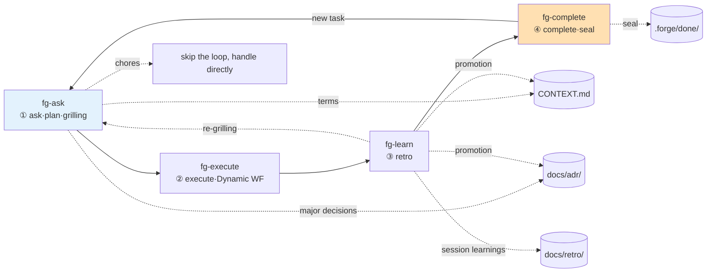

# forge

> A development loop that takes one task through a single cycle of **ask → plan → execute → retro → complete**.
> A loop-style workflow plugin made of four Claude Code skills with the `fg-` prefix.

[한국어](./README.ko.md)

Planning happens as grill-with-docs-style conversational grilling, execution runs as a Claude Code Dynamic Workflow, the retro feeds learnings back into project docs (`CONTEXT.md` · ADRs · retro log), and the complete step seals the task so the same task never runs twice.

## Skill catalog

| Skill | Stage | One-line role | Input | Output | Next |
| --- | --- | --- | --- | --- | --- |
| `fg-ask` | ① Ask·plan | grill-with-docs verbatim — grills the plan against domain, terms, and decisions | User request | `.forge/backlog/<slug>.md` + CONTEXT/ADR | `fg-execute` |
| `fg-execute` | ② Execute | Picks a task from the backlog (menu · Run all) and runs it as a Dynamic Workflow | `.forge/backlog/`, `plan.md` | Results + `.forge/run.md` (or `executed/`) | `fg-learn` |
| `fg-learn` | ③ Retro | Promotes learnings to docs, surfaces the next inquiry | `.forge/run.md`, `plan.md`, `executed/` | `docs/retro/*.md` + promotions | `fg-complete` / `fg-ask` |
| `fg-complete` | ④ Complete | Seals the task, clears active state, blocks re-runs | `.forge/*` | `.forge/done/<date-slug>/` | `fg-ask` / end |

`fg-ask` is the entry point of the loop — it handles both inquiry/triage and grilling (the former `fg-ask`+`fg-plan` merged). It triggers on utterances like "start with forge", "new task", "let's work on this", "refine the plan".

## Overall flow

When one skill finishes, it guides the way to the next (what was done, what comes next, how to start), asks whether to continue right away, and invokes the next skill on the spot if the user agrees. After `fg-complete` seals a task, the loop restarts at `fg-ask` only as a **new task** — the same task never runs again.



## Install

Add the GitHub marketplace, then install the plugin.

```
/plugin marketplace add gyuha/forge
/plugin install forge@forge
```

After installing, the loop starts in a Claude Code session by triggering `fg-ask`, or with an utterance like "start with forge".

## Shared state and directories

State is passed through files so the flow continues even when stages are invoked independently. A lightweight `.forge/` working directory holds it (volatile state, gitignored).

```
repo/
├── CONTEXT.md                 # glossary (persistent)
├── CONTEXT-MAP.md             # only for multi-context repos
├── docs/
│   ├── adr/0001-*.md          # architecture decisions (persistent)
│   └── retro/YYYY-MM-DD-*.md  # retro log (persistent)
└── .forge/                    # loop working state (volatile, gitignored)
    ├── backlog/<slug>.md      # ① fg-ask grilling output — queue of unexecuted plans
    ├── plan.md                # active slot: source of truth for the current cycle (promoted from the backlog by fg-execute)
    ├── run.md                 # ② fg-execute output = plan vs actual
    ├── executed/<slug>/       # awaiting retro after "Run all" (plan+run, no retro yet)
    └── done/                  # ④ fg-complete seal archive
```

- Each skill reads its input from `.forge/` and writes its output to `.forge/`. Even calling `fg-execute` alone finds the backlog and active slot and continues.
- If the backlog has several tasks, `fg-execute` presents the unfinished list as a selection menu (last option: "Run all"). The active slot is always exactly one — one plan.md = one run.md = one seal.
- If an input file is missing, the skill points to the prior step.
- If the active slot, backlog, and awaiting-retro queue are all empty = no work in progress. `fg-execute` does not run on an empty state (re-run guard).

## The two pillars

1. **Grilling (planning) is conversational, outside the Dynamic Workflow.** A Dynamic Workflow cannot take user input mid-run, so question-by-question grilling never goes inside a workflow.
2. **Docs are the loop's fuel, not its by-product.** Terms sharpened in planning become the standard for execution, and retro learnings become the starting point of the next plan.

## Credits

The grilling/documentation pattern of `fg-ask` (including the verbatim original) and `CONTEXT-FORMAT.md`/`ADR-FORMAT.md` are inherited from [grill-with-docs in mattpocock/skills](https://github.com/mattpocock/skills/tree/main/skills/engineering/grill-with-docs).
