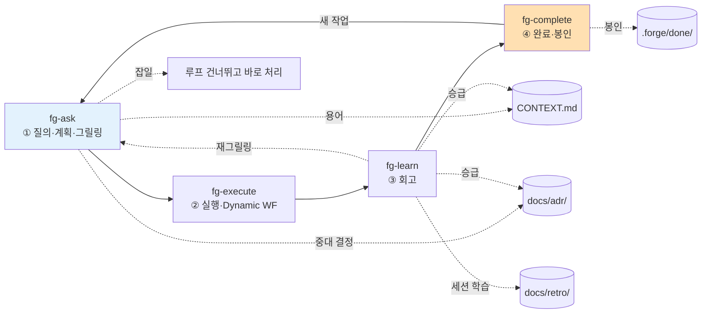

# forge

> 작업 하나를 **질의 → 계획 → 실행 → 회고 → 완료**의 한 바퀴로 돌리는 개발 루프.
> `fg-` 프리픽스를 가진 Claude Code 스킬 4개로 구성된 루프형 워크플로우 플러그인.

계획은 grill-with-docs식 대화형 그릴링으로, 실행은 Claude Code Dynamic Workflow로 수행하고, 회고는 학습을 프로젝트 문서(`CONTEXT.md` · ADR · 회고 로그)에 되돌린 뒤, 완료 단계에서 작업을 봉인해 같은 작업이 두 번 실행되지 않게 한다.

## 스킬 카탈로그

| 스킬 | 단계 | 한 줄 역할 | 입력 | 출력 | 다음 |
| --- | --- | --- | --- | --- | --- |
| `fg-ask` | ① 질의·계획 | grill-with-docs 원문 그대로 — 계획을 도메인·용어·결정에 대고 그릴링 | 사용자 요청 | `.forge/backlog/<slug>.md` + CONTEXT/ADR | `fg-execute` |
| `fg-execute` | ② 실행 | 백로그에서 작업 선택(메뉴·모두 실행) 후 Dynamic Workflow로 실행 | `.forge/backlog/`, `plan.md` | 결과 + `.forge/run.md` (또는 `executed/`) | `fg-learn` |
| `fg-learn` | ③ 회고 | 학습을 문서로 승급, 다음 질의 도출 | `.forge/run.md`, `plan.md`, `executed/` | `docs/retro/*.md` + 승급 | `fg-complete` / `fg-ask` |
| `fg-complete` | ④ 완료 | 작업 봉인·활성 상태 정리·재실행 방지 | `.forge/*` | `.forge/done/<날짜-slug>/` | `fg-ask` / 종료 |

`fg-ask`가 루프의 진입점이다 — 질의·분류와 그릴링을 함께 맡는다(기존 `fg-ask`+`fg-plan` 통합). "forge 시작", "새 작업", "이거 작업하자", "계획 다듬자" 같은 발화에서 트리거된다.

## 전체 흐름

한 스킬이 끝나면 다음 스킬로 가는 길(무엇을 했고, 다음은 무엇이며, 어떻게 시작하는지)을 안내하고, 바로 이어갈지 물어 동의하면 그 자리에서 다음 스킬을 호출한다. 루프는 `fg-complete`가 작업을 봉인한 뒤, **새 작업**으로서만 `fg-ask`에서 다시 시작된다 — 같은 작업을 다시 실행하지 않는다.



## 설치

GitHub 마켓플레이스로 추가한 뒤 플러그인을 설치한다.

```
/plugin marketplace add gyuha/forge
/plugin install forge@forge
```

설치 후 Claude Code 세션에서 `fg-ask`부터 트리거되거나, "forge로 시작" 같은 발화로 루프가 시작된다.

## 공유 상태와 디렉터리

단계를 독립적으로 호출해도 흐름이 이어지도록 상태를 파일로 넘긴다. 가벼운 `.forge/` 작업 디렉터리를 둔다(휘발 상태, gitignore됨).

```
repo/
├── CONTEXT.md                 # 글로서리 (영속)
├── CONTEXT-MAP.md             # 멀티 컨텍스트일 때만
├── docs/
│   ├── adr/0001-*.md          # 아키텍처 결정 (영속)
│   └── retro/YYYY-MM-DD-*.md  # 회고 로그 (영속)
└── .forge/                    # 루프 작업 상태 (휘발, gitignore)
    ├── backlog/<slug>.md      # ① fg-ask 그릴링 산출 — 미실행 plan 대기열
    ├── plan.md                # 활성 슬롯: 지금 도는 한 바퀴의 정답 기준 (fg-execute가 백로그에서 승격)
    ├── run.md                 # ② fg-execute 산출 = 계획 vs 실제
    ├── executed/<slug>/       # "모두 실행" 후 회고 대기 (plan+run, 미회고)
    └── done/                  # ④ fg-complete 봉인 아카이브
```

- 각 스킬은 입력 파일을 `.forge/`에서 읽고 산출을 `.forge/`에 쓴다. `fg-execute`만 따로 불러도 백로그·활성 슬롯을 찾아 이어간다.
- `fg-execute`는 백로그에 작업이 여럿이면 미완료 목록을 선택 메뉴로 제시한다(마지막 옵션 "모두 실행"). 활성 슬롯은 항상 1개 — 한 plan.md = 한 run.md = 한 봉인.
- 입력 파일이 없으면 스킬은 앞 단계를 안내한다.
- 활성 슬롯·백로그·회고 대기열이 모두 비어 있으면 = 진행 중 작업 없음. `fg-execute`는 빈 상태에서 실행하지 않는다(재실행 방지).

## 두 기둥

1. **그릴링(계획)은 Dynamic Workflow 밖의 대화형으로.** Dynamic Workflow는 실행 중 사용자 입력을 못 받으므로, 한 질문씩 주고받는 그릴링을 워크플로우 안에 넣지 않는다.
2. **문서는 산출물이 아니라 루프의 연료.** 계획에서 다듬은 용어가 실행의 기준이 되고, 회고의 학습이 다음 계획의 출발점이 된다.

## 크레딧

`fg-ask`의 그릴링·문서화 패턴(원문 포함)과 `CONTEXT-FORMAT.md`/`ADR-FORMAT.md`는 [mattpocock/skills의 grill-with-docs](https://github.com/mattpocock/skills/tree/main/skills/engineering/grill-with-docs)를 계승했다.
