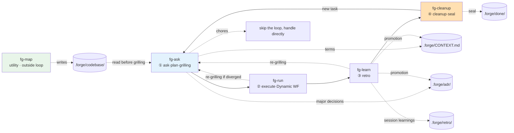

# forge

> A development loop that takes one task through a single cycle of **ask·plan → execute → retro → cleanup**.
> A loop-style workflow plugin built from `fg-`-prefixed Claude Code skills — four that form the loop, plus the `fg-map` utility outside it.

[한국어](./README.ko.md)

Planning happens as grill-with-docs-style conversational grilling, execution runs as a Claude Code Dynamic Workflow, the retro feeds learnings back into project docs (`CONTEXT.md` · ADRs · retro log), and the cleanup step tidies up the cycle's leftovers — seals the task so the same task never runs twice.

## Skill catalog

| Skill | Stage | One-line role | Input | Output | Next |
| --- | --- | --- | --- | --- | --- |
| `fg-ask` | ① Ask·plan | grill-with-docs verbatim — grills the plan against domain, terms, and decisions | User request | `.forge/backlog/<slug>.md` + CONTEXT/ADR | `fg-run` |
| `fg-run` | ② Execute | Runs the plan as a Dynamic Workflow — one unexecuted plan runs immediately (no menu), several show a selection menu (last option "Run all") | `.forge/backlog/`, `plan.md` | Results + `.forge/run.md` + `STATUS.md` (or `executed/`) | `fg-learn` |
| `fg-learn` | ③ Retro | Promotes learnings to docs, surfaces the next inquiry | `.forge/run.md`, `plan.md`, `executed/` | `.forge/retro/*.md` + promotions | `fg-cleanup` (re-grill via `fg-ask` if diverged) |
| `fg-cleanup` | ④ Cleanup | Tidies up the cycle — confirms retro, closes `STATUS.md` to done, archives, clears active state, closes the loop | `.forge/*` | `.forge/done/<date-slug>/` | `fg-ask` / end |
| `fg-map` | Utility (outside the loop) | Maps the codebase with parallel subagents into `.forge/codebase/` so grilling reads a map instead of re-exploring the code (cuts context rot) | Codebase | `.forge/codebase/*.md` (7 docs) | — (consumed by `fg-ask`) |
| `fg-quick` | Lightweight lane (outside the loop) | For trivial tasks — grills lightly, then runs directly with no formal artifacts (no ADR/plan/retro); bails to `fg-ask` if the task turns out non-trivial | User request | one entry in `.forge/quick/LOG.md` | — (self-contained) |

`fg-ask` is the entry point of the loop — it handles both inquiry/triage and grilling (the former separate `fg-plan` step is folded into `fg-ask`). It triggers on utterances like "start with forge", "new task", "let's work on this", "refine the plan". `fg-cleanup` triggers on "forge cleanup", "tidy up this task", "clean this up" (and still recognizes the legacy "forge complete" as an alias). `fg-map` is **not a loop stage** — it is an on-demand utility you run when the codebase has changed enough that the map is stale; it triggers on "map the codebase", "analyze the codebase". `fg-quick` is **also outside the loop** — a lightweight lane for trivial tasks (typo fixes, small renames, version bumps): it still grills, but lightly, then runs the change directly with no formal artifacts (no ADR/plan/retro), recording one line to `.forge/quick/LOG.md`. If the task turns out non-trivial mid-grill, it bails to `fg-ask` (the full loop). It triggers on "forge quick", "quick task", "이거 빨리 해줘".

## Overall flow

When one skill finishes, it guides the way to the next (what was done, what comes next, how to start), asks whether to continue right away, and invokes the next skill on the spot if the user agrees. After `fg-cleanup` seals a task, the loop restarts at `fg-ask` only as a **new task** — the same task never runs again.

```
fg-ask ───▶ fg-run ───▶ fg-learn ───▶ fg-cleanup
① ask/plan      ② execute       ③ retro       ④ cleanup
(grilling·      (Dynamic WF)    (reflect      (seal·
 conversational)                 into docs)    re-run guard)
```



## Install

In a Claude Code session, add the GitHub marketplace, then install the plugin.

```
/plugin marketplace add gyuha/forge
/plugin install forge@forge
```

To install from a local clone instead (e.g. while developing), pass the path to the repo root:

```
/plugin marketplace add /path/to/forge
/plugin install forge@forge
```

Notes:

- The GitHub install pulls the repo's default branch (`main`) — to test a change via install, it must be pushed to `main` first.
- Skills are auto-discovered from `skills/<name>/SKILL.md`; no extra configuration is needed.
- To update later, run `/plugin marketplace update forge`, and to remove, `/plugin uninstall forge@forge`.

After installing, the loop starts in a Claude Code session by triggering `fg-ask`, or with an utterance like "start with forge".

## Shared state and directories

State is passed through files so the flow continues even when stages are invoked independently. A single `.forge/` directory holds everything — both the volatile loop state and the git-tracked permanent docs. The `.gitignore` excludes `.forge/` by default and whitelists only the permanent docs, so location is `.forge/` for all of it and the distinction is whether git tracks it.

```
repo/
├── CONTEXT-MAP.md             # only for multi-context repos (stays at root)
└── .forge/                    # all loop documents live here
    │                          # ── permanent docs (git-tracked via whitelist) ──
    ├── CONTEXT.md             # glossary (single-context)
    ├── adr/0001-*.md          # architecture decisions
    ├── retro/YYYY-MM-DD-*.md  # retro log
    ├── codebase/*.md          # codebase map from fg-map
    │                          # ── volatile loop state (gitignored) ──
    ├── backlog/<slug>.md      # ① fg-ask grilling output — queue of unexecuted plans
    ├── plan.md                # active slot: source of truth for the current cycle (promoted from the backlog by fg-run)
    ├── run.md                 # ② fg-run output = plan vs actual
    ├── STATUS.md              # active slot: fg-run writes this on finish (status: executed, retro: pending) — retro field later becomes a path or "skipped"
    ├── executed/<slug>/       # awaiting retro after "Run all" (plan+run+STATUS, no retro yet)
    └── done/<date-slug>/      # ④ fg-cleanup seal archive (plan+run+STATUS, status: done)
```

`.gitignore` pattern:

```gitignore
.forge/*
!.forge/CONTEXT.md
!.forge/adr/
!.forge/retro/
!.forge/codebase/
```

- Each skill reads its input from `.forge/` and writes its output to `.forge/`. Even calling `fg-run` alone finds the backlog and active slot and continues.
- If the backlog has several tasks, `fg-run` presents the unfinished list as a selection menu (last option: "Run all"). The active slot is always exactly one — one plan.md = one run.md = one seal.
- If an input file is missing, the skill points to the prior step.
- If the active slot, backlog, and awaiting-retro queue are all empty = no work in progress. `fg-run` does not run on an empty state (re-run guard). Completion is determined by `done/*/STATUS.md` (status: done).
- The retro can be **skipped** for a trivial, low-divergence task. fg-run offers it as an explicit choice at the handoff — never automatic, and never offered when the result diverged significantly from the plan (that is exactly when there is something to learn). Skipping records `retro: skipped` in STATUS.md, which fg-cleanup accepts as satisfying its no-seal-without-retro guard; no retro file is written. Retro stays the default ([ADR-0002](./.forge/adr/0002-optional-retro-skip.md)).

## The two pillars

1. **Grilling (planning) is conversational, outside the Dynamic Workflow.** A Dynamic Workflow cannot take user input mid-run, so question-by-question grilling never goes inside a workflow.
2. **Docs are the loop's fuel, not its by-product.** Terms sharpened in planning become the standard for execution, and retro learnings become the starting point of the next plan.

## Credits

The grilling/documentation pattern of `fg-ask` (including the verbatim original) and `CONTEXT-FORMAT.md`/`ADR-FORMAT.md` are inherited from [grill-with-docs in mattpocock/skills](https://github.com/mattpocock/skills/tree/main/skills/engineering/grill-with-docs).
