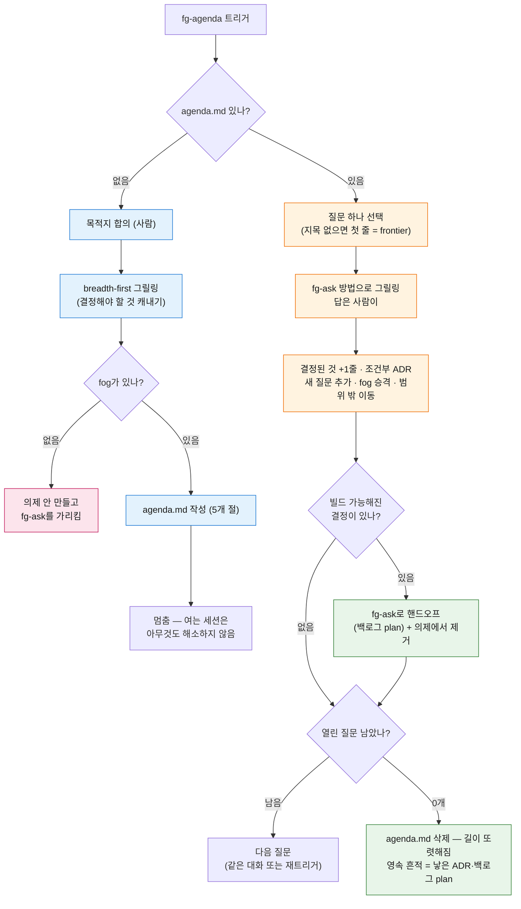

# fg-agenda 사용 가이드 — 결정 대기열

> `fg-agenda`의 **사용방법과 사용 흐름**을 담은 문서. 개념·설계 근거는 [스킬 상세](skills.md#fg-agenda)와 ADR [`260805-201313`](https://github.com/gyuha/forge/blob/main/.forge/adr/260805-201313-fg-agenda-decision-queue.md)을, `.forge/` 상태 전반은 [상태 계약](state-contract.md)을 보라.

## 무엇인가

`fg-agenda`는 **아직 내리지 않은 결정**이 사는 자리다. forge 루프(fg-ask → fg-run → fg-learn → fg-done)의 산출물은 전부 *빌드* 산출물이고 ADR은 *이미 내려진* 결정을 기록하므로, 안개 속의 큰 작업은 억지로 완결된 계획이 되거나 결정이 대화 속에 흩어져 사라진다. `fg-agenda`는 그 사이를 `.forge/agenda.md` **한 파일**로 메운다 — 목적지와 열린 질문들을 담아 두고, 질문을 하나씩 해소하다가, 열린 질문이 0이 되면 파일이 스스로 삭제된다.

핵심 규칙은 하나다: **결정해야 할 것을 캐내는 것은 에이전트, 답은 전부 사람이 한다.** 에이전트가 자기 질문에 스스로 답하는 순간 "결정된 것"은 결정이 아니라 추측이 된다(기둥 1).

- 활성 의제는 **1개** (활성 슬롯 1개 규율과 같은 모양). 두 번째 목적지는 두 번째 의제다 — 지금 것을 끝내거나 버린 뒤에.
- 위치는 해석된 forge 루트 기준 `.forge/agenda.md` (브랜치별 — `loop.md`와 같은 취급).
- 루프 밖 유틸리티다. `fg-next`/`fg-status`의 다음 단계 사슬에 편입되지 않는다(fg-status는 의제가 있으면 한 줄 보고만).

## 언제 쓰나 — fg-ask와의 갈림길

기본 진입점은 언제나 **fg-ask**다. `fg-agenda`는 작업이 **흐릿할 때만** 앞에 끼는 선택 단계다.

판별 테스트는 "지금 답할 수 있나"가 아니라 **"내가 뭘 결정해야 하는지, 그 질문을 정확히 진술할 수 있나"**다:

| 상태 | 가는 곳 |
| --- | --- |
| 무엇을 만들지 알고, 그릴링하면 plan이 나올 수 있다 | **fg-ask** 바로 |
| 목적지는 어렴풋한데 결정 안 된 것이 많고, 질문조차 또렷이 진술 못 하는 부분(fog)이 있다 | **fg-agenda** 먼저 |

작업 종류별 진입 흐름:

```
또렷한 작업:  fg-ask → fg-run → fg-learn → fg-done
흐릿한 작업:  fg-agenda(질문 적재 → 하나씩 결정) → 빌드 가능해진 것부터 fg-ask → 루프 진입
```

주의: 의제가 다 해소되기를 기다렸다가 한꺼번에 fg-ask로 가는 게 아니다. **빌드 가능해진 줄부터 그때그때** fg-ask로 빠져나간다(아래 "working 모드" 6단계).

## 트리거

| 하고 싶은 것 | 트리거 |
| --- | --- |
| 의제 열기 / 다음 질문 해소 | `/forge:fg-agenda`, 또는 "의제", "결정 대기열", "뭘 결정해야 하는지 정리해줘", "어디서 시작할지 모르겠다" |
| 특정 질문 해소 | `fg-agenda` + 질문 지목 (지목 없으면 열린 질문 첫 줄 = frontier) |
| 멈춘 의제 폐기 | `fg-drop` (fg-agenda의 소관 아님) |

모드는 인자가 아니라 **`.forge/agenda.md`의 존재 여부**로 갈린다 — 없으면 열기(open), 있으면 해소(working).

## 사용 흐름

### 열기(open) — 의제가 없을 때

느슨한 아이디어를 들고 `fg-agenda`를 트리거하면, 이 세션은 결정을 **캐내기만** 하고 아무것도 해소하지 않는다:

1. **목적지를 사람과 먼저 합의한다.** 목적지가 범위를 고정하고, 이후 모든 판단("이건 범위 밖인가?", "이건 fog인가 질문인가?")의 잣대가 된다.
2. **breadth-first로 그릴링한다.** 한 갈래를 깊이 파지 않고 공간 전체에 퍼진다 — 목표는 어느 질문의 *답*이 아니라 *무엇을 결정해야 하는지*의 커버리지다.
3. **안개가 없으면 의제를 만들지 않는다.** 캐낸 것이 전부 지금 답할 수 있는 것뿐이면 길은 이미 또렷한 것이다 — 그렇게 말하고 fg-ask를 가리킨다. fog 없는 의제는 순수한 오버헤드다.
4. `agenda.md`를 5개 절 형식으로 작성한다.
5. **멈춘다.** 여는 세션에서 방금 찾은 질문에 답하러 미끄러지지 않는다.

### 해소(working) — 의제가 있을 때

`fg-agenda`를 다시 트리거할 때마다 열린 질문을 **한 번에 하나씩** 해소한다:

1. 의제를 읽고 `## 목적지`에 먼저 정렬한다.
2. **질문 하나를 고른다.** 사용자가 지목했으면 그것, 아니면 열린 질문의 **첫 줄**(목록이 "지금 답할 수 있는 것 우선" 순서라 첫 줄이 곧 frontier — 별도 의존 관리가 필요 없다).
3. **fg-ask의 그릴링 방법으로 해소한다. 답은 사람이 한다.**
4. **기록한다**: `## 결정된 것`에 한 줄 추가, 열린 질문에서 그 줄 삭제. 세 조건 게이트(되돌리기 어렵다 · 맥락 없이 의아하다 · 진짜 트레이드오프)를 넘으면 ADR도 작성.
5. **의제를 갱신한다**: 답이 새로 드러낸 질문 추가, 또렷해진 fog를 열린 질문으로 승격, 답이 목적지 밖으로 밀어낸 것은 범위 밖으로 이동.
6. **결정으로 빌드 작업이 특정 가능해졌으면 그것은 백로그 plan이다** — fg-ask에 넘겨 그릴링·적재하고, 그 줄은 의제에서 떨어뜨린다. 의제는 빌드 작업을 싣지 않는다.

전체 흐름(두 모드 + 종료):



파랑 = 열기(open) 세션, 주황 = 해소(working) 세션, 초록 = 루프로 나가는 출구, 분홍 = 의제 없이 끝나는 경로.

## agenda.md 형식 — 5개 절

canonical 절 이름은 영문이지만 실제 파일은 사용자 언어로 렌더된다. 한국어 세션의 예:

```md
# AGENDA — 알림 시스템을 자체 구축에서 SaaS로 이관

started: 2026-08-15

## 목적지
사내 알림 발송이 전부 새 SaaS를 경유하고, 기존 발송 코드가 제거된 상태.

## 결정된 것
- SaaS 후보 → OneSignal (셀프호스팅 요구 없음 확인) — ADR 260815-...

## 열린 질문
- 기존 큐에 쌓인 미발송 알림의 이관 정책은? (drain 후 전환 vs 이중 발송)
- 수신 동의 데이터의 마이그레이션 책임은 어느 팀인가?

## 아직 또렷하지 않은 것
- 온프레미스 고객사 배포판에서의 처리 — 무엇이 문제인지 아직 질문으로 진술 못 함

## 범위 밖
- 알림 템플릿 에디터 개편 — 목적지(이관)와 무관, 별도 작업
```

- **`## 열린 질문` vs `## 아직 또렷하지 않은 것`(fog)의 경계**: 지금 질문을 **정확히 진술할 수 있으면** 열린 질문이다 — *답할 수 있는지*는 기준이 아니다(답 못 하는 질문은 목록 아래로 밀릴 뿐, 쫓겨나지 않는다). 진술조차 안 되면 fog다. fog는 범위 밖이 아니라 **범위 안의 아직 안 또렷한 것**이다.
- `## 열린 질문`은 **지금 답할 수 있는 것 우선** 순서로 유지한다. 그래서 첫 줄이 곧 다음에 할 일이고, 의존 엣지·blocking 표기가 필요 없다.
- `## 범위 밖`은 의식적으로 목적지 밖으로 밀어낸 것 + 이유다. 승격되지 않는다.
- 해소기(resolver)는 기본이 fg-ask이며, 다른 것이 필요한 줄에만 그 줄에 이름을 적는다(예: fg-visual로 시각 비교). 티켓 유형 분류는 없다.

## 자율성 경계

| 에이전트가 스스로 하는 것 | 사람이 하는 것 |
| --- | --- |
| 열린 결정 캐내기 (breadth-first 그릴링) | **목적지 명명** |
| fog ↔ 질문 구분 (진술 가능성 테스트) | **모든 답** |
| 순서 정하기 — 답할 수 있는 것 우선 | |
| 지목 없을 때 다음 질문 선택 | |
| 또렷해진 fog 승격 · 범위 밖 판정 | |

에이전트는 **절대 자기 질문에 스스로 답하지 않는다.** 이 줄이 무너지면 결정 대기열이 아니라 에이전트의 추측이 결정의 옷을 입은 것이다.

## 다른 스킬과의 관계

- **fg-ask** — 의제 질문을 해소하는 *방법*이 fg-ask의 그릴링이다(단일 정의 참조, 복붙 아님). 출력만 다르다: fg-ask의 그릴링은 백로그 plan으로 끝나고, 의제 질문의 그릴링은 `## 결정된 것` 한 줄 + 조건부 ADR로 끝난다. 그릴링 중 오히려 빌드 가능함이 드러나면 그 시점이 바로 fg-ask로의 핸드오프 지점이다.
- **fg-loop** — 거울상이다. `loop.md`는 **기계 검증 가능한** 정지 조건 + **무인** 주행, `agenda.md`는 **판단** 정지 조건 + **사람이 계속 개입**하는 주행. 같은 모양의 계약 파일, 반대 성질의 멈춤.
- **fg-status / fg-next** — 다음 단계 사슬에 편입되지 않는다. fg-status는 의제가 있으면 한 줄 보고만 하고, fg-next는 의제를 주행하지 않는다.
- **fg-drop** — 더 갈 뜻이 없는 의제를 버리는 곳. fg-agenda 자신은 열린 질문이 0일 때만 파일을 지운다.

## 하지 않는 것

- **빌드 작업을 싣지 않는다.** 빌드 가능해진 줄은 즉시 의제를 떠나 백로그 plan이 된다 — 이 선이 없으면 의제가 두 번째 백로그가 되어 fg-next·fg-run이 무엇을 봐야 하는지 모호해진다.
- **아카이브를 만들지 않는다.** 열린 질문 0 = 삭제. 영속 흔적은 의제가 낳은 ADR과 백로그 plan이다.
- **의존 엣지·blocking·티켓 유형 분류를 만들지 않는다.** 파일 하나를 위에서 아래로 읽는 것이 곧 frontier다.
- **루프 상태를 건드리지 않는다.** `plan.md`·`run.md`·`STATUS.md`·`backlog/`·`executed/`·`done/`에 일절 쓰지 않는다. 백로그 쓰기는 fg-ask의 소유다.
