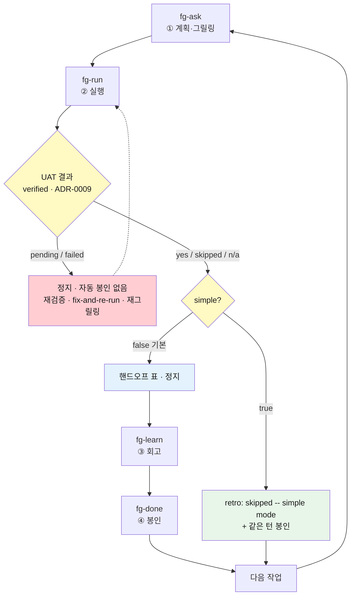

# 설정 모드 — `simple` 자동 봉인

> `.forge/config.json`이 forge의 **동작 방식**을 어떻게 바꾸는지 담은 문서. 지금은 신설 키 `simple`을 상세히 다룬다. 설정 진입점(`fg-config`)의 사용법과 나머지 키의 개요는 [스킬 상세](skills.md#fg-config)를, `.forge/` 상태 전반은 [상태 계약](state-contract.md)을 보라.

## 무엇인가

forge의 프로젝트 설정은 `.forge/config.json` **한 파일**에 여섯 키로 산다. 진입점은 `fg-config` 스킬이다 — `fg-config`(무인자)는 전체 설정 표와 변경 메뉴를, `fg-config <키> <값>`은 한 키를 바로 설정한다. 파일을 직접 편집해도 된다(스킬은 편의 표면이지 잠금이 아니다).

이 파일은 **브랜치 해석의 전역 예외**다 — 어느 브랜치에 있든 항상 최상위 `.forge/config.json`을 읽고 쓴다(`defaultBranch` 자체가 여기 살기 때문 — [ADR-0011](https://github.com/gyuha/forge/blob/main/.forge/adr/0011-branch-isolated-forge-root.md)).

```
/forge:fg-config                 # 전체 설정 표 + 변경 메뉴
/forge:fg-config simple true     # 자동 봉인 모드 켜기
/forge:fg-config simple false    # 끄기 (기본값)
```

셸 명령이 아니라 Claude Code의 슬래시 명령이다(Codex에서는 `$fg-config`). "simple 모드 켜줘" 같은 자연어로도 트리거된다 — 호출 표기는 [Codex 가이드](codex.md)를 보라.

**이 명령은 내 세션이 아니라 커밋되는 파일을 바꾼다** — `config.json`은 git 추적되는 팀 공유 기본값이라, 켜고 끄면 팀원의 흐름도 함께 바뀐다.

## `simple` — 무엇을 바꾸나

**`simple`은 단계를 생략하는 모드가 아니라 자동으로 봉인하는 모드다.** 이름 때문에 "회고와 완료를 건너뛴다"로 읽히기 쉬운데, 문자 그대로의 생략은 forge에서 성립하지 않는다 — **봉인**(fg-done이 작업을 `.forge/done/`으로 아카이브하고 활성 슬롯을 비우는 것)이 있어야 다음 작업이 승격되므로, 봉인을 빼면 다음 `fg-run`이 재실행 가드에 걸려 아무것도 못 한다.

그래서 `simple: true`가 실제로 하는 일은 **fg-run의 작업 종료 지점에서 남은 두 단계를 자동으로 잇는 것**이다:

1. UAT(**검증** — 계획의 목표·완료 정의에 대고 결과가 실제로 동작하는지 확인)를 수행하고 `verified:`를 기록한다.
2. 회고를 **무조건** 건너뛰고 `retro: skipped (simple mode)`를 기록한다(계획↔실제 차이가 커도 마찬가지 — `fg-next all`·`fg-loop`과 같은 완화 계열).
3. 같은 턴에 봉인 스크립트를 호출한다.

사용자 체감은 `fg-ask → fg-run` 두 단계지만, 내부적으로는 검증과 봉인이 전부 돈다. **검증 게이트는 불가침이다** — `verified:`가 `pending`(검증 안 됨)이거나 `failed`(검증했는데 깨짐)이면 **아무것도 자동 봉인하지 않고** fg-run이 종전대로 멈춰 보고한다([ADR-0009](https://github.com/gyuha/forge/blob/main/.forge/adr/0009-verification-gate-before-seal.md)).

근거: ADR [`260905-212045`](https://github.com/gyuha/forge/blob/main/.forge/adr/260905-212045-fg-config-simple-mode.md).

## 흐름 비교 — fg-run이 끝난 다음

바뀌는 것은 **fg-run의 작업 종료 지점 한 곳**뿐이다. 검증 결과(`verified:`)별로 대조하면 이렇다.

| UAT 결과 (`verified:`) | `simple: false` (기본) | `simple: true` |
| --- | --- | --- |
| `yes` / `skipped` / `n/a` (봉인 가능) | 핸드오프 표를 내고 **멈춘다**. 사람이 `fg-learn`(회고) → `fg-done`(봉인)을 각각 트리거한다. 저-divergence면 "회고 건너뛰고 봉인"이 대안으로 제시된다 | `retro: skipped (simple mode)` 기록 → **같은 턴에 봉인**까지 자동. 한 줄 보고 후 다음 작업을 가리킨다 |
| `pending` (검증 미완) | 멈추고 검증 전용 재진입을 안내(재실행 없음) | **동일 — 자동 봉인 없음** |
| `failed` (검증했으나 깨짐) | 멈추고 fix-and-re-run 또는 `fg-ask` 재그릴링으로 라우팅 | **동일 — 자동 봉인 없음** |

사람 트리거 횟수로 보면: 봉인 가능한 결과일 때만 **2회(`fg-learn`+`fg-done`) → 0회**로 줄고, 나머지 두 행은 완전히 동일하다.

대가는 셋이다. 편의만 보고 켜면 셋 다 조용히 따라온다.

1. **학습이 영속 문서로 승급되지 않는다.** 회고가 무조건 건너뛰어지므로, 학습은 아카이브된 `run.md`(계획↔실제 차이 기록)에 남을 뿐 `CONTEXT.md`·`.forge/adr/`로 올라가지 않는다. `.forge/done/*/STATUS.md`에 `retro: skipped (simple mode)`로 구분돼 나중에 되짚을 수는 있는데, **평범한 `/forge:fg-learn`으로는 안 된다** — 봉인된 작업은 기본 후보에서 제외되고 fg-learn의 **일괄 승급 모드**를 명시적으로 요청해야 닿는다.
2. **오판정 봉인을 되돌릴 길이 없다.** UAT(검증) 판정 자체가 틀린 채로 — 예컨대 실제로는 docs-only가 아닌데 `n/a`로 확인한 채로 — 봉인되면, `status: done`을 되돌리는 forge 스킬이 없다(`fg-drop`도 `done/`은 손대지 않는다). `simple`이 없앤 회고·봉인 트리거 2회는 마찰이기도 하지만 **오판을 잡을 재고의 관문**이기도 했다.
3. **봉인 전 적대적 리뷰를 걸 수 없다.** `fg-adversarial-review`(결과가 틀렸다고 가정하고 공격하는 선택적 유틸리티)는 **활성 슬롯만** 대상으로 하는데, `simple`은 UAT 통과 즉시 같은 턴에 봉인해 활성 슬롯을 비운다 — 리뷰를 요청할 기회가 오기 전에 작업이 `done/`으로 넘어가고, 봉인된 작업을 되돌려 리뷰하는 경로는 없다. 봉인 전 리뷰를 관행으로 쓰는 팀에게는 그 관행이 조용히 사라진다는 뜻이다.

## 경로별 영향

`simple`이 건드리는 것은 **대화형 경로**(`fg-run`·`fg-next`)다. 무인 주행(`fg-next all`·`fg-loop`)은 이미 회고를 건너뛰고 작업마다 봉인하므로 영향권 밖이고, `fg-quick`은 애초에 루프 밖이라 무관하다 — **어느 경로군이 영향권 밖인지**가 이 표의 핵심이다.

| 실행 경로 | `simple: true`의 효과 |
| --- | --- |
| `fg-run` (단일 작업) | **바뀐다** — UAT 후 회고 skip + 같은 턴 봉인 |
| `fg-run` → "모두 실행"(Run all) | **바뀐다** — 작업을 `executed/`에 파킹하는 대신 작업마다 즉시 봉인(`failed`는 종전대로 활성 슬롯에 잔류) |
| `fg-next` (한 단계) | **도출된 단계에 따라 다르다** — `fg-run`이 도출되면(백로그 실행·검증 재진입) 그 안에서 simple이 적용돼, UAT가 봉인 가능(`yes`/`skipped`/`n/a`)으로 나올 때 **확인 게이트 없이 그 한 번의 호출로 봉인까지** 끝난다. UAT가 다시 `pending`/`failed`면 simple이 없을 때와 똑같이 멈추고, `verified: failed`는 fg-next가 먼저 fix-and-re-run/재그릴링 **fork를 사람에게 묻는다**. `fg-learn`이 도출되면 기존 회고→봉인 자동연결(ADR-0026)과 결과가 같아 차이 없다. 호출 전에 어느 쪽인지 알고 싶으면 `fg-status`로 먼저 확인하라 |
| `fg-next all` (무인 주행) | 영향 없음 — 이미 회고 자동 skip + 작업당 봉인 |
| `fg-loop` (goal 주도 루프) | 영향 없음 — 이미 회고 자동 skip + 작업당 봉인 |
| `fg-quick` (경량 차선) | 영향 없음 — 루프 밖이라 활성 슬롯·봉인 계약과 애초에 격리돼 있다 |
| `fg-status` | 상태 보고에 "자동 봉인 모드가 켜져 있다"는 한 줄이 추가된다(켜져 있으면 회고 대기 항목이 드물어야 정상이므로) |

## 흐름도

분기점은 **한 곳**이다 — UAT 결과가 먼저 갈리고, 봉인 가능할 때만 `simple` 여부로 다시 갈린다. 즉 `simple`은 검증 게이트를 우회하는 것이 아니라 그 **뒤**에 붙는다.



## 언제 켜고 언제 끄나

| 상황 | 권장 |
| --- | --- |
| 작업 하나하나가 작고 예측 가능하며, 배울 게 거의 없다 | **켠다** — 회고·봉인 트리거 2회가 순수 마찰이다 |
| 익숙한 코드베이스에서 비슷한 작업을 연달아 친다 | **켠다** |
| 새 도메인·낯선 스택이라 계획이 자주 어긋난다 | **끈다** — 회고가 다음 계획의 연료이고, divergence가 클수록 배울 게 많다 |
| 팀이 `.forge/adr/`·`CONTEXT.md`를 실제로 쌓아가는 중이다 | **끈다** — 승급 경로가 회고뿐이다 |
| 봉인 전 `fg-adversarial-review`를 관행으로 돌린다 | **끈다** — 위 대가 3처럼, 리뷰를 요청할 활성 슬롯 자체가 남지 않는다 |
| 무인 주행(`fg-next all`·`fg-loop`)만 쓴다 | 무관 — 그쪽은 이미 자동 봉인이다 |

위에서 말했듯 `config.json`은 git 추적되는 **팀 공유 기본값**이다 — 이 표의 권고는 개인이 아니라 팀 단위로 읽어야 한다.

## 나머지 다섯 키

이 문서는 지금 `simple`만 상세히 다룬다. 나머지는 [스킬 상세 — fg-config](skills.md#fg-config)에 설명이 있다.

| 키 | 타입 / 기본값 | 한 줄 요약 |
| --- | --- | --- |
| `eco` | boolean / `false` | 위임 서브에이전트를 sonnet으로 캡 + 코드 단순성·간결 출력 규율 + 작업 종료 요약 표 |
| `tdd` | boolean / `false` | fg-ask가 작업마다 "TDD로?"를 물을 때의 기본 답(계획의 marker가 켜지면 fg-run이 test-first) |
| `driveCommit` | **엄격 불리언** / `false` | 무인 주행이 작업을 봉인할 때마다 로컬 커밋(push 없음, 롤백 지점용) |
| `driveCommitMessage` | string / 없음 | 그 커밋 메시지 템플릿. 치환자는 `{title}`·`{slug}`·`{task}` 셋뿐 |
| `defaultBranch` | string / `main` | forge 루트가 최상위 `.forge/`인 브랜치(그 외는 `.forge/branch/<브랜치>/`) |
