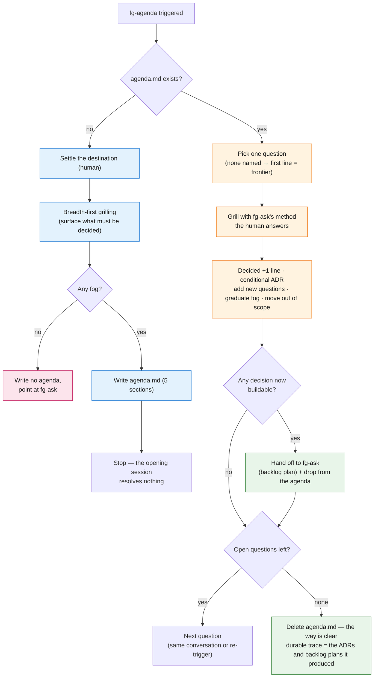

# fg-agenda usage guide — the decision queue

> How to **use** `fg-agenda` and how a session flows. For the concept and the design rationale see the [skill detail](skills.md#fg-agenda) and ADR [`260805-201313`](https://github.com/gyuha/forge/blob/main/.forge/adr/260805-201313-fg-agenda-decision-queue.md); for `.forge/` state in general see the [state contract](state-contract.md).

## What it is

`fg-agenda` is the place where **a decision not yet made** lives. Everything the forge loop (fg-ask → fg-run → fg-learn → fg-done) produces is a *build* artifact, and an ADR records a decision *already made* — so a large piece of work that is still in fog either gets forced into a prematurely-complete plan or its decisions scatter across conversation and vanish. `fg-agenda` fills that gap with **a single file**, `.forge/agenda.md`: it holds the destination and the open questions, you resolve them one at a time, and when no open question is left the file deletes itself.

There is one core rule: **the agent surfaces what must be decided; the human gives every answer.** The moment the agent answers its own question, what sits under "Decided" is no longer a decision but a guess (pillar #1).

- **One active agenda at a time** (the same shape as the one-active-slot discipline). A second destination is a second agenda — finish or drop this one first.
- Its location is `.forge/agenda.md` relative to the resolved forge root (branch-aware — treated like `loop.md`).
- It is a utility outside the loop. It is not part of the `fg-next` / `fg-status` next-step chain (fg-status only reports a present agenda in one line).

## When to use it — the fork with fg-ask

The default entry point is always **fg-ask**. `fg-agenda` is an optional stage that goes in front **only when the work is foggy**.

The test is not "can I answer this now" but **"can I state precisely what I must decide?"**:

| Where you are | Where to go |
| --- | --- |
| You know what to build, and grilling can produce a plan | straight to **fg-ask** |
| The destination is vague, a lot is undecided, and some parts can't even be phrased as a question (fog) | **fg-agenda** first |

Entry flow by kind of work:

```
Sharp work:  fg-ask → fg-run → fg-learn → fg-done
Foggy work:  fg-agenda (load the questions → decide one at a time) → fg-ask as soon as something is buildable → into the loop
```

Note: you do not wait for the whole agenda to be resolved and then go to fg-ask all at once. **Each line leaves for fg-ask the moment it becomes buildable** (step 6 of "working mode" below).

## Triggers

| What you want | Trigger |
| --- | --- |
| Open an agenda / resolve the next question | `/forge:fg-agenda`, or "agenda", "decision queue", "sort out what I need to decide", "I don't know where to start" |
| Resolve a specific question | `fg-agenda` + name the question (if none is named, the first line of the open questions = the frontier) |
| Drop a stalled agenda | `fg-drop` (not fg-agenda's job) |

The mode is decided not by an argument but by **whether `.forge/agenda.md` exists** — absent means opening (open), present means resolving (working).

## How it flows

### Opening an agenda — when there is none

Trigger `fg-agenda` with a loose idea and this session only **surfaces** decisions; it resolves none of them:

1. **Settle the destination with the human first.** The destination fixes the scope and becomes the yardstick for every later judgment ("is this out of scope?", "is this fog or a question?").
2. **Grill breadth-first.** Don't go deep on one thread — fan out across the whole space. The goal is coverage of *what must be decided*, not the *answer* to any one question.
3. **If no fog surfaces, don't create an agenda.** If everything surfaced is answerable right now, the way is already clear — say so and point at fg-ask. An agenda with no fog in it is pure overhead.
4. Write `agenda.md` in the five-section format.
5. **Stop.** The opening session does not slide into answering the questions it just found.

### Working the agenda — when one exists

Every time you trigger `fg-agenda` again, it resolves open questions **one at a time**:

1. Read the agenda and orient to `## Destination` first.
2. **Choose one question.** The one the user named, or else the **first line** of the open questions (the list is kept in answerable-now-first order, so the top line *is* the frontier — no separate dependency bookkeeping needed).
3. **Resolve it with fg-ask's grilling method. The human answers.**
4. **Record it**: add one line under `## Decided` and delete that line from the open questions. If it clears the three-condition gate (hard to reverse · puzzling without context · a real tradeoff), write an ADR too.
5. **Update the agenda**: add questions the answer newly surfaced, graduate fog that just became sharp into the open questions, and move anything the answer pushed past the destination into out of scope.
6. **When a decision makes a build task specifiable, that is a backlog plan** — hand it to fg-ask to grill and load, and drop the line from the agenda. The agenda does not carry build work.

The whole flow (both modes + the exit):



Blue = the opening session, orange = the working session, green = the exits into the loop, pink = the path that ends with no agenda.

## The agenda.md format — five sections

The canonical section names are English, but the actual file is rendered in the user's language. An example from an English session:

```md
# AGENDA — move notifications from in-house to a SaaS

started: 2026-08-15

## Destination
Every internal notification goes through the new SaaS, and the old sending code is gone.

## Decided
- SaaS candidate → OneSignal (confirmed no self-hosting requirement) — ADR 260815-...

## Open questions
- What is the migration policy for unsent notifications already queued? (drain then switch vs. dual-send)
- Which team owns migrating the opt-in consent data?

## Not yet sharp
- Handling in the on-premise customer distribution — can't yet phrase what the problem is as a question

## Out of scope
- Reworking the notification template editor — unrelated to the destination (the migration), separate work
```

- **The line between `## Open questions` and `## Not yet sharp` (fog)**: if you **can phrase the question precisely now**, it is an open question — *whether you can answer it* is not the test (an unanswerable question just sinks down the list, it is not thrown out). If you can't even phrase it, it is fog. Fog is not out of scope; it is **in scope but not yet sharp**.
- `## Open questions` is kept in **answerable-now-first** order. That is why the top line *is* the next thing to do, and why no dependency edges or blocking markers are needed.
- `## Out of scope` is what you consciously ruled past the destination, plus why. It never graduates.
- The default resolver is fg-ask; name a different one on the line only when that line needs it (e.g. fg-visual for a visual comparison). There is no ticket-type taxonomy.

## Autonomy boundary

| The agent does this on its own | The human does this |
| --- | --- |
| Surfacing the open decisions (breadth-first grilling) | **Naming the destination** |
| Telling fog from a question (the phraseability test) | **Every answer** |
| Ordering — answerable-now first | |
| Picking the next question when none was named | |
| Graduating sharpened fog · ruling items out of scope | |

The agent **never answers its own question.** Once that line falls, it is not a decision queue — it is the agent's guesses wearing a decision's clothes.

## How it relates to other skills

- **fg-ask** — fg-ask's grilling is the *method* by which an agenda question is resolved (used by reference, never copied). Only the output differs: fg-ask's grilling ends in a backlog plan, while an agenda question's grilling ends in one line under `## Decided` plus a conditional ADR. If the grilling instead reveals the thing is buildable, that is exactly the handoff point to fg-ask.
- **fg-loop** — the mirror image. `loop.md` pins a **machine-verifiable** stop condition and drives **unattended**; `agenda.md` pins a **judgment** stop condition and keeps **the human in the loop** throughout. Same shape of contract file, opposite kind of stopping.
- **fg-status / fg-next** — not part of the next-step chain. fg-status reports a present agenda in one line and nothing more, and fg-next never drives an agenda.
- **fg-drop** — where an agenda you no longer intend to pursue goes. fg-agenda itself deletes the file only when there are zero open questions.

## What it doesn't do

- **It doesn't carry build work.** A line that becomes buildable leaves the agenda immediately and becomes a backlog plan — without that line the agenda turns into a second backlog, and then fg-next / fg-run no longer know what to look at.
- **It doesn't make an archive.** Zero open questions = delete. The durable trace is the ADRs and backlog plans the agenda produced.
- **It doesn't invent dependency edges, blocking, or a ticket-type taxonomy.** Reading one file top to bottom *is* the frontier.
- **It doesn't touch loop state.** It never writes to `plan.md`, `run.md`, `STATUS.md`, `backlog/`, `executed/`, or `done/`. Backlog writes belong to fg-ask.
