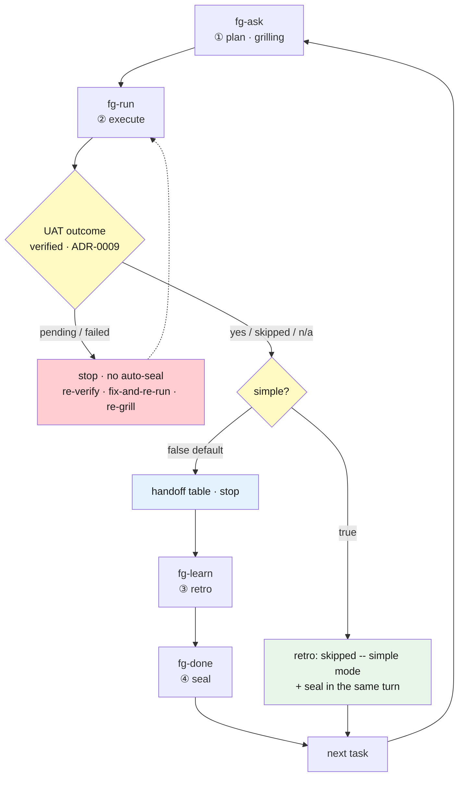

# Config modes — `simple` auto-seal

> How `.forge/config.json` changes the way forge **behaves**. For now this page covers the new `simple` key in detail. For the settings entry point (`fg-config`) and an overview of the other keys, see [Skills in detail](skills.md#fg-config); for `.forge/` state at large, see the [state contract](state-contract.md).

## What it is

forge's project settings live as six keys in the single file `.forge/config.json`. The entry point is the `fg-config` skill — `fg-config` (no argument) shows the full settings table and a change menu, `fg-config <key> <value>` sets one key directly. Editing the file by hand is also fine (the skill is a convenience surface, not a lock).

This file is a **global exemption from branch resolution** — whatever branch you are on, it is always the top-level `.forge/config.json` that is read and written (because `defaultBranch` itself lives here — [ADR-0011](https://github.com/gyuha/forge/blob/main/.forge/adr/0011-branch-isolated-forge-root.md)).

```
/forge:fg-config                 # full settings table + change menu
/forge:fg-config simple true     # turn auto-seal mode on
/forge:fg-config simple false    # turn it off (the default)
```

These are Claude Code slash commands, not shell commands (in Codex, `$fg-config`). Natural language works too — "turn simple mode on". For invocation forms, see the [Codex guide](codex.md).

**This changes a committed file, not your own session** — `config.json` is a git-tracked team-shared default, so flipping it changes your teammates' flow too.

## `simple` — what it changes

**`simple` is not a skip mode, it is an auto-seal mode.** The name invites the reading "it skips the retro and the completion step," but a literal skip does not work in forge — the **seal** (fg-done archiving the task into `.forge/done/` and emptying the active slot) is what lets the next task be promoted, so dropping it means the next `fg-run` hits the re-run guard and can do nothing.

So what `simple: true` actually does is **chain the two remaining steps automatically at fg-run's task-end**:

1. Perform the UAT (**verification** — checking against the plan's goal / Definition of Done that the result actually works) and record `verified:`.
2. Skip the retro **unconditionally** and record `retro: skipped (simple mode)` (even when plan and reality diverged sharply — the same relaxation family as `fg-next all` and `fg-loop`).
3. Invoke the seal script in the same turn.

You experience it as two stages, `fg-ask → fg-run`, while verification and sealing both still run underneath. **The verification gate is inviolable** — if `verified:` is `pending` (never verified) or `failed` (verified and broken), **nothing is auto-sealed**; fg-run stops and reports exactly as it always did ([ADR-0009](https://github.com/gyuha/forge/blob/main/.forge/adr/0009-verification-gate-before-seal.md)).

Rationale: ADR [`260905-212045`](https://github.com/gyuha/forge/blob/main/.forge/adr/260905-212045-fg-config-simple-mode.md).

## Flow comparison — after fg-run finishes

Only **one place** changes: fg-run's task-end. Contrasted by verification outcome (`verified:`):

| UAT outcome (`verified:`) | `simple: false` (default) | `simple: true` |
| --- | --- | --- |
| `yes` / `skipped` / `n/a` (sealable) | Renders the handoff table and **stops**. You trigger `fg-learn` (retro) and then `fg-done` (seal) yourself. On low divergence, "skip the retro and seal" is offered as the alternative | Records `retro: skipped (simple mode)` → **seals in the same turn**. Reports in one line and points at the next task |
| `pending` (verification incomplete) | Stops and points to the verification-only resume (no re-execution) | **Identical — nothing is auto-sealed** |
| `failed` (verified and broken) | Stops and routes to fix-and-re-run or a re-grill via `fg-ask` | **Identical — nothing is auto-sealed** |

Counted in human triggers: only on a sealable outcome does it go from **2 (`fg-learn` + `fg-done`) to 0**; the other two rows are unchanged.

There are three costs. Turn it on for the convenience alone and all three come along quietly.

1. **Learnings are never promoted into the permanent docs.** The retro is skipped unconditionally, so they stay in the archived `run.md` (the plan-vs-actual divergence note) instead of rising into `CONTEXT.md` or `.forge/adr/`. They are marked in `.forge/done/*/STATUS.md` as `retro: skipped (simple mode)` and can be revisited later — but **not through a plain `/forge:fg-learn`**: a sealed task is excluded from its default candidates, and you have to ask for fg-learn's **batch promotion mode** explicitly.
2. **A misjudged seal cannot be undone.** If the UAT (verification) verdict itself was wrong — say it was confirmed `n/a` when the change was not really docs-only — nothing in forge reverts `status: done` (`fg-drop` leaves `done/` alone). The two triggers `simple` removes were friction, but they were also **the checkpoints where a wrong verdict got a second look**.
3. **You cannot run an adversarial review before the seal.** `fg-adversarial-review` (the optional utility that assumes the result is wrong and attacks it) targets **the active slot only**, and `simple` seals in the same turn the UAT passes, emptying that slot — the task moves into `done/` before you get the chance to ask for a review, and there is no path back to review a sealed task. For a team that reviews before sealing, that practice quietly disappears.

## Effect per path

`simple` touches the **conversational paths** (`fg-run`, `fg-next`). The unattended drives (`fg-next all`, `fg-loop`) already skip retros and seal per task, so they are out of its reach, and `fg-quick` sits outside the loop entirely — **which paths are out of reach** is the point of this table.

| Execution path | Effect of `simple: true` |
| --- | --- |
| `fg-run` (single task) | **Changes** — after the UAT, retro skipped + sealed in the same turn |
| `fg-run` → "Run all" | **Changes** — instead of parking tasks into `executed/`, each is sealed right away (`failed` still stays in the active slot) |
| `fg-next` (one step) | **Depends on the derived step** — when it derives `fg-run` (backlog execution, verification resume), simple applies inside it, so a sealable UAT (`yes`/`skipped`/`n/a`) means that **single call runs through to the seal with no confirmation gate**. If the UAT comes back `pending`/`failed` it stops exactly as it would without simple, and `verified: failed` makes fg-next **ask you first** — fix-and-re-run or re-grill. When it derives `fg-learn`, the outcome matches fg-next's existing retro→seal chain (ADR-0026), so nothing changes. To know which case you are in before calling, check with `fg-status` |
| `fg-next all` (unattended drive) | No effect — already auto-skips retros and seals per task |
| `fg-loop` (goal-driven loop) | No effect — already auto-skips retros and seals per task |
| `fg-quick` (lightweight lane) | No effect — it is outside the loop and isolated from the active-slot/seal contract to begin with |
| `fg-status` | Adds one line to the status report saying auto-seal mode is on (while it is, an awaiting-retro entry should be rare) |

## The flow drawn out

There is **one** branch point: the UAT outcome splits first, and only on a sealable outcome does `simple` split it again. In other words `simple` does not bypass the verification gate — it hangs **behind** it.



## When to turn it on, when to leave it off

| Situation | Recommendation |
| --- | --- |
| Each task is small and predictable, with little to learn | **On** — the two triggers for retro and seal are pure friction |
| You are running similar tasks back to back in a familiar codebase | **On** |
| A new domain or unfamiliar stack, where plans diverge often | **Off** — the retro is fuel for the next plan, and the larger the divergence the more there is to learn |
| The team is actively building up `.forge/adr/` and `CONTEXT.md` | **Off** — the retro is the only promotion path |
| You run `fg-adversarial-review` before sealing as a matter of practice | **Off** — as cost 3 above says, there is no active slot left to request a review on |
| You only use the unattended drives (`fg-next all`, `fg-loop`) | Irrelevant — those already auto-seal |

As noted above, `config.json` is a git-tracked **team-shared default** — read this table's recommendations at the team level, not the individual one.

## The other five keys

This page details only `simple` for now. The rest are covered in [Skills in detail — fg-config](skills.md#fg-config).

| Key | Type / default | One-line summary |
| --- | --- | --- |
| `eco` | boolean / `false` | Caps delegated subagents at sonnet + code-simplicity and terse-output discipline + the task-end summary table |
| `tdd` | boolean / `false` | The default answer when fg-ask asks "test-first for this task?" (when the plan's marker is on, fg-run runs test-first) |
| `driveCommit` | **strict boolean** / `false` | A local commit each time an unattended drive seals a task (never a push — a rollback point) |
| `driveCommitMessage` | string / none | The template for that commit message. The only placeholders are `{title}`, `{slug}`, `{task}` |
| `defaultBranch` | string / `main` | The branch whose forge root is the top-level `.forge/` (every other branch gets `.forge/branch/<branch>/`) |
