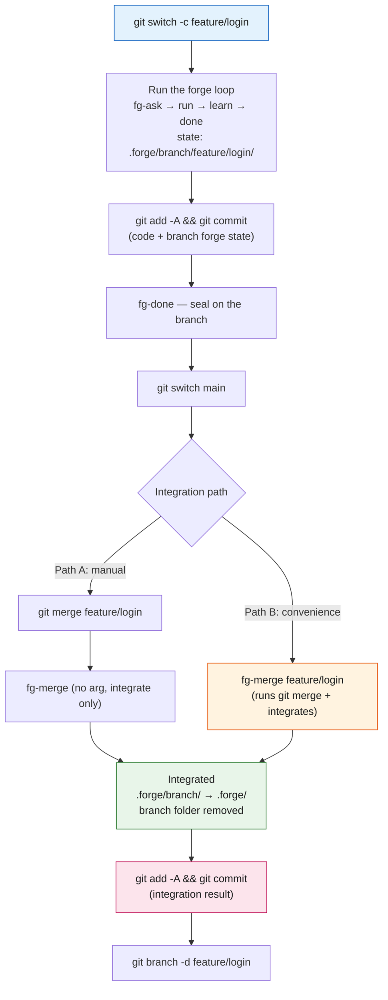

# Working with git in forge — branches and commits

This is the user manual for how you drive git while using forge. The question that matters is **"does forge touch my git for me?"**, and the answer is almost always **no** — forge only writes `.forge/` state; `commit`, `push`, and `branch` are yours. This doc lays out that principle and the **step-by-step way to run a feature branch with forge (git CLI included)**.

> This doc focuses on the **git model and branch operations**. Team merge policy, conflict authority, and CI gates live in [team-workflow.md](./team-workflow.md); the tracked/ignored rules and directory layout of `.forge/` live in [state-contract.md](./state-contract.md) — linked here rather than repeated.

## 1. The principle — forge does not touch git by default

The loop skills (`fg-ask` → `fg-run` → `fg-learn` → `fg-done`) and almost every utility **only write `.forge/` state files.** They do **not** `commit` your code, `push` it to a remote, or create a `branch`. When there is something to commit, they simply **tell you** "commit these."

The reason is a clean boundary — git collaboration (branching strategy, PRs, merge timing, branch protection) belongs to your git tooling and your team's conventions, and forge stays out of it. That is what lets you put forge on top of any git workflow.

```
What forge does:  writes .forge/ state  +  reminds you "commit these files"
What you do:      git add / commit / push / branch / merge  (the one exception, fg-merge, is §2)
```

## 2. The exception — only `fg-merge <branch>` actually runs git

There is exactly one exception. **Give `fg-merge` a branch argument** (`fg-merge <branch>`) and, as a convenience, it **runs `git merge <branch>` for you first**, then integrates the forge state (ADR `260717-10a`). `fg-merge` with no argument still **integrates only**, as before.

- The git merge runs **only in the interactive skill layer**. The integration core — the deterministic `forge-merge.sh`/`.js` script and the CI path — **still never runs git** (which is what keeps it usable AI-free in CI).
- If the merge **conflicts**, it leaves the conflict in place and **stops** (no integration) — you resolve the conflict, `git commit`, then integrate with `fg-merge` (no argument).
- **It does not commit.** The merge commit is git's own; the integration changes are left uncommitted, with a reminder to commit them.

No other forge skill runs git.

## 3. What git tracks vs. ignores (summary)

To understand branch operations you need to know what goes into git. Only the summary is here; for the full rules (the `.gitignore` whitelist) see [state-contract.md](./state-contract.md).

| What | Default branch | Non-default (feature) branch |
|------|---------------|------------------------------|
| Volatile loop state (`plan`/`run`/`STATUS`/`backlog`/`executed`/`done`) | **git-ignored** (gitignore) | under the branch root `.forge/branch/<branch>/` → **tracked whole** |
| Permanent fuel (`CONTEXT.md`·`adr/`·`retro/`·`codebase/`·`config.json`) | **tracked** (whitelist) | under the branch root → **tracked** |

The key asymmetry (ADR-0011): **the default branch's volatile state is never committed, but a feature branch's forge state is committed whole.** Because the paths are namespaced per branch (`.forge/branch/<branch>/`), two branches never write the same file, so `git merge` conflicts on forge state are eliminated at the source.

## 4. Skill-by-skill git contact map

Where each skill touches git, at a glance:

| Skill | git contact |
|-------|-------------|
| **fg-merge** | **Runs git** (`git merge` in `<branch>` mode) — the only one in forge. Reminds you to commit after integrating |
| fg-done | Never runs git. After sealing, if tracked docs (retro·ADR·CONTEXT) are uncommitted, it **reminds you to commit** |
| fg-learn / fg-ask | Never runs git. They write tracked fuel (CONTEXT·ADR·retro), so committing is yours |
| fg-run | Never runs git. It changes your code but **never forces a commit** |
| fg-map / fg-agents | Never runs git. Their output (`.forge/codebase/` · `.claude/agents/`) is tracked → commit reminder |
| fg-drop | Never runs git. On a non-default branch a deletion shows up as a tracked change → you `commit` or `git restore` |
| fg-doctor | Read-only. It only **detects an orphaned branch root** you forgot to integrate after `git merge` (A8) |
| Everything else (status·next·quick·loop·tdd·eco·cleanup·statusline·adversarial-review) | No git contact |

In short: **`fg-merge <branch>` is the only thing that runs git**; the rest either tell you "commit this" when they write tracked files, or have nothing to do with git at all.

## 5. Solo — on the default branch only (no branches needed)

If you work alone on the default branch (`main`), you **don't need branches at all.** Just run the forge loop: the volatile state is gitignored so there is nothing to think about, and the only things to commit are the **permanent fuel (the ADRs and CONTEXT entries grilling produced, plus retros) and your code**.

```
fg-ask → fg-run → fg-learn → fg-done   (one turn)
   → after sealing, commit the tracked docs left behind:
     git add .forge/adr .forge/retro .forge/CONTEXT.md <changed code>
     git commit -m "..."
```

When it seals, `fg-done` tells you if any tracked docs are uncommitted. When you commit is entirely up to you (forge never forces it).

## 6. Running a feature branch (the core)

This is the flow where you cut a branch per feature and fold it back into the default branch. Because forge state is isolated under `.forge/branch/<branch>/` (§3) there are no forge conflicts between branches, and when you fold it back `fg-merge` integrates the forge docs.

### Step by step (git CLI included)

**① Create the branch.** Cut it from the default branch.

```bash
git switch -c feature/login      # (older form: git checkout -b feature/login)
```

From this moment the forge root resolves to `.forge/branch/feature/login/` (ADR-0011). Every bit of forge state from here on piles up there.

**② Run the forge loop + commit the branch state.** Run `fg-ask` → `fg-run` → `fg-learn` → `fg-done` as usual. On a feature branch `.forge/branch/<branch>/` is **tracked whole**, so the forge state gets committed alongside the code.

```bash
# after running the forge loop
git add -A                       # changed code + .forge/branch/feature/login/ state
git commit -m "feat: login (+ forge state)"
```

**③ Seal on the branch.** A branch's work must be sealed on the branch with `fg-done` (→ `.forge/branch/feature/login/done/`). If you try to fold it back with unfinished state (active slot, `executed/`, a halted `loop.md`), integration blocks you (the `forge-merge.sh` in-flight halt).

**④ Switch to the default branch + integrate.** There are two paths:

```bash
git switch main

# Path A — merge yourself, then integrate only
git merge feature/login          # namespaced, so the folder comes in whole with no conflict
fg-merge                         # (no arg) integrate .forge/branch/ → .forge/

# Path B — fg-merge runs the merge for you (convenience, interactive)
fg-merge feature/login           # git merge + integrate in one go
```

`fg-merge` moves the branch's time-based ADRs as-is (only a same-second accidental collision takes the next free letter), moves retros, merges CONTEXT terms, remaps done/backlog task numbers, and then removes the `.forge/branch/feature/login/` folder.

**⑤ Commit the integration + clean up the branch.** `fg-merge` doesn't commit, so you do.

```bash
git add -A
git commit -m "integrate feature/login forge state"
git branch -d feature/login      # clean up the local branch (the remote one on your host)
```

### Branch lifecycle

The steps above as a picture:



> If the merge conflicts (Path B), `fg-merge` leaves it in place and stops — resolve the conflict, `git commit`, then integrate with `fg-merge` (no arg) (§2).

## 7. Working in parallel with git worktrees

Because forge state is namespaced per branch (§3), **you can have several branches checked out as worktrees at once and their `.forge/` state will never collide** (ADR-0011 explicitly supports worktrees). Each worktree runs its own branch's root (`.forge/branch/<branch>/`) independently.

```bash
git worktree add ../forge-feature-b feature/b   # check out feature/b in a separate directory
# running the forge loop in ../forge-feature-b isolates state under .forge/branch/feature/b/
git worktree remove ../forge-feature-b          # clean up when you're done
```

Integration is the same as always — on the default branch, `git merge` → `fg-merge`. Don't fold several branches in at once; handling them **one at a time, in sequence** (`fg-merge` right after each `git merge`) is decisive (details in "Ordering when merging several branches" in [team-workflow.md](./team-workflow.md)).

## 8. Commit-timing playbook

forge never forces a commit, so use the table below to decide what to commit when.

| Moment | What to commit | Note |
|--------|---------------|------|
| After `fg-ask` grilling | Newly created ADRs and CONTEXT entries (tracked) | Backlog plans are gitignored (default branch) — not commit material |
| After `fg-run` execution | **Your changed code** | forge doesn't force it — commit when you want |
| After the `fg-learn` retro | Promoted ADRs, CONTEXT entries, and the retro log (tracked) | |
| After the `fg-done` seal | Any tracked docs still uncommitted | The done archive itself is gitignored on the default branch |
| While working on a feature branch | Code + `.forge/branch/<branch>/` (tracked whole) | |
| After the `fg-merge` integration | The integration result (moved docs + the deleted branch folder) | fg-merge doesn't commit |

## 9. The boundary — what forge does not do

- **It does not own PRs, branch protection, or merge timing.** Those belong to GitHub (or your host) and your team's conventions.
- **It does not `push`.** Getting things to the remote is yours.
- **The integration core (`forge-merge.sh`) and the CI path never run git** — only the interactive convenience of `fg-merge <branch>` is the exception (§2).

### See also
- **Team merge policy, conflict authority, CI gates** → [team-workflow.md](./team-workflow.md)
- **`.forge/` tracked/ignored rules, directory layout, branch isolation in detail** → [state-contract.md](./state-contract.md)
- **The decisions behind this** → branch isolation [ADR-0011](https://github.com/gyuha/forge/blob/main/.forge/adr/0011-branch-isolated-forge-root.md) · fg-merge git mode [ADR-260717-10a](https://github.com/gyuha/forge/blob/main/.forge/adr/260717-10a-fg-merge-optin-git-merge-mode.md)
