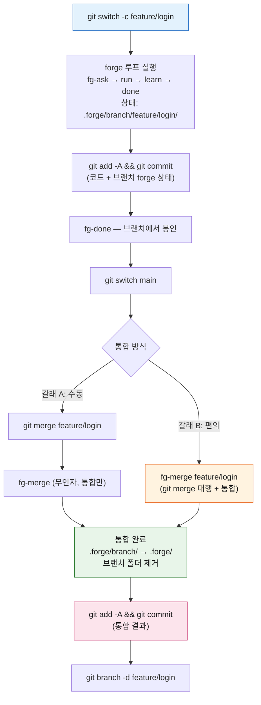

# forge에서 git 다루기 — 브랜치 운영과 커밋

forge를 쓰면서 git을 어떻게 굴리는지에 대한 사용자 매뉴얼이다. 핵심 질문은 **"forge가 내 git을 대신 건드리나?"** 인데, 답은 거의 항상 **아니오**다 — forge는 `.forge/` 상태만 쓰고, `commit`·`push`·`branch`는 네 몫이다. 이 문서는 그 원칙과, **피처 브랜치를 forge로 운영하는 단계별 방법(git CLI 포함)**을 정리한다.

> 이 문서는 **git 모델과 브랜치 운영**에 집중한다. 팀 merge 정책·충돌 권한·CI 게이트는 [team-workflow.md](./team-workflow.md), `.forge/`의 추적/무시 규칙과 디렉터리 구조는 [state-contract.md](./state-contract.md)에 있다 — 여기서는 중복하지 않고 링크한다.

## 1. 원칙 — forge는 기본적으로 git을 건드리지 않는다

forge의 루프 스킬(`fg-ask` → `fg-run` → `fg-learn` → `fg-done`)과 대부분의 유틸리티는 **`.forge/` 상태 파일만 쓴다.** 네 코드를 `commit`하거나 원격에 `push`하거나 `branch`를 만드는 일은 **하지 않는다.** 대신 커밋할 게 생기면 "커밋하세요"라고 **알려줄 뿐**이다.

이유는 경계를 명확히 하기 위해서다 — git 협업(브랜치 전략·PR·머지 타이밍·브랜치 보호)은 git 도구와 팀 규약의 몫이고, forge는 거기에 끼어들지 않는다. 그래서 forge를 어떤 git 워크플로 위에도 얹을 수 있다.

```
forge가 하는 일:   .forge/ 상태 쓰기  +  "이 파일들 커밋하세요" 안내
네가 하는 일:      git add / commit / push / branch / merge (fg-merge 예외는 §2)
```

## 2. 예외 — `fg-merge <branch>`만 git을 실제로 돌린다

딱 하나의 예외가 있다. **`fg-merge`에 브랜치 인자를 주면**(`fg-merge <branch>`) 편의를 위해 `git merge <branch>`를 **대신 돌려준 뒤** forge 상태를 통합한다(ADR `260717-10a`). 인자 없는 `fg-merge`는 종전대로 **통합만** 한다.

- git merge는 **대화형 스킬 계층에서만** 실행된다. 통합 코어인 결정론 스크립트 `forge-merge.sh`/`.js`와 CI 경로는 **여전히 git을 안 돌린다**(그래서 AI 없이 CI에서 쓸 수 있다).
- merge가 **충돌**하면 그 자리에 충돌을 남기고 **멈춘다**(통합 안 함) — 네가 충돌을 풀고 `git commit`한 뒤 `fg-merge`(무인자)로 통합한다.
- **커밋은 안 한다.** `git merge`가 만든 merge 커밋은 git이 만들고, 통합 변경분은 미커밋으로 남겨 "커밋하세요"라고 알린다.

그 외 어떤 forge 스킬도 git을 실행하지 않는다.

## 3. git이 추적하는 것 vs 무시하는 것 (요약)

브랜치 운영을 이해하려면 무엇이 git에 들어가는지 알아야 한다. 요약만 싣고, 전체 규칙(`.gitignore` 화이트리스트)은 [state-contract.md](./state-contract.md)를 보라.

| 대상 | 기본 브랜치 | 비-기본(피처) 브랜치 |
|------|------------|--------------------|
| 휘발 루프 상태 (`plan`/`run`/`STATUS`/`backlog`/`executed`/`done`) | **git 무시**(gitignore) | 브랜치 루트 `.forge/branch/<branch>/` 아래 → **통째 추적** |
| 영속 연료 (`CONTEXT.md`·`adr/`·`retro/`·`codebase/`·`config.json`) | **추적**(화이트리스트) | 브랜치 루트 아래 → **추적** |

핵심 비대칭(ADR-0011): **기본 브랜치의 휘발 상태는 커밋 안 되지만, 피처 브랜치의 forge 상태는 통째로 커밋된다.** 경로가 브랜치별로 네임스페이스(`​.forge/branch/<branch>/`)돼 두 브랜치가 같은 파일을 안 건드리므로 `git merge` 충돌이 원천 차단된다.

## 4. 스킬별 git 접점 맵

어느 스킬이 git과 어떻게 얽히는지 한눈에:

| 스킬 | git 접점 |
|------|---------|
| **fg-merge** | **git을 실행**(`<branch>` 모드의 `git merge`) — forge에서 유일. 통합 후 커밋 리마인드 |
| fg-done | git 실행 안 함. 봉인 후 tracked 문서(retro·ADR·CONTEXT)가 미커밋이면 **커밋 리마인드** |
| fg-learn / fg-ask | git 실행 안 함. tracked 연료(CONTEXT·ADR·retro)를 쓰므로 커밋은 네 몫 |
| fg-run | git 실행 안 함. 네 코드를 바꾸지만 **커밋을 강제하지 않음** |
| fg-map / fg-agents | git 실행 안 함. 산출물(`.forge/codebase/` · Claude Code의 `.claude/agents/`)이 tracked → 커밋 리마인드. Codex 네이티브 agent materialize는 아직 미지원 |
| fg-drop | git 실행 안 함. 비-기본 브랜치에선 삭제가 tracked 변경으로 보임 → 네가 `commit`/`git restore` |
| fg-doctor | 읽기 전용. `git merge` 후 통합을 잊은 **고아 브랜치 루트를 감지**만(A8) |
| 그 외 (status·next·quick·loop·tdd·eco·cleanup·statusline·adversarial-review) | git 접점 없음 |

정리: **git을 돌리는 건 `fg-merge <branch>` 하나뿐**, 나머지는 tracked 파일을 쓰면 "커밋하세요"라고 알리거나 아예 git과 무관하다.

## 5. Solo — 기본 브랜치에서만 (브랜치 안 써도 됨)

혼자 기본 브랜치(`main`)에서 작업한다면 **브랜치를 쓸 필요가 없다.** forge 루프를 그대로 돌리면 휘발 상태는 gitignore돼 있으니 신경 쓸 것도 없고, 커밋할 것은 **영속 연료(그릴링이 만든 ADR·CONTEXT, 회고)와 네 코드**뿐이다.

```
fg-ask → fg-run → fg-learn → fg-done   (한 바퀴)
   → 봉인 후 남는 tracked 문서를 커밋:
     git add .forge/adr .forge/retro .forge/CONTEXT.md <바뀐 코드>
     git commit -m "..."
```

`fg-done`이 봉인 시 미커밋 tracked 문서가 있으면 알려준다. 언제 커밋하든 네 자유다(forge는 강제하지 않는다).

## 6. 피처 브랜치 운영 (핵심)

기능 단위로 브랜치를 따서 작업하고 기본 브랜치로 합치는 흐름이다. forge 상태가 `.forge/branch/<branch>/`로 격리(§3)되므로 브랜치 간 forge 충돌이 없고, 합칠 때 `fg-merge`가 forge 문서를 통합한다.

### 단계별 (git CLI 포함)

**① 브랜치 생성.** 기본 브랜치에서 딴다.

```bash
git switch -c feature/login      # (구식: git checkout -b feature/login)
```

이 순간부터 forge 루트는 `.forge/branch/feature/login/`으로 해석된다(ADR-0011). 이후 forge 상태는 전부 거기 쌓인다.

**② forge 루프 실행 + 브랜치 상태 커밋.** 평소처럼 `fg-ask` → `fg-run` → `fg-learn` → `fg-done`을 돈다. 피처 브랜치에선 `.forge/branch/<branch>/`가 **통째 tracked**이므로, 코드와 함께 forge 상태도 커밋된다.

```bash
# forge 루프를 돌린 뒤
git add -A                       # 바뀐 코드 + .forge/branch/feature/login/ 상태
git commit -m "feat: login (+ forge 상태)"
```

**③ 브랜치에서 봉인.** 브랜치의 작업은 반드시 브랜치에서 `fg-done`으로 봉인한다(→ `.forge/branch/feature/login/done/`). 미완 상태(활성 슬롯·`executed/`·멈춘 `loop.md`)로 합치려 하면 통합 단계에서 막힌다(`forge-merge.sh` in-flight halt).

**④ 기본 브랜치로 전환 + 통합.** 두 갈래가 있다:

```bash
git switch main

# 갈래 A — 수동 merge 후 통합만
git merge feature/login          # 네임스페이스라 충돌 없이 폴더째 들어옴
fg-merge                         # (무인자) .forge/branch/ → .forge/ 통합

# 갈래 B — fg-merge가 merge까지 대행 (편의, 대화형)
fg-merge feature/login           # git merge + 통합을 한 번에
```

`fg-merge`는 브랜치의 시간ID ADR을 그대로 옮기고(같은-시 우연 충돌만 다음 글자로), retro 이동·CONTEXT 용어 병합·done/backlog task 번호 재부여 후 `​.forge/branch/feature/login/` 폴더를 제거한다.

**⑤ 통합 결과 커밋 + 브랜치 정리.** `fg-merge`는 커밋을 안 하므로 네가 커밋한다.

```bash
git add -A
git commit -m "merge feature/login forge 상태 통합"
git branch -d feature/login      # 로컬 브랜치 정리 (원격은 호스트에서)
```

### 브랜치 생명주기

위 단계를 그림으로:



> merge가 충돌하면(갈래 B) `fg-merge`는 그 자리에 남기고 멈춘다 — 충돌 해소·`git commit` 후 `fg-merge`(무인자)로 통합(§2).

## 7. git worktree로 병렬 작업

forge 상태가 브랜치별로 네임스페이스되므로(§3), **여러 브랜치를 worktree로 동시에 띄워도 `.forge/` 상태가 안 부딪힌다**(ADR-0011이 worktree를 명시 지원). 각 worktree는 자기 브랜치의 루트(`.forge/branch/<branch>/`)를 독립적으로 운영한다.

```bash
git worktree add ../forge-feature-b feature/b   # 별도 디렉터리에 feature/b 체크아웃
# ../forge-feature-b 에서 forge 루프를 돌리면 .forge/branch/feature/b/ 에 격리됨
git worktree remove ../forge-feature-b          # 작업 끝나면 정리
```

통합은 평소와 같다 — 기본 브랜치에서 `git merge` → `fg-merge`. 두 브랜치를 몰아 합치지 말고 **하나씩 순차**로(각 `git merge` 직후 `fg-merge`) 처리하는 게 결정적이다(자세히는 [team-workflow.md](./team-workflow.md)의 "다중 브랜치 merge 순서").

## 8. 커밋 시점 플레이북

forge는 커밋을 강제하지 않으니, 무엇을 언제 커밋할지는 아래를 기준으로 삼으면 된다.

| 시점 | 커밋할 것 | 비고 |
|------|----------|------|
| `fg-ask` 그릴링 후 | 새로 생긴 ADR·CONTEXT 항목 (tracked) | backlog plan은 gitignore(기본 브랜치) — 커밋 대상 아님 |
| `fg-run` 실행 후 | 바뀐 **네 코드** | forge는 강제 안 함 — 원할 때 커밋 |
| `fg-learn` 회고 후 | 승급된 ADR·CONTEXT·회고 로그 (tracked) | |
| `fg-done` 봉인 후 | 아직 미커밋인 tracked 문서 | done 아카이브 자체는 기본 브랜치에서 gitignore |
| 피처 브랜치 작업 중 | 코드 + `.forge/branch/<branch>/` (통째 tracked) | |
| `fg-merge` 통합 후 | 통합 결과(옮겨진 문서 + 브랜치 폴더 삭제) | fg-merge는 커밋 안 함 |

## 9. 경계 — forge가 하지 않는 것

- **PR·브랜치 보호·머지 타이밍을 소유하지 않는다.** 그건 GitHub(또는 네 호스트)와 팀 규약의 몫이다.
- **`push`를 하지 않는다.** 원격 반영은 네가 한다.
- **통합의 코어(`forge-merge.sh`)·CI 경로는 git을 안 돌린다** — `fg-merge <branch>`의 대화형 편의만 예외(§2).

### 더 보기
- **팀 merge 정책·충돌 권한·CI 게이트** → [team-workflow.md](./team-workflow.md)
- **`.forge/` 추적/무시 규칙·디렉터리 구조·브랜치 격리 상세** → [state-contract.md](./state-contract.md)
- **결정 근거** → 브랜치 격리 [ADR-0011](https://github.com/gyuha/forge/blob/main/.forge/adr/0011-branch-isolated-forge-root.md) · fg-merge git 모드 [ADR-260717-10a](https://github.com/gyuha/forge/blob/main/.forge/adr/260717-10a-fg-merge-optin-git-merge-mode.md)
