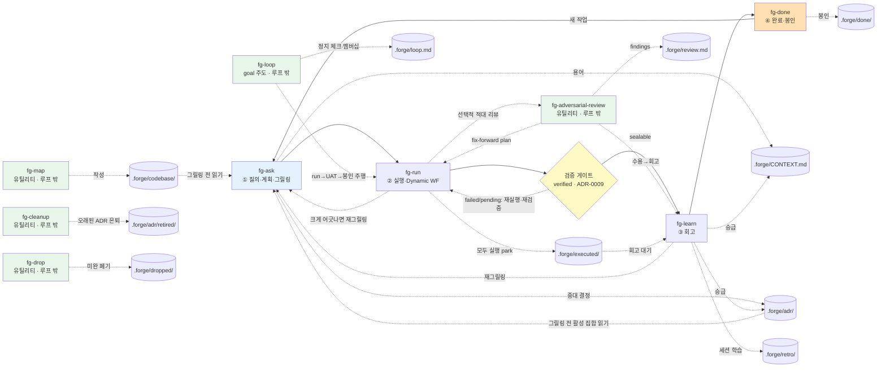

# forge 상태 계약과 디렉터리

> README의 「공유 상태와 디렉터리」를 풀어 쓴 문서. `.forge/` 디렉터리 구조, 브랜치 격리, 회고 스킵·검증 게이트 규칙, 그리고 전체 흐름 상세도를 담는다.

## 공유 상태와 디렉터리

단계를 독립적으로 호출해도 흐름이 이어지도록 상태를 파일로 넘긴다. 모든 것을 `.forge/` 한 디렉터리에 둔다 — 휘발 루프 상태와 git 추적되는 영속 문서가 함께 산다. `.gitignore`가 `.forge/`를 기본 제외하고 영속 문서만 화이트리스트로 추적하므로, **위치는 전부 `.forge/` 안이고 구분은 git 추적 여부**다.

```
repo/
├── CONTEXT-MAP.md             # 멀티 컨텍스트일 때만 (루트 유지)
└── .forge/                    # 모든 루프 문서가 여기 산다
    │                          # ── 영속 문서 (화이트리스트로 git 추적) ──
    ├── CONTEXT.md             # 글로서리 (단일 컨텍스트)
    ├── adr/0001-*.md          # 아키텍처 결정
    ├── adr/retired/           # 은퇴/대체된 ADR (fg-cleanup이 이동)
    ├── retro/YYMMDD-HHMMSS-*.md  # 회고 로그 (구 YYYY-MM-DD-*는 grandfather)
    ├── codebase/*.md          # fg-map이 만든 코드베이스 지도
    ├── config.json            # 프로젝트 설정(tdd · eco · defaultBranch) — 전역, 브랜치 해석 안 함
    │                          # ── 휘발 루프 상태 (gitignore) ──
    ├── backlog/<slug>.md      # ① fg-ask 그릴링 산출 — 미실행 plan 대기열
    ├── plan.md                # 활성 슬롯: 지금 도는 한 바퀴의 정답 기준 (fg-run가 백로그에서 승격)
    ├── run.md                 # ② fg-run 산출 = 계획 vs 실제
    ├── review.md              # (선택) fg-adversarial-review findings — 휘발·활성 슬롯 동반·비-게이트; fg-learn 승급 입력, 봉인 시 done/ 아카이브 (ADR-0018)
    ├── STATUS.md              # 활성 슬롯: fg-run가 실행 완료 시 작성 (status: executed, verified: pending, retro: pending) — verified는 yes/skipped/n/a(봉인 가능) 또는 failed(차단), retro는 이후 경로 또는 "skipped"가 됨
    ├── loop.md                # goal 계약(fg-loop): 정지 체크·replan 라운드/상한·## Tasks 멤버십 — goal 충족 시 fg-loop가 삭제 (ADR-0016)
    ├── executed/<slug>/       # "모두 실행" 후 회고 대기 (plan+run+STATUS, 미회고)
    ├── done/<날짜-slug>/       # ④ fg-done 봉인 아카이브 (plan+run+STATUS, status: done)
    ├── quick/LOG.md           # fg-quick 차선 로그(빠른 작업당 한 줄)
    ├── dropped/<slug>/        # fg-drop이 "보관"으로 폐기한 미완 작업 (기본 브랜치 휘발·gitignore; 비-기본 브랜치 루트에선 추적·fg-merge 보존; doctor 관용·status 무시 — ADR-0021)
    └── branch/<branch>/       # 비-기본 브랜치는 forge 루트 전체를 여기서 운영(git 추적); fg-merge가 .forge/로 통합 (ADR-0011)
```

비-기본 브랜치에서는 위의 모든 `.forge/...` 경로가 `.forge/branch/<branch>/` 아래로 해석된다(기본 브랜치는 `.forge/`를 그대로 사용) — 단 전역 예외 두 개, `.forge/config.json`(규칙 자신이 읽어야 하는 `defaultBranch`를 담음)과 `.forge/codebase/`(지도는 공유 참조 연료)는 모든 브랜치에서 항상 최상위 `.forge/`에 머문다. 해석 규칙은 `skills/fg-run/FORGE-ROOT.md`에 한 번 정의되고 모든 루프 스킬이 이를 참조한다.

`.gitignore` 패턴:

```gitignore
.forge/*
!.forge/CONTEXT.md
!.forge/adr/
!.forge/retro/
!.forge/codebase/
!.forge/config.json
!.forge/branch/        # 비-기본 브랜치 루트는 통째로 추적 (ADR-0011)
```

- 각 스킬은 입력 파일을 `.forge/`에서 읽고 산출을 `.forge/`에 쓴다(브랜치별로 해석 — 아래 참조). `fg-run`만 따로 불러도 백로그·활성 슬롯을 찾아 이어간다.
- **브랜치 격리 ([ADR-0011](../.forge/adr/0011-branch-isolated-forge-root.md)).** 비-기본 브랜치에서는 forge 루트 전체가 `.forge/branch/<branch>/`(git 추적)로 옮겨가, 병렬 브랜치가 `.forge` 상태에서 충돌하지 않는다 — ADR/task 번호·CONTEXT.md·휘발 상태가 모두 브랜치별로 네임스페이스된다. 영속 연료(CONTEXT.md·ADR·회고)의 읽기는 최상위 베이스 문서 위에 오버레이되어(브랜치 우선) 갓 만든 브랜치도 main의 용어·결정 위에서 그릴링하고, 쓰기는 브랜치 루트에만 간다. `git merge` 뒤 `fg-merge`(무인자)가 브랜치 루트를 `.forge/`로 통합한다(무인자 모드 — `fg-merge <branch>`는 대화형에서 `git merge`까지 대신 돌린다, ADR `260717-10a`; **결정론 스크립트 `forge-merge.sh`/`.js`** — 시간ID ADR 이동[충돌 시 다음 글자, cascade 재번호 없음]·task 번호 재부여·retro 이동·CONTEXT 용어 병합 후 브랜치 폴더 제거, AI 없이 CI 게이트 가능). 기본 브랜치는 종전과 같다. 해석 규칙은 `skills/fg-run/FORGE-ROOT.md`에 한 번만 정의된다.
- `fg-run`는 백로그에 작업이 여럿이면 미완료 목록을 선택 메뉴로 제시한다(마지막 옵션 "모두 실행"). 활성 슬롯은 항상 1개 — 한 plan.md = 한 run.md = 한 봉인.
- 입력 파일이 없으면 스킬은 앞 단계를 안내한다.
- 활성 슬롯·백로그·회고 대기열이 모두 비어 있으면 = 진행 중 작업 없음. `fg-run`는 빈 상태에서 실행하지 않는다(재실행 방지). 완료 판별은 `done/*/STATUS.md`(status: done)다.
- 회고는 사소한 **저-divergence** 작업에 한해 **건너뛸 수 있다**. fg-run가 핸드오프에서 명시 선택지로 제시한다 — 자동이 아니고, 계획과 크게 어긋난 실행에는 제시하지 않는다(그때야말로 배울 게 있다). 건너뛰면 STATUS.md에 `retro: skipped`를 기록하고 회고 파일은 만들지 않으며, fg-done이 이를 봉인 가드 통과로 인정한다. 회고가 기본값이다 ([ADR-0002](../.forge/adr/0002-optional-retro-skip.md)).
- 작업은 봉인 전에 **검증 결정이 기록된다**. 루프 순서는 run → verify → learn → done이다. 실행 직후 fg-run의 대화형 핸드오프가 계획의 목표에 대고 UAT를 수행하고 결과를 STATUS.md `verified:`에 기록한다 — `yes (증거)`(동작 확인 + *어떻게* 확인했는지 한 줄 증거를 동반: 돌린 명령·관찰한 출력, 예: `yes (npm test → 42 passing)`; TDD 모드에선 통과한 슬라이스 테스트가 곧 그 증거) / `n/a (사유)`(확인할 런타임 없음, 예: 문서만 변경) / `skipped (사유)`(의도적·감사 가능한 waiver). 두 상태는 봉인을 **차단**한다: `pending`(UAT 미수행 — 초기값 또는 중단된 핸드오프)과 `failed (사유)`(UAT를 수행했으나 목표 미달 — 수정·재실행 또는 재그릴로 가며 절대 봉인 안 됨). fg-done은 `verified:`가 차단 상태이면 봉인하지 않는다(**no-seal-without-verification 가드**) — 기록된 *봉인 가능* 결정 없이는 아무것도 `done/`에 들어가지 않는다. 단 `skipped`는 **봉인을 통과한다** — confirmation이 아니라 명시적 waiver다(retro-skip과 동일한 절제). 이 게이트가 보장하는 것은 "조용한 누락 없음"이지 "모든 작업이 동작 확인됨"이 아니다 ([ADR-0009](../.forge/adr/0009-verification-gate-before-seal.md)). ADR-0009 이전에 봉인된 작업은 이 필드가 없던 시절이라 `verified: n/a (legacy pre-ADR-0009)`로 채워져 있다 — `done/` 이력에서 `verified:`가 비어 있으면 게이트 실패가 아니라 legacy 데이터라는 뜻이다.

### 미봉인 잔여 알림 (SessionStart 훅)

**미봉인 잔여(unsealed tail)** 는 실행은 끝났는데 봉인되지 않아 루프가 닫히지 않은 작업이다 — 활성 슬롯에 남은 `status: executed`가 이에 해당한다. `executed/`의 park은 잔여가 아니라 **의도된 대기**다(사람이 "나중에 회고하겠다"고 남긴 상태).

이걸 까먹는 걸 막는 방어선은 셋인데, 각자 새는 지점이 다르다:

| 방어선 | 언제 작동 | 새는 지점 |
| --- | --- | --- |
| statusline (`📝N`) | 항상 표시 | 사람이 그 픽셀을 안 보면 끝 |
| fg-ask STEP 0 | fg-ask를 트리거할 때 | 스킬을 안 부르고 그냥 말을 걸면 돌지 않음 |
| **SessionStart 훅** | 세션 진입(`startup`/`resume`/`clear`/`compact`) | 세션 중 새로 생긴 잔여는 다음 진입까지 대기 |

**fg-ask STEP 0은 알리는 데서 그치지 않고 닫는다 (ADR `260727-201115`).** 남은 판단의 양으로 갈린다:

```
새 그릴링 시작 → 활성 슬롯에 미봉인 잔여?
  ├── 없음 → 아무 말 없이 그릴링 시작 (흔한 경우, 추가 지연 0)
  └── 있음 → 남은 판단은?
        ├── 없음 (검증 봉인가능 + 회고 해결)            → 무질문 봉인 → 한 줄 보고 → 같은 턴에 그릴링 계속
        ├── 회고만 밀림 + 저-divergence                → 회고 자동 skip + 봉인 → 한 줄 보고 → 그릴링 계속
        └── 남음 (고-div · pending · failed · 멈춘 loop) → 질문 → (a) 마감 후 **보류한 요청으로 복귀** / (b) 새 작업 계속
```

경계 셋은 불변이다: **사정거리는 활성 슬롯 1건**(`executed/` park은 의도된 대기라 개수만 보고·무간섭), **검증 게이트 불가침**(`pending`/`failed`는 자동 봉인 안 되고 fg-ask는 UAT를 하지 않음), **위임 봉인이라 간결**(단일-봉인 상세 요약 금지 — ADR-0032 개정). 과거처럼 "마감했으니 fg-ask를 다시 치라"고 요구하지 않는다 — 새 요청을 버리는 그 중단이 흐름을 끊던 본체였다.

훅(`hooks/hooks.json` — 플러그인 설치만으로 걸리고 사용자 설정 편집 불필요)은 **잔여·park·멈춘 `loop.md`가 있을 때만** 짧은 `<forge-state>` 블록을 세션 컨텍스트에 주입하고, 에이전트에게 "새 작업을 시작하기 전에 사용자에게 한 줄로 알리고 마감 여부를 확인하라 · 자동 실행·자동 봉인 금지"를 지시한다 — 보고까지만 하고 결정은 사람이 하는 fg-status와 같은 자세다. **백로그만 대기 중이면 완전 침묵**한다(백로그는 부채가 아니라 정상 대기열 — statusline의 "idle이면 아무것도 띄우지 않는다" 원칙 계승). 본체는 `scripts/forge-hook-session-start.sh`/`.js` 트윈이고, `hooks/run-hook.cmd`가 bash→node 순으로 디스패치한다(런타임이 없으면 exit 0 침묵 — 알림이 안 뜨는 실패는 무해하다). **훅은 세션 시작 시 로드되므로 새로 설치·수정한 훅은 다음 세션부터 적용된다** ([ADR 260727-201031](../.forge/adr/260727-201031-forge-ships-session-start-hook.md)).

## 생산자·소비자 계약

각 휘발 상태 파일을 **누가 쓰고 누가 읽는가**의 계약. 스킬을 편집할 때 이 입출력을 깨지 않아야 흐름이 이어진다(아래 경로는 모두 해석된 forge 루트 기준 — 비-기본 브랜치면 `.forge/branch/<branch>/`). 입력 파일이 없으면 각 스킬은 앞 단계를 안내한다.

| 파일 | 생산자 | 소비자 |
| --- | --- | --- |
| `ask.md` (그릴링 시작 시 쓰는 표시용 마커, 백로그 적재/fg-quick 이탈 시 삭제) | fg-ask | fg-statusline(표시 전용 — 다른 스킬은 게이트로 읽지 않음) |
| `backlog/<slug>.md` | fg-ask | fg-run(선택 메뉴·승격) |
| `plan.md` (활성 슬롯) | fg-run(백로그에서 승격) | fg-run(정답 기준)·fg-learn |
| `run.md` | fg-run | fg-learn |
| `review.md` (선택·비-게이트) | fg-adversarial-review | fg-learn(retro 승급 입력)·fg-done(봉인 시 `done/` 아카이브) |
| `STATUS.md` (동반 마커) | fg-run(`status: executed`·`verified:`·`retro:` 기록) | fg-run(상태 요약·검증 재진입)·fg-learn(검증 통과 시 회고)·fg-done(`status: done` 마감) |
| `executed/<slug>/` | fg-run("모두 실행" park) | fg-learn(회고 대기)·fg-done(봉인) |
| `done/<날짜-slug>/` | fg-done | fg-ask(slug 충돌 검출)·fg-run(완료 판별)·fg-learn(회고 대상 제외)·fg-done(이중 봉인 방지) |
| `loop.md` (goal 계약) | fg-loop | fg-loop(재개·멤버십 필터 주행)·fg-status(한 줄 보고+상태 머신 step 0)·fg-ask(벽에 멈춘 루프 경고)·fg-next(all 모드 양보)·fg-merge(브랜치 잔존 시 in-flight halt) |

- **STATUS.md는 이중 장부가 아니라 동반 마커다.** 상태의 원천은 파일 위치이고, STATUS.md는 plan/run과 함께 활성 슬롯 → `executed/` → `done/`을 따라 이동한다. plan 첫 줄의 `<!-- forge-slug: ... -->` 주석이 회고·봉인의 짝 맞춤 식별자다(파일이 이동해도 영속).
- **은퇴된 ADR(`adr/retired/`)은 그릴링 연료에서 빠진다** — `fg-ask`는 `retired/`를 정답소스로 읽지 않으므로, `fg-cleanup`이 옮긴 결정은 디스크에 남되 활성 결정 집합에서 제외된다 ([ADR-0012](../.forge/adr/0012-fg-cleanup-renamed-to-fg-done-cleanup-retires-adrs.md)·ADR-0011 개정).

## 전체 흐름 상세도

루프와 문서(`.forge/`)의 산출·소비 관계를 한눈에 본 다이어그램. 텍스트 흐름도는 [README](../README.ko.md#전체-흐름)에 있다. **루프 4단계의 재귀 흐름**과 거기 물린 `.forge/` 상태 파일, 그리고 그 흐름에 직접 관여하는 루프 밖 유틸리티(fg-map·fg-cleanup·fg-loop·fg-adversarial-review·fg-drop)만 표시한다. 설정 토글(fg-tdd·fg-eco), 상태를 직접 쓰지 않는 리포터·오케스트레이터(fg-status·fg-next·fg-doctor), 그리고 재귀 루프 밖의 일회성 유틸리티(fg-quick·fg-merge·fg-statusline)는 이 흐름에 들지 않아 생략했다.


