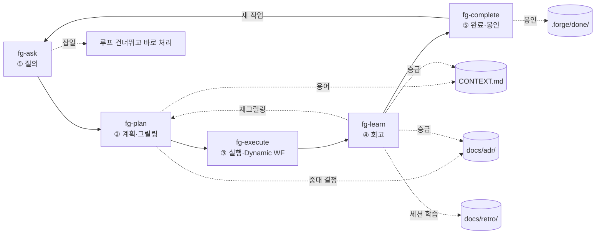

# forge — 단계별 워크플로우 스킬 모음 (`fg-*`) PRD

> **프로젝트명:** `forge` · **스킬 프리픽스:** `fg-`
> 작업 하나를 **질의 → 계획 → 실행 → 회고 → 완료**의 한 바퀴로 돌리는 개발 루프.
> 루프를 단계별 스킬 5개로 쪼갠다. 각 스킬은 단독 실행되며, 끝에서 **다음 단계로 가는 길을 안내**한다. 마지막 `fg-complete`는 작업을 **봉인하고 재실행을 막는다**.

---

## 1. 한 줄 요약

`forge`는 `fg-` 프리픽스를 가진 스킬 5개로 이루어진 루프형 워크플로우다. 계획은 grill-with-docs식 대화형 그릴링으로, 실행은 Claude Code Dynamic Workflow로 수행하고, 회고는 학습을 프로젝트 문서(CONTEXT.md · ADR · 회고 로그)에 되돌린 뒤, 완료 단계에서 작업을 봉인해 같은 작업이 두 번 실행되지 않게 한다.

---

## 2. 단계와 스킬

```
fg-ask ──▶ fg-plan ──▶ fg-execute ──▶ fg-learn ──▶ fg-complete
 ① 질의      ② 계획        ③ 실행          ④ 회고         ⑤ 완료
(분류·라우팅)(그릴링·대화형)(Dynamic WF)   (문서 반영)   (봉인·재실행 방지)
```

이전 PRD 대비 바뀐 점:

| 구분 | 이전 | 이번 |
| --- | --- | --- |
| 프리픽스 | `forge-` | **`fg-`** |
| 단계 수 | 4개 | **5개** (완료 단계 추가) |
| 종결 처리 | 회고 후 곧장 다음 질의 | **`fg-complete`가 봉인 후 새 바퀴 안내** |
| 재실행 방지 | 명시 안 됨 | **`fg-complete`가 활성 상태를 비워 재실행 차단** |

유지하는 두 기둥:

1. **그릴링(계획)은 Dynamic Workflow 밖의 대화형으로.** Dynamic Workflow는 실행 중 사용자 입력을 못 받으므로, 한 질문씩 주고받는 그릴링을 워크플로우 안에 넣을 수 없다.
2. **문서는 산출물이 아니라 루프의 연료.** 계획에서 다듬은 용어가 실행의 기준이 되고, 회고의 학습이 다음 계획의 출발점이 된다.

---

## 3. 전체 흐름



각 화살표는 **핸드오프**다. 한 스킬이 끝나면 다음 스킬로 가는 길(무엇을 했고, 다음은 무엇이며, 어떻게 시작하는지)을 안내한다(§6). 루프는 `fg-complete`가 작업을 봉인한 뒤, **새 작업**으로서만 `fg-ask`에서 다시 시작된다 — 같은 작업을 다시 실행하지 않는다.

---

## 4. 스킬 카탈로그

| 스킬 | 단계 | 한 줄 역할 | 입력 | 출력 | 다음 단계 |
| --- | --- | --- | --- | --- | --- |
| `fg-ask` | ① 질의 | 작업 정의·컨텍스트 식별·잡일/루프 분류 | 사용자 요청 | `.forge/task.md` | `fg-plan` (실질 작업) / 직접 처리 (잡일) |
| `fg-plan` | ② 계획 | grill-with-docs식 대화형 그릴링으로 계획을 날카롭게 | `.forge/task.md` | `.forge/plan.md` + CONTEXT/ADR 인라인 갱신 | `fg-execute` |
| `fg-execute` | ③ 실행 | 계획을 Dynamic Workflow로 실행 | `.forge/plan.md` | 실행 결과 + `.forge/run.md` | `fg-learn` |
| `fg-learn` | ④ 회고 | 학습을 문서로 승급, 다음 질의 도출 | `.forge/run.md`, `.forge/plan.md` | `docs/retro/*.md` + (선택) CONTEXT/ADR 승급 | `fg-complete` / `fg-plan` (재그릴링) |
| `fg-complete` | ⑤ 완료 | 작업 봉인, 활성 상태 정리, **재실행 방지**, 완료 안내 | `.forge/*` | `.forge/done/<id>/` 아카이브 + 빈 활성 상태 | `fg-ask` (새 작업) / 종료 |

`fg-ask`가 루프의 **진입점**이다. "forge 시작", "새 작업", "이거 작업하자" 같은 발화에서 트리거된다.

---

## 5. 단계별 상세

각 스킬은 **목적 → 동작 → 다음 흐름 안내 → 문서 영향** 순으로 정의한다.

### 5.1 `fg-ask` — ① 질의

**목적.** 요청을 한 문장 작업 정의로 정리하고, 대상 컨텍스트를 식별하고, 루프를 돌릴 실질 작업인지 잡일인지 분류한다.

**원본**
https://github.com/mattpocock/skills/tree/main/skills/engineering/grill-with-docs
위 내용을 그대로 옮기되, grill-with-docs의 그릴링·문서화는 `fg-plan`으로 넘긴다. `fg-ask`는 요청을 작업으로 정의하고 분류하는 데 집중한다.

**동작.**
- 처음 진입 시 문서 구조 파악: `CONTEXT-MAP.md`면 멀티 컨텍스트, `CONTEXT.md`만 있으면 단일, 둘 다 없으면 첫 용어 정리 시 lazy 생성. 대상 컨텍스트가 불분명하면 묻는다.
- 요청을 자기 말로 되짚어 한 문장으로 정리.
- **분류:** 사소한 수정·단일 파일 변경 등 잡일이면 루프를 건너뛰고 바로 처리. 실질 작업이면 계획으로.
- **활성 상태 점검:** `.forge/`에 봉인되지 않은 진행 중 작업이 있으면, 새로 시작할지 그걸 이어갈지 먼저 확인한다(작업 충돌 방지).
- 작업 정의를 `.forge/task.md`에 적는다.

**다음 흐름 안내.**
- 실질 작업: "작업을 `{한 문장}`으로 잡았고 `{컨텍스트}`를 건드립니다. 다음은 `fg-plan`으로 계획을 다듬을게요."
- 잡일: "루프까지 갈 일이 아니라 바로 처리하겠습니다."

**문서 영향.** (필요 시) CONTEXT 구조 부트스트랩, `.forge/task.md` 생성.

### 5.2 `fg-plan` — ② 계획 (그릴링)  ※ 대화형, 워크플로우 밖

**목적.** 계획을 도메인 모델·기존 용어·문서화된 결정에 대고 집요하게 검증해, Dynamic Workflow에 넘길 만큼 구체적으로 만든다. **반드시 본 세션 대화로** 진행한다.

**동작 (grill-with-docs 계승).**
- **한 번에 한 질문**, 매번 추천 답을 함께 제시하고 피드백을 기다린다.
- 코드베이스로 답할 수 있는 건 질문 대신 코드를 탐색해 답한다.
- **글로서리 충돌 감지** — CONTEXT.md 정의와 어긋난 용어 즉시 지적.
- **모호어 날카롭게** — 과부하 단어에 정식 용어 제안.
- **구체 시나리오로 스트레스 테스트** — 경계 케이스로 개념 경계 강제.
- **코드와 교차 확인** — 동작 설명이 코드와 어긋나면 표면화.
- **CONTEXT.md 인라인 갱신** — 용어 정리 즉시(모아서 X). 형식: `references/CONTEXT-FORMAT.md`.
- **ADR은 아껴서** — 세 조건(되돌리기 어렵다 / 맥락 없이 의아하다 / 진짜 트레이드오프) 모두 충족 시에만. 형식: `references/ADR-FORMAT.md`.

**종료 기준.** 공유된 이해 + 용어 정렬 + 워크플로우에 넘길 만큼 구체적인 계획이 `.forge/plan.md`에 정리됨.

**다음 흐름 안내.** "계획을 `.forge/plan.md`에 정리했고 용어는 CONTEXT.md에 반영했습니다. 다음은 `fg-execute`로 실행할게요 — Dynamic Workflow로 돌릴 만큼 큰 작업인가요, 아니면 바로 처리할까요?"

**문서 영향.** CONTEXT.md 인라인 갱신, (조건 충족 시) ADR 추가, `.forge/plan.md` 생성.

> 📌 이 단계 산출물 품질이 실행의 성패를 좌우한다. Dynamic Workflow는 흔들리는 계획을 빠르게 태우는 게 아니라, 날카로운 계획을 빠르게 검증·실행할 때 가치가 있다.

### 5.3 `fg-execute` — ③ 실행 (Dynamic Workflow)

**목적.** `.forge/plan.md`를 Claude Code Dynamic Workflow로 실행한다.

**동작.**
- **재실행 가드:** 시작 전 활성 `.forge/plan.md`가 있는지 확인한다. **없으면 실행하지 않고**(직전 작업이 이미 `fg-complete`로 봉인됨) `fg-ask`/`fg-plan`으로 안내한다. 이미 `run.md`가 있는 계획을 다시 실행하려 하면 **중복 실행 경고** 후 확인을 받는다 — Dynamic Workflow는 토큰을 많이 쓰므로 실수 재실행을 막는다.
- **착수:** 프롬프트에 `workflow` 키워드를 넣거나 effort를 `ultracode`로 올려 Claude가 워크플로우를 구성하게 한다.
- 오케스트레이션 스크립트 작성 → 사용자 승인 → 백그라운드 병렬 서브에이전트 실행(세션 응답 유지). `/workflows`로 관찰.
- 계획·CONTEXT.md·ADR이 **정답 기준** — 워크플로우가 결과를 이 기준에 대고 교차 검증.
- "계획과 현실의 차이"를 `.forge/run.md`에 메모(회고 입력).

**제약 반영.**
- **중간 사인오프가 필요하면 단계를 쪼개 각각을 별도 워크플로우로**(런타임 중간 입력 불가).
- 큰 작업은 작은 슬라이스로 비용 가늠. 한 에이전트로 충분하면 워크플로우 생략.
- 반복할 작업이면 실행 스크립트를 `/명령`으로 저장해 재사용.
- 연구 프리뷰 · Claude Code v2.1.154+ · 유료 플랜.

**다음 흐름 안내.** "실행이 끝났습니다. 결과는 `{요약}`이고 계획과 어긋난 지점은 `.forge/run.md`에 적어 뒀습니다. 다음은 `fg-learn`으로 학습을 문서에 반영할게요."

**문서 영향.** (선택) 저장된 워크플로우 `/명령`, `.forge/run.md` 생성.

### 5.4 `fg-learn` — ④ 회고 (문서 반영)

**목적.** 실행에서 얻은 학습을 분류해 알맞은 문서로 보내고, 다음 질의를 끌어낸다.

**동작.**
- 회고 질문: 계획과 현실이 일치했나 / 어떤 용어·가정이 깨졌나 / 다음에 다르게 할 것은?
- 학습을 세 종류로 분류해 각 문서로. **승급 규율 유지.**

| 학습의 성격 | 목적지 | 승급 기준 |
| --- | --- | --- |
| 새/변경된 도메인 용어 | `CONTEXT.md` | 컨텍스트 고유 개념일 때만. 일반 개념·구현 세부 제외 |
| 되돌리기 어렵고 의아하고 트레이드오프인 결정 | `docs/adr/NNNN-slug.md` | 세 조건 모두 충족 시 |
| 프로세스·세션 학습 | `docs/retro/YYYY-MM-DD-slug.md` | 기록할 가치 있으면 |

> 회고에서 나온 모든 걸 CONTEXT.md/ADR에 밀어 넣지 않는다. 바를 못 넘는 학습은 전부 **회고 로그**로. 무엇을 승급할지의 판단은 사람과 함께. 형식: `references/RETRO-FORMAT.md`.

**다음 흐름 안내.**
- "회고를 `docs/retro/...`에 남겼고 `{용어/ADR}`을 승급했습니다. 다음은 `fg-complete`로 이 작업을 마무리할게요. 후속으로 `{다음 작업 후보}`가 보입니다."
- 실행이 계획에서 크게 벗어났다면: "이번 실행이 계획과 많이 달랐습니다. 마무리 전에 `fg-plan`으로 다시 그릴링하는 게 좋겠습니다."

**문서 영향.** `docs/retro/*.md` 생성, (조건 충족 시) CONTEXT/ADR 승급.

### 5.5 `fg-complete` — ⑤ 완료 (봉인·재실행 방지)

**목적.** 한 바퀴를 명확히 끝내고, 작업을 봉인해 **같은 작업이 다시 실행되지 않게** 한다.

**동작.**
- **선행 점검:** 회고(`fg-learn`)가 끝났는지 확인. 안 끝났으면 "먼저 `fg-learn`으로 회고하세요"라고 안내한다(미회고 봉인 방지).
- **봉인·아카이브:** 활성 `.forge/task.md` · `plan.md` · `run.md`를 `.forge/done/<날짜-slug>/`로 옮기고 완료 표시를 남긴다.
- **활성 상태 비우기:** 활성 `.forge/`를 비워, `fg-execute`가 더는 실행할 계획을 찾지 못하게 한다 → **재실행 방지의 핵심 메커니즘.**
- **완료 안내:** 무엇을 했고 어떤 문서가 갱신됐는지 한눈에 정리해 마무리를 분명히 한다.
- **루프 닫기:** `fg-learn`이 후속 작업을 남겼으면, **새 작업**으로서 `fg-ask`를 시작할지 묻는다(같은 작업 재개가 아님).

**다음 흐름 안내.**
- "이 작업은 완료했습니다 — `{갱신된 문서 요약}`. 활성 상태를 정리했으니 같은 계획이 다시 실행될 일은 없습니다. 후속 `{다음 작업 후보}`를 새로 시작할까요(`fg-ask`)?"
- 후속이 없으면: "여기서 마무리하겠습니다."

**문서 영향.** `.forge/done/<id>/` 아카이브, 활성 `.forge/` 정리.

---

## 6. 핸드오프(다음 흐름 안내) 규약

각 스킬은 끝에서 다음 세 가지를 **자연스럽게** 전달한다. 정해진 양식을 사무적으로 출력하지 말고 한 흐름의 대화처럼.

1. **방금 한 것** — 산출물 한 줄 요약(어떤 파일/문서가 생겼는지).
2. **다음 단계** — 다음 스킬과 그게 언제 적절한지.
3. **시작하는 법** — 그대로 이어서 진행할지 묻거나 트리거 문구를 알려준다.

**예시 (`fg-plan` 종료 시):**
> 계획을 `.forge/plan.md`에 정리했고 'Settlement'/'Payout' 용어를 CONTEXT.md에 정리했습니다. 파일 200개를 건드리니 `fg-execute`에서 Dynamic Workflow로 돌리는 게 맞아 보입니다. 바로 실행할까요?

체인 끝(`fg-complete`)은 작업을 봉인한 뒤 **새 작업**으로서만 `fg-ask`를 가리킨다. 단계가 건너뛰어졌거나(잡일) 실행이 계획과 크게 어긋났으면, 핸드오프는 그에 맞는 단계(직접 처리 / 재그릴링)를 가리킨다.

---

## 7. 공유 상태와 디렉터리 구조

단계를 **독립적으로 호출**해도 흐름이 이어지려면 상태를 파일로 넘겨야 한다. 가볍게 `.forge/` 작업 디렉터리를 둔다.

```
repo/
├── CONTEXT.md                 # 글로서리 (영속)
├── CONTEXT-MAP.md             # 멀티 컨텍스트일 때만
├── docs/
│   ├── adr/0001-*.md          # 아키텍처 결정 (영속)
│   └── retro/2026-06-03-*.md  # 회고 로그 (영속, 신규)
└── .forge/                    # 루프 작업 상태 (휘발, gitignore 권장)
    ├── task.md                # ① fg-ask 산출
    ├── plan.md                # ② fg-plan 산출 = 실행의 정답 기준
    ├── run.md                 # ③ fg-execute 산출 = 계획 vs 실제
    └── done/                  # ⑤ fg-complete 봉인 아카이브
        └── 2026-06-03-slug/
```

- 각 스킬은 입력 파일을 `.forge/`에서 읽고 산출을 `.forge/`에 쓴다. 그래서 `fg-execute`만 따로 불러도 `.forge/plan.md`를 찾아 이어간다.
- 입력 파일이 없으면 스킬은 앞 단계를 안내한다.
- **활성 `.forge/`가 비어 있으면 = 진행 중 작업 없음.** `fg-execute`는 빈 상태에서 실행하지 않는다(재실행 방지). `fg-complete`가 봉인하면서 활성 상태를 비운다.
- `CONTEXT.md` / `docs/adr/` / `docs/retro/`는 영속. `.forge/`(done 포함)는 작업 상태(커밋 여부는 §13).

---

## 8. 문서 모델

| 문서 | 역할 | 규칙 | 갱신 스킬 |
| --- | --- | --- | --- |
| `CONTEXT.md` | 도메인 글로서리(용어만) | 한두 문장 정의, 의견 있게, 구현 세부 금지 | fg-plan(인라인) · fg-learn(승급) |
| `docs/adr/NNNN-slug.md` | 아키텍처 결정 | 순차 번호, 1~3문장, 3조건 충족 시 | fg-plan · fg-learn |
| `CONTEXT-MAP.md` | 멀티 컨텍스트 지도 | 컨텍스트 위치·관계 | fg-ask(부트스트랩) |
| `docs/retro/*.md` *(신규)* | 세션 회고 로그 | 계획-실현 차이, 프로세스 학습 | fg-learn |

CONTEXT/ADR 형식은 grill-with-docs의 `CONTEXT-FORMAT.md`/`ADR-FORMAT.md` 계승. RETRO-FORMAT만 신규. 모든 문서는 **lazy 생성**.

---

## 9. 자연스러운 흐름 원칙

- **단계 전환을 사무적으로 선언하지 않는다.** 핸드오프는 의례가 아니라 대화의 일부.
- **벌이를 못 하는 단계는 건너뛴다.** 잡일은 `fg-ask`에서 이탈, 작은 실행은 워크플로우 생략, 별일 없던 세션은 회고 한 줄, 완료는 한 줄 봉인.
- **절제 규율 유지** — ADR·글로서리 용어는 바를 넘을 때만.
- **루프는 마찰을 줄여야 한다.** 문서가 쌓일수록 다음 바퀴가 가벼워지는 게 성공의 모습.
- **각 스킬은 자기 입력이 없으면 앞 단계를 안내**해, 어디서 들어와도 흐름에 합류할 수 있게 한다.
- **완료는 분명히.** 끝난 작업은 봉인해 같은 일을 두 번 실행하지 않는다.

---

## 10. 스킬 패키징

skill-creator 컨벤션(SKILL.md = name+description 프런트매터 + 명령형 본문, references는 필요 시 로드, lazy 파일 생성)을 따른다.

```
fg-ask/
└── SKILL.md
fg-plan/
├── SKILL.md
└── references/
    ├── CONTEXT-FORMAT.md      # grill-with-docs 계승
    └── ADR-FORMAT.md          # grill-with-docs 계승
fg-execute/
└── SKILL.md
fg-learn/
├── SKILL.md
└── references/
    └── RETRO-FORMAT.md        # 신규
fg-complete/
└── SKILL.md
```

**description 초안 (트리거 강하게):**

- `fg-ask` — "forge 개발 루프의 진입점. 새 작업·요청을 한 문장으로 정의하고, 어느 도메인 컨텍스트인지 식별하고, 루프를 돌릴 실질 작업인지 바로 처리할 잡일인지 분류한다. '새 작업 시작', 'forge로 시작', '이거 작업하자' 같은 맥락에서 사용."
- `fg-plan` — "grill-with-docs식 대화형 그릴링으로 계획을 도메인 모델·용어·기존 결정에 대고 검증해 실행 가능한 수준으로 다듬고 CONTEXT.md·ADR을 인라인 갱신한다. 계획을 스트레스 테스트하고 싶을 때 사용."
- `fg-execute` — "다듬어진 계획을 Claude Code Dynamic Workflow로 실행한다. 마이그레이션·전수 감사처럼 많은 서브에이전트가 필요한 큰 작업을 백그라운드 병렬로 돌릴 때 사용. 활성 계획이 없으면 실행하지 않는다."
- `fg-learn` — "실행 후 학습을 분류해 CONTEXT.md·ADR·회고 로그로 승급하고 다음 질의를 끌어낸다. 작업 후 배운 것을 문서에 남기고 싶을 때 사용."
- `fg-complete` — "한 바퀴를 마무리하고 작업을 봉인해 같은 계획이 재실행되지 않게 한다. 회고까지 끝낸 작업을 종결하고 싶을 때 사용. 활성 상태를 비우고 완료를 안내한다."

**RETRO-FORMAT.md 초안:**
```md
# {YYYY-MM-DD} — {작업 한 줄 요약}

## 계획 vs 실제
- 계획대로 된 것:
- 갈라진 지점:

## 학습
- 다음에 다르게 할 것:

## 문서 반영
- CONTEXT.md 승급: {용어 or 없음}
- ADR 추가: {ADR-NNNN or 없음}
```

---

## 11. 엣지 케이스와 제약

- **그릴링은 절대 워크플로우 안에 넣지 않는다** — 중간 입력 불가. 단계 사인오프는 워크플로우 분리.
- **계획이 부실하면 실행도 부실하다** — `fg-plan` 종료 기준을 못 넘으면 `fg-execute`로 안 넘어간다.
- **재실행 방지** — 활성 계획이 없으면 `fg-execute`는 실행하지 않고, 봉인된 계획을 다시 돌리려 하면 경고한다.
- **미회고 봉인 방지** — `fg-complete`는 `fg-learn`이 끝나야 봉인한다.
- **실행이 계획에서 크게 벗어나면** `fg-learn`이 재그릴링(`fg-plan`)을 안내.
- **CONTEXT.md 오염 방지** — 회고에서도 구현 세부를 글로서리에 넣지 않는다.
- **멀티 컨텍스트** — 컨텍스트 추론, 불분명하면 질문.
- **비용** — Dynamic Workflow는 토큰을 많이 쓴다. 큰 작업은 작은 슬라이스로 가늠 후 진행.

---

## 12. 성공 기준

1. 사용자가 `fg-ask → plan → execute → learn → complete`를 **도구를 손으로 잇지 않고** 한 흐름으로 돌릴 수 있다.
2. 각 스킬을 **단독 호출**해도 `.forge/` 상태를 찾아 합류하거나, 없으면 앞 단계를 안내한다.
3. 각 스킬이 끝에서 **다음 단계를 자연스럽게 안내**한다.
4. `fg-plan`이 **Dynamic Workflow에 그대로 넘길 수 있는** 계획을 만든다.
5. 실행 후 문서가 실제 일어난 일을 반영하되 **승급 규율이 깨지지 않는다.**
6. `fg-complete` 이후 **같은 작업이 재실행되지 않는다**(활성 상태가 비어 `fg-execute`가 멈춘다).
7. 같은 영역 두 번째 바퀴가 첫 바퀴보다 **빠르다.**

---

## 13. 오픈 퀘스천 (확정 필요)

1. **공유 references** — `CONTEXT-FORMAT.md`/`ADR-FORMAT.md`를 `fg-plan`·`fg-learn`이 모두 쓴다. 각 스킬에 복사할지, 공통 위치를 둘지(스킬은 보통 자기 완결적 패키징).
2. **기존 스킬과의 관계** — `session-retro`/`plan-before-code`를 `fg-learn`/`fg-plan`이 대체할지, 별개로 둘지.
3. **`.forge/` 커밋 여부** — 휘발 상태로 gitignore할지, `done/`만 추적할지.
4. **회고 로그 형식** — 세션별 파일(`docs/retro/날짜-slug.md`) vs 롤링 단일 파일.
5. **회고 자동화 범위** — 회고 초안을 Dynamic Workflow로 자동 생성할지, 항상 대화형으로 둘지.
6. **봉인 단위** — `fg-complete`가 작업(task) 단위로만 봉인할지, 여러 작업을 묶은 에픽 단위 봉인도 둘지.

---

*이 문서는 PRD 초안입니다. §13의 결정이 끝나면 `fg-ask`부터 SKILL.md 작성으로 넘어갑니다.*
