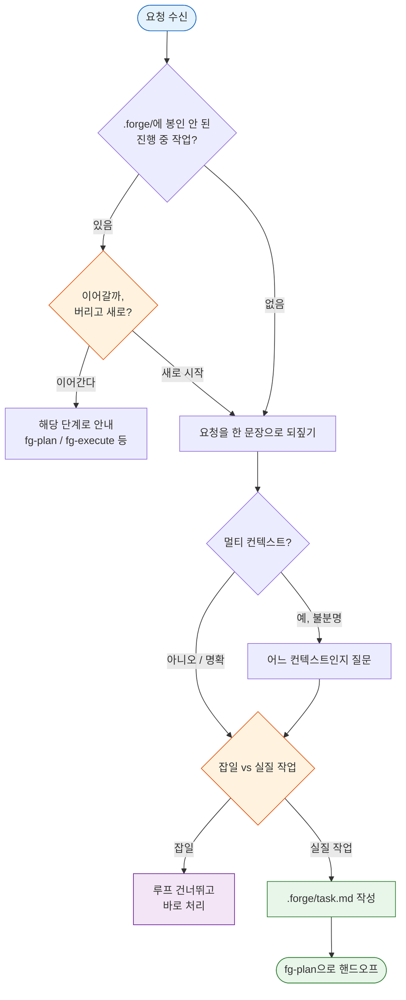

# fg-ask — ① 질의

forge 루프의 첫 단계다. 사용자가 들고 온 요청을 받아, 한 문장 작업 정의로 정리하고, 어느 도메인 컨텍스트를 건드리는지 식별하고, 루프를 돌릴 가치가 있는 실질 작업인지 그냥 처리하면 끝나는 잡일인지 분류한다. 산출은 `.forge/task.md` 하나뿐이다 — 계획·그릴링·문서화는 다음 단계(fg-plan)의 몫이다.

이 스킬은 grill-with-docs(github.com/mattpocock/skills `engineering/grill-with-docs`)를 계승하되, 그릴링과 문서 갱신은 fg-plan으로 넘긴다. 여기서는 "이 요청이 무엇이고 어디에 속하는가"만 또렷하게 잡는다. 한 단계가 한 가지 일만 하게 분리해야 루프 전체가 디버깅 가능해지기 때문이다.

이 스킬은 자기완결(standalone)이다. 외부 스킬(session-retro, plan-before-code 등)에 의존하지 않는다.

## 먼저: 활성 작업 충돌부터 점검한다

다른 무엇보다 먼저 `.forge/`를 본다. 봉인되지 않은 진행 중 작업(`task.md`, `plan.md`, `run.md` 중 하나라도 존재)이 있으면, 새 작업을 덮어쓰기 전에 사용자에게 확인한다. forge는 한 번에 한 작업만 루프에 올린다 — 점검 없이 새 `task.md`를 쓰면 진행 중이던 작업의 맥락이 조용히 사라지기 때문이다.

- `.forge/`가 비어 있으면 = 진행 중 작업 없음. 그대로 새로 시작한다.
- 진행 중 작업이 있으면 두 가지를 제시한다: (a) 그걸 이어간다(어느 단계에 멈췄는지 `.forge/` 내용으로 안내), (b) 봉인 없이 버리고 새로 시작한다. 사용자가 고르게 한다.

봉인된 작업은 `.forge/done/`에 있으므로 충돌 대상이 아니다. 또한 `.forge/`는 gitignore된 휘발 상태라 추적·커밋하지 않는다.

## 동작

1. **문서 구조를 파악한다.** 첫 진입 시 리포에서 컨텍스트 구조를 추론한다.
   - 루트에 `CONTEXT-MAP.md`가 있으면 멀티 컨텍스트 → 읽어서 어떤 컨텍스트들이 있는지 본다.
   - 루트에 `CONTEXT.md`만 있으면 단일 컨텍스트.
   - 둘 다 없으면 아직 부트스트랩 전 — 강제로 만들지 않는다. 첫 용어가 정리되는 시점(주로 fg-plan)에 lazy 생성될 것이다.
   - 형식 상세는 `${CLAUDE_PLUGIN_ROOT}/references/CONTEXT-FORMAT.md`(스킬 디렉터리 기준 `../../references/CONTEXT-FORMAT.md`)를 읽어 확인한다. 각 스킬에 복사하지 않고 이 공통 위치 1벌만 참조한다.

2. **요청을 한 문장으로 되짚는다.** 사용자 말을 그대로 받아쓰지 말고, 자기 말로 다시 표현해 "내가 이해한 작업은 이것이다"를 한 문장으로 제시한다. 오해가 있으면 여기서 잡는다 — 잘못 정의된 작업은 뒤 단계 전체를 헛돌게 만든다.

3. **대상 컨텍스트를 식별한다.** 멀티 컨텍스트면 이 작업이 어느 컨텍스트에 속하는지 추론한다. 불분명하면 추측하지 말고 묻는다. 단일/부트스트랩 전이면 이 단계는 생략한다.

4. **분류한다.** 이 요청이 루프를 돌 실질 작업인지, 바로 처리하면 끝날 잡일인지 판단한다.
   - **잡일**: 사소한 수정, 단일 파일 변경, 명백한 오타·설정값 교체처럼 계획이 필요 없는 일. 루프를 건너뛰고 그 자리에서 처리한다.
   - **실질 작업**: 설계 판단·여러 파일·검증이 필요한 일. `.forge/task.md`에 정의를 쓰고 fg-plan으로 넘긴다.

5. **작업 정의를 쓴다.** 실질 작업이면 `.forge/task.md`에 한 문장 정의 + 대상 컨텍스트를 기록한다. 이 파일이 fg-plan의 입력이 된다.

흐름은 다음과 같다.

## 마무리: 다음으로 넘기기

작업이 끝나면 사무적인 양식이 아니라 자연스러운 대화체로 세 가지를 전한다. 다음 사람(또는 다음 세션의 자신)이 어디서 이어야 할지 헷갈리지 않게 하려는 것이다.

- **실질 작업으로 분류했을 때**: 작업을 한 문장으로 어떻게 잡았는지, 어떤 컨텍스트를 건드리는지 한 줄로 요약하고, `.forge/task.md`가 생겼음을 알린다. 그다음은 fg-plan으로 계획을 다듬을 차례라고, 그릴링과 문서 확인이 거기서 이뤄진다고 안내한다. 바로 이어갈지 묻거나 "fg-plan" 트리거를 알려준다.
- **잡일로 분류했을 때**: 루프까지 돌릴 일이 아니라 지금 바로 처리한다고 말하고, 그대로 처리한다. `.forge/task.md`를 만들지 않는다.
- **활성 작업 충돌이 있었을 때**: 사용자가 "이어간다"를 골랐으면 멈춰 있던 단계(예: 계획까지 됐으면 fg-plan 재그릴링 또는 fg-execute)를 가리킨다. "새로 시작"을 골랐으면 위 실질/잡일 분기로 진행한다.

## 문서 영향

- `.forge/task.md` — 실질 작업일 때 생성(① 산출). fg-plan의 입력.
- `CONTEXT.md` / `CONTEXT-MAP.md` — 강제 생성하지 않는다. 부트스트랩 전이면 구조만 파악하고 둔다(lazy 생성은 뒤 단계 몫).
- `.forge/`는 gitignore된 휘발 상태 — 추적·커밋하지 않는다.
