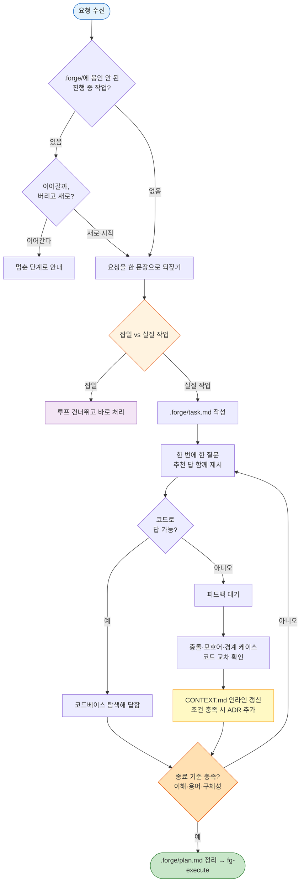

# fg-ask — ① 질의·계획 (그릴링)

forge 루프의 첫 단계다. 기존 `fg-ask`(질의·분류)와 `fg-plan`(그릴링)을 **하나로 통합**했다. 사용자가 들고 온 요청을 받아 작업으로 정의·분류하고, 그대로 이어서 [grill-with-docs](https://github.com/mattpocock/skills/tree/main/skills/engineering/grill-with-docs)식 그릴링으로 계획을 실행 가능한 수준까지 다듬는다.

핵심은 **반드시 본 세션 대화로 진행**한다는 점이다. 다음 단계의 Dynamic Workflow(fg-execute)는 돌기 시작하면 중간에 사용자 입력을 받지 못한다. 그래서 흔들리는 부분, 애매한 용어, 검증 안 된 가정은 *여기서 전부 태워 없애야 한다*. 그릴링을 워크플로우 안으로 미루면 실행 중에 막히고, 잘못된 가정 위에서 코드가 쌓인다. 이 단계 산출물의 품질이 실행의 성패를 가른다.

이 스킬은 자기완결(standalone)이다. 외부 스킬(session-retro, plan-before-code 등)에 의존하지 않는다.

## 먼저: 활성 작업 충돌부터 점검한다

다른 무엇보다 먼저 `.forge/`를 본다. 봉인되지 않은 진행 중 작업(`task.md`, `plan.md`, `run.md` 중 하나라도 존재)이 있으면, 새 작업을 덮어쓰기 전에 사용자에게 확인한다. forge는 한 번에 한 작업만 루프에 올린다 — 점검 없이 새 `task.md`를 쓰면 진행 중이던 작업의 맥락이 조용히 사라지기 때문이다.

- `.forge/`가 비어 있으면 = 진행 중 작업 없음. 그대로 새로 시작한다.
- 진행 중 작업이 있으면 두 가지를 제시한다: (a) 그걸 이어간다(어느 단계에 멈췄는지 `.forge/` 내용으로 안내), (b) 봉인 없이 버리고 새로 시작한다. 사용자가 고르게 한다.

봉인된 작업은 `.forge/done/`에 있으므로 충돌 대상이 아니다. 또한 `.forge/`는 gitignore된 휘발 상태라 추적·커밋하지 않는다.

## 1단계: 작업 정의·분류

그릴링에 들어가기 전에, 무엇을 하려는지부터 또렷하게 잡는다.

1. **문서 구조를 파악한다.** 첫 진입 시 리포에서 컨텍스트 구조를 추론한다.
   - 루트에 `CONTEXT-MAP.md`가 있으면 멀티 컨텍스트 → 읽어서 어떤 컨텍스트들이 있는지 본다.
   - 루트에 `CONTEXT.md`만 있으면 단일 컨텍스트.
   - 둘 다 없으면 아직 부트스트랩 전 — 강제로 만들지 않는다. 첫 용어가 정리되는 시점(아래 그릴링 중)에 lazy 생성한다.
   - 형식 상세는 `${CLAUDE_PLUGIN_ROOT}/references/CONTEXT-FORMAT.md`(스킬 디렉터리 기준 `../../references/CONTEXT-FORMAT.md`)를 읽어 확인한다. 각 스킬에 복사하지 않고 이 공통 위치 1벌만 참조한다.

2. **요청을 한 문장으로 되짚는다.** 사용자 말을 그대로 받아쓰지 말고, 자기 말로 다시 표현해 "내가 이해한 작업은 이것이다"를 한 문장으로 제시한다. 오해가 있으면 여기서 잡는다 — 잘못 정의된 작업은 뒤 단계 전체를 헛돌게 만든다.

3. **대상 컨텍스트를 식별한다.** 멀티 컨텍스트면 이 작업이 어느 컨텍스트에 속하는지 추론한다. 불분명하면 추측하지 말고 묻는다. 단일/부트스트랩 전이면 이 단계는 생략한다.

4. **분류한다.** 이 요청이 루프를 돌 실질 작업인지, 바로 처리하면 끝날 잡일인지 판단한다.
   - **잡일**: 사소한 수정, 단일 파일 변경, 명백한 오타·설정값 교체처럼 계획이 필요 없는 일. 루프를 건너뛰고 그 자리에서 처리한다. 그릴링도 하지 않는다.
   - **실질 작업**: 설계 판단·여러 파일·검증이 필요한 일. `.forge/task.md`에 한 문장 정의 + 대상 컨텍스트를 기록하고, 아래 2단계 그릴링으로 넘어간다.

## 2단계: 그릴링 (grill-with-docs)

실질 작업이면, 정의한 작업을 도메인 모델·기존 용어·문서화된 결정에 대고 집요하게 검증한다. 아래는 grill-with-docs 원문을 그대로 옮긴 것이다. forge에 맞춘 차이는 두 가지뿐이다 — (1) 참조 형식 파일은 `${CLAUDE_PLUGIN_ROOT}/references/`(상대경로 `../../references/`)의 공통 1벌을 읽는다, (2) 그릴링 산출물은 `.forge/plan.md`에 정리한다.

<what-to-do>

Interview me relentlessly about every aspect of this plan until we reach a shared understanding. Walk down each branch of the design tree, resolving dependencies between decisions one-by-one. For each question, provide your recommended answer.

Ask the questions one at a time, waiting for feedback on each question before continuing.

If a question can be answered by exploring the codebase, explore the codebase instead.

</what-to-do>

<supporting-info>

## Domain awareness

During codebase exploration, also look for existing documentation:

### File structure

Most repos have a single context:

```
/
├── CONTEXT.md
├── docs/
│   └── adr/
│       ├── 0001-event-sourced-orders.md
│       └── 0002-postgres-for-write-model.md
└── src/
```

If a `CONTEXT-MAP.md` exists at the root, the repo has multiple contexts. The map points to where each one lives:

```
/
├── CONTEXT-MAP.md
├── docs/
│   └── adr/                          ← system-wide decisions
├── src/
│   ├── ordering/
│   │   ├── CONTEXT.md
│   │   └── docs/adr/                 ← context-specific decisions
│   └── billing/
│       ├── CONTEXT.md
│       └── docs/adr/
```

Create files lazily — only when you have something to write. If no `CONTEXT.md` exists, create one when the first term is resolved. If no `docs/adr/` exists, create it when the first ADR is needed.

## During the session

### Challenge against the glossary

When the user uses a term that conflicts with the existing language in `CONTEXT.md`, call it out immediately. "Your glossary defines 'cancellation' as X, but you seem to mean Y — which is it?"

### Sharpen fuzzy language

When the user uses vague or overloaded terms, propose a precise canonical term. "You're saying 'account' — do you mean the Customer or the User? Those are different things."

### Discuss concrete scenarios

When domain relationships are being discussed, stress-test them with specific scenarios. Invent scenarios that probe edge cases and force the user to be precise about the boundaries between concepts.

### Cross-reference with code

When the user states how something works, check whether the code agrees. If you find a contradiction, surface it: "Your code cancels entire Orders, but you just said partial cancellation is possible — which is right?"

### Update CONTEXT.md inline

When a term is resolved, update `CONTEXT.md` right there. Don't batch these up — capture them as they happen. Use the format in `${CLAUDE_PLUGIN_ROOT}/references/CONTEXT-FORMAT.md` (스킬 디렉터리 기준 `../../references/CONTEXT-FORMAT.md`).

`CONTEXT.md` should be totally devoid of implementation details. Do not treat `CONTEXT.md` as a spec, a scratch pad, or a repository for implementation decisions. It is a glossary and nothing else.

### Offer ADRs sparingly

Only offer to create an ADR when all three are true:

1. **Hard to reverse** — the cost of changing your mind later is meaningful
2. **Surprising without context** — a future reader will wonder "why did they do it this way?"
3. **The result of a real trade-off** — there were genuine alternatives and you picked one for specific reasons

If any of the three is missing, skip the ADR. Use the format in `${CLAUDE_PLUGIN_ROOT}/references/ADR-FORMAT.md` (스킬 디렉터리 기준 `../../references/ADR-FORMAT.md`).

</supporting-info>

## 종료 기준 → `.forge/plan.md`

다음 셋이 모두 갖춰지면 그릴링을 멈춘다.

- **공유된 이해** — 무엇을, 왜 하는지에 사용자와 내가 합의했다.
- **용어 정렬** — 계획에 쓰인 용어가 CONTEXT.md와 일치한다.
- **충분한 구체성** — Dynamic Workflow에 넘겨도 입력 없이 진행할 만큼 계획이 명확하다.

이 상태를 `.forge/plan.md`에 정리해 적는다. 이 파일이 실행 단계(fg-execute)의 정답 기준이 된다.

흐름은 다음과 같다. 진입 분류에서 잡일이면 루프를 빠져나가고, 실질 작업이면 그릴링 루프(질문→피드백→문서 갱신→종료 기준 점검)를 돌아 `.forge/plan.md`에 도달한다.



## 다음 흐름 안내

작업이 끝나면 사무적인 양식이 아니라 자연스러운 대화체로 다음을 전한다.

- **실질 작업(그릴링 완료)**: 계획을 `.forge/plan.md`에 정리했고 정리된 용어를 CONTEXT.md에 반영했음을(필요했다면 ADR도 추가했음을) 한 줄로 요약한다. 다음은 fg-execute로 실행할 차례라고 알리고, Dynamic Workflow로 돌릴 만큼 큰 작업인지 아니면 바로 처리할 만큼 작은지 묻는다 — 그 답에 따라 fg-execute가 실행 방식을 고른다.
- **잡일**: 루프까지 돌릴 일이 아니라 지금 바로 처리한다고 말하고, 그대로 처리한다. `.forge/task.md`/`plan.md`를 만들지 않는다.
- **활성 작업 충돌이 있었을 때**: "이어간다"를 골랐으면 멈춰 있던 단계(예: 계획까지 됐으면 여기서 재그릴링, 실행 차례면 fg-execute)를 가리킨다. "새로 시작"을 골랐으면 위 분기로 진행한다.

그릴링 도중 계획이 근본부터 흔들린다고 판단되면, 억지로 종료 기준으로 밀지 말고 계속 그릴링한다 — 흔들리는 계획을 실행에 넘기는 것이 가장 비싼 실수다.

## 문서 영향

- `.forge/task.md` — 실질 작업일 때 분류 직후 생성(한 문장 정의 + 대상 컨텍스트).
- `.forge/plan.md` — 그릴링 산출물. 실행의 정답 기준으로 생성한다.
- `CONTEXT.md` — 용어가 정리될 때마다 인라인 갱신(lazy 생성). 멀티 컨텍스트면 CONTEXT-MAP.md를 읽어 해당 컨텍스트를 찾는다.
- `docs/adr/` — 세 조건 모두 충족 시에만 ADR 추가(lazy 생성, 순차 번호).
- `.forge/`는 gitignore된 휘발 상태 — 추적·커밋하지 않는다.
