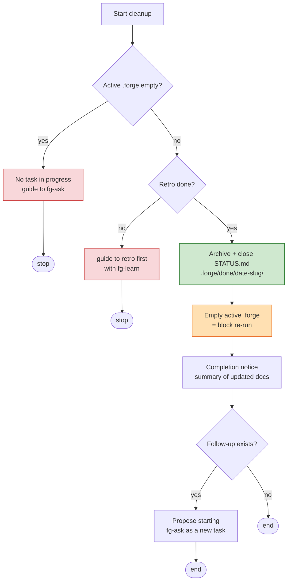

# fg-cleanup — ④ Cleanup (tidy-up / re-run guard)

This is the last step of the forge loop. Its job is not to "declare completion" but to **tidy up** the residue left by one loop (ask·plan → execute → retro → cleanup): confirm the retro, mark the task's STATUS.md as done, archive it, empty the active state, and close the loop. The unit of cleanup is a single **task** — there is no notion of closing an epic or bundling several tasks together. Because a task *is* one loop, you only need to tidy up that one loop cleanly.

**Language**: This skill file is authored in English, but always converse with the user in the user's language. All documents this skill generates for the user's project (plan, run notes, retros, CONTEXT.md entries, ADRs, handoff messages) are written in the user's language. Section headings defined in the format docs are canonical English names — when writing a document, render headings in the user's language; consumers match sections by meaning and position, not exact strings.

This skill is self-contained and standalone. It depends on no external skills: it reads input from `.forge/` and writes output to `.forge/done/`.

## Before starting: confirm the state is ready to tidy up

Cleanup is cumbersome to undo, and once you empty the state, the trace of the active task moves into the archive. So before starting, look at two things.

First, check whether there is actually a task to tidy up. The targets are the **active slot** (`.forge/plan.md`/`run.md`) and the **awaiting-retro queue** (`.forge/executed/<slug>/` — the tasks parked by fg-execute "Run all"). If both are absent or empty, it means there is no task in progress. In that case there is nothing to tidy up, so guide the user to start with `fg-ask` to begin a new task, and stop.

Also consult the existing completion markers `.forge/done/*/STATUS.md`: if a marker with the same slug already exists, this task has already been tidied up — surface it instead of double-sealing, and disambiguate the new archive directory name (`<date>-<slug>-2`) only when the user confirms it really is a separate cycle.

Next, confirm **whether the retro is done**, on a per-task basis. Tidying up without a retro means whatever was learned in that loop is lost forever — this is exactly why forge keeps the retro as a formal step of the loop. The decision rule is slug matching: for each task, the first line of the plan `<!-- forge-slug: <slug> -->` must have a corresponding retro (`docs/retro/*-<slug>.md`) for the retro to count as done. Do not tidy up a task that is not done; instead guide "first run a retro with `fg-learn`" — when there are several tasks in `executed/`, clean up only the ones whose retro is done and leave the rest. Unless the user explicitly insists on skipping the retro, block cleanup without a retro (the no-seal-without-retro guard).

```
Active .forge empty? ── yes ──▶ "No task in progress. Start fresh with fg-ask" → stop
        │ no
        ▼
Retro done? ── no ──▶ "First run a retro with fg-learn" → stop
        │ yes
        ▼
   Proceed with cleanup
```

## Behavior

Cleanup proceeds in the order archive → empty → notify → close the loop. The order matters because if you empty the active state before the archive finishes, you lose the original you were going to move.

**1) Tidy up·archive.** Move the task being tidied up into `.forge/done/<date-slug>/` — for the active slot, move `.forge/plan.md`/`run.md` (and `.forge/STATUS.md`); for the awaiting-retro queue, move the whole `.forge/executed/<slug>/` directory (which already carries its `STATUS.md`). The slug is taken from the `forge-slug` comment on the first line of the plan and paired with the retro file under the same rule (`YYYY-MM-DD-slug`). The unit of cleanup is still one task — when there are several tasks in `executed/`, clean up each into its own separate `done/` directory.

The status marker **`STATUS.md`** was already written by fg-execute with `status: executed`. Cleanup does not create a new marker — it **closes out the existing one**: flip `status:` to `done` and fill in the `completed` / `retro` / `docs updated` fields, then archive it alongside `plan.md`/`run.md`. (If the STATUS.md is missing — e.g. an older run that predates this lifecycle — create it now for backward compatibility.) The closed-out content is minimal and fixed (written in the user's language):

```md
# STATUS — {task title}
- slug: {slug}
- status: done
- executed: {YYYY-MM-DD}
- completed: {YYYY-MM-DD}
- retro: docs/retro/{YYYY-MM-DD}-{slug}.md
- docs updated: {CONTEXT.md terms / ADR-NNNN / none}
```

`STATUS.md` is the machine-readable completion marker that travels with the task files — fg-execute reads `done/*/STATUS.md` (`status: done`) to summarize finished work in its start-up guidance.

For reference, `.forge/` is gitignored, volatile state and is not tracked. The persistent trace cleanup leaves is not `.forge/done/` but the retro (`docs/retro/`) and the persistent docs that task updated (`CONTEXT.md`, `docs/adr/`, etc.). The archive is, at most, a local work record.

**2) Empty the active state.** By the time the archive move is done, the active `.forge/` should no longer have `plan.md`/`run.md`/`STATUS.md` — if any leftover copy or byproduct remains, delete it and confirm the active state is definitely empty. This is the **core mechanism of the re-run guard**. `fg-execute` runs by treating `.forge/plan.md` as the source of truth; once that file is gone, it can no longer find a plan to run. In other words, it structurally prevents the accident of "a closed task accidentally running again."

**3) Completion notice.** Summarize at a glance what was finished, which persistent docs were updated (retro, ADR, CONTEXT, etc.), and where the archive was left. Make the wrap-up explicit so the user clearly recognizes that one loop is done.

**4) Close the loop.** If `fg-learn` left a follow-up, ask whether to start it as a **new task**. This is not resuming the task you just closed — that task is sealed — but opening a new loop starting from `fg-ask`. If there is no follow-up, finish here.



## Wrap-up: guide the next flow

When cleanup is done, convey the following three things naturally, in a conversational tone. Don't mechanically stamp out a fixed template; speak so the user knows where they stand right now.

- **What you just did** — that you tidied up the task, archived it into `.forge/done/<date-slug>/` with STATUS.md marked done, and emptied the active state, plus a one-line summary of the docs this loop updated (retro, ADR, CONTEXT).
- **Next step** — make it clear that, since the active state is empty, the same plan will never run again. If `fg-learn` left a follow-up, let them know it can be started as a new task.
- **How to start** — if there is a follow-up, ask whether to start a new loop right away, and if the user agrees, invoke the `fg-ask` skill on the spot to open the grilling for the follow-up task. If they want to do it later, tell them the trigger — the utterances "forge ask" / "새 작업 시작", or `/forge:fg-ask`. If there is no follow-up, finish here.

## Document impact

- `.forge/done/<date-slug>/` — archive of the tidied-up `plan.md`/`run.md` + the closed-out `STATUS.md` (`status: done`) completion marker (local, gitignored). fg-execute reads the `STATUS.md` markers to exclude finished work from its candidates and to summarize status.
- Active `.forge/` — emptied of `plan.md`/`run.md`/`STATUS.md` so the next run finds no plan.
- Persistent docs (`docs/retro/`, `docs/adr/`, `CONTEXT.md`, etc.) are not newly created in this step — the earlier steps already updated them.

If you need the format for retro·ADR·CONTEXT, read the original format docs directly (don't copy per skill):
`${CLAUDE_PLUGIN_ROOT}/skills/fg-learn/RETRO-FORMAT.md`, `${CLAUDE_PLUGIN_ROOT}/skills/fg-ask/ADR-FORMAT.md`, `${CLAUDE_PLUGIN_ROOT}/skills/fg-ask/CONTEXT-FORMAT.md`
(relative paths from the skill directory: `../fg-learn/RETRO-FORMAT.md`, `../fg-ask/<file>`)
