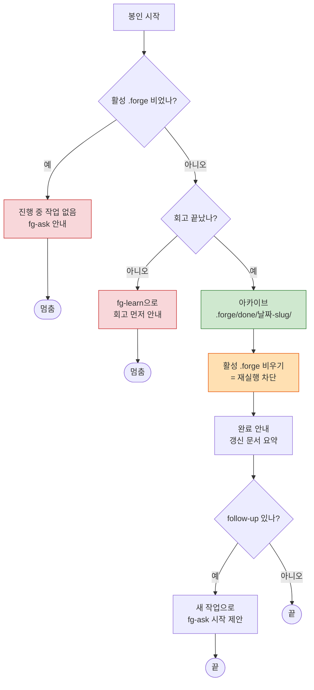

# fg-complete — 완료(봉인·재실행 방지)

forge 루프의 마지막 단계다. 한 바퀴(질의→계획→실행→회고→완료)를 명확히 끝내고, 끝낸 작업을 봉인해 같은 작업이 다시 실행되지 않게 한다. 봉인 단위는 **작업(task)** 하나다 — 에픽이나 여러 작업을 묶어서 닫는 개념은 없다. 작업이 곧 한 바퀴이기 때문에, 그 한 바퀴만 깔끔히 닫으면 된다.

이 스킬은 자기완결 standalone이다. 외부 스킬에 의존하지 않고, 입력은 `.forge/`에서 읽고 산출은 `.forge/done/`에 쓴다.

## 시작 전: 봉인 가능한 상태인지 확인

봉인은 되돌리기 번거롭고, 한 번 비우면 활성 작업의 흔적이 아카이브로 넘어간다. 그래서 시작 전에 두 가지를 본다.

먼저 활성 작업이 실제로 있는지 본다. `.forge/`에 `task.md`/`plan.md`/`run.md`가 없거나 비어 있으면 진행 중인 작업이 없다는 뜻이다. 이때는 봉인할 게 없으므로, 새 작업을 시작하려면 `fg-ask`부터 하라고 안내하고 멈춘다.

다음으로 **회고가 끝났는지** 확인한다. 회고 없이 봉인하면 그 한 바퀴에서 배운 것이 영영 사라진다 — forge가 회고를 루프의 정식 단계로 두는 이유가 이것이다. 이번 작업에 대응하는 회고가 `docs/retro/YYYY-MM-DD-slug.md`에 있는지, 그리고 `.forge/run.md`가 회고를 거쳤는지 본다. 안 끝났으면 봉인하지 말고 "먼저 `fg-learn`으로 회고하세요"라고 안내한 뒤 멈춘다. 사용자가 회고를 건너뛰겠다고 명시적으로 고집하지 않는 한, 미회고 봉인은 막는다.

```
활성 .forge 비었나? ── 예 ──▶ "진행 중 작업 없음. fg-ask로 새로 시작" → 멈춤
        │ 아니오
        ▼
회고 끝났나? ── 아니오 ──▶ "먼저 fg-learn으로 회고하세요" → 멈춤
        │ 예
        ▼
   봉인 진행
```

## 동작

봉인은 아카이브 → 비우기 → 안내 → 루프 닫기 순서로 진행한다. 순서가 중요한 이유는, 아카이브가 끝나기 전에 활성 상태를 비우면 옮길 원본을 잃기 때문이다.

**1) 봉인·아카이브.** 활성 `.forge/task.md`, `.forge/plan.md`, `.forge/run.md`를 `.forge/done/<날짜-slug>/`로 옮긴다. `<날짜-slug>`는 회고 파일과 같은 규칙(`YYYY-MM-DD-slug`)을 따라 나중에 짝을 찾기 쉽게 한다. 아카이브 디렉터리에는 언제 완료했고 무엇을 끝냈는지 한 줄 완료 표시를 남겨, 이 폴더가 닫힌 작업임을 분명히 한다.

참고로 `.forge/`는 gitignore된 휘발 상태라 추적하지 않는다. 봉인이 남기는 영속 흔적은 `.forge/done/`이 아니라, 회고(`docs/retro/`)와 그 작업이 갱신한 영속 문서(`CONTEXT.md`, `docs/adr/` 등)다. 아카이브는 어디까지나 로컬 작업 기록이다.

**2) 활성 상태 비우기.** 아카이브가 끝나면 활성 `.forge/`의 `task.md`/`plan.md`/`run.md`를 비운다. 이것이 **재실행 방지의 핵심 메커니즘**이다. `fg-execute`는 `.forge/plan.md`를 정답 기준으로 삼아 실행하는데, 그 파일이 사라지면 더는 실행할 계획을 찾지 못한다. 즉 "닫은 작업이 우연히 다시 돌아가는" 사고를 구조적으로 막는다.

**3) 완료 안내.** 무엇을 끝냈고, 어떤 영속 문서가 갱신됐으며(회고·ADR·CONTEXT 등), 아카이브가 어디에 남았는지 한눈에 정리한다. 한 바퀴가 끝났음을 사용자가 분명히 인지하도록 마무리를 명시적으로 만든다.

**4) 루프 닫기.** `fg-learn`이 후속 작업거리(follow-up)를 남겼다면, 그걸 **새 작업**으로 시작할지 묻는다. 이건 방금 닫은 작업을 재개하는 게 아니라 — 그 작업은 봉인됐다 — 새 한 바퀴를 `fg-ask`부터 여는 것이다. 후속이 없으면 여기서 끝낸다.



## 마무리: 다음 흐름 안내

봉인을 끝내면 다음 세 가지를 대화체로 자연스럽게 전한다. 정형 양식을 사무적으로 찍어내지 말고, 사용자가 지금 어디에 서 있는지 알 수 있게 말한다.

- **방금 한 것** — 작업을 봉인해 `.forge/done/<날짜-slug>/`에 아카이브했고 활성 상태를 비웠다는 점, 그리고 이번 바퀴가 갱신한 문서(회고·ADR·CONTEXT)를 한 줄로 요약한다.
- **다음 단계** — 활성 상태가 비었으니 같은 계획이 다시 실행될 일은 없다는 점을 분명히 한다. `fg-learn`이 후속 작업을 남겼다면 그것을 새 작업으로 시작할 수 있다고 알린다.
- **시작하는 법** — 후속 작업을 이어가려면 `fg-ask`로 새 한 바퀴를 시작하면 된다고 안내한다('forge ask' 같은 트리거 문구를 알려준다). 후속이 없으면 여기서 마무리한다.

## 문서 영향

- `.forge/done/<날짜-slug>/` — 봉인된 `task.md`/`plan.md`/`run.md` 아카이브(로컬, gitignore).
- 활성 `.forge/` — `task.md`/`plan.md`/`run.md`를 비워 다음 실행이 계획을 찾지 못하게 한다.
- 영속 문서(`docs/retro/`, `docs/adr/`, `CONTEXT.md` 등)는 이 단계에서 새로 만들지 않는다 — 이미 앞 단계가 갱신한 것이다.

회고·ADR·CONTEXT의 형식이 필요하면 플러그인 공통 references를 직접 읽는다(스킬마다 복사하지 않는다):
`${CLAUDE_PLUGIN_ROOT}/references/RETRO-FORMAT.md`, `${CLAUDE_PLUGIN_ROOT}/references/ADR-FORMAT.md`, `${CLAUDE_PLUGIN_ROOT}/references/CONTEXT-FORMAT.md`
(스킬 디렉터리 기준 상대경로: `../../references/<파일>`)
