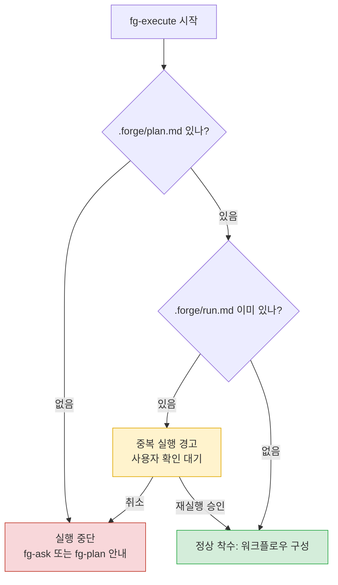

# fg-execute — ③ 실행(Dynamic Workflow)

forge 루프의 세 번째 바퀴다. fg-plan이 다듬어 둔 `.forge/plan.md`를 Claude Code Dynamic Workflow로 실제 코드/변경에 반영한다. 마이그레이션, 전수 감사, 대량 리팩터처럼 서브에이전트 여럿이 병렬로 붙어야 하는 큰 작업을 백그라운드로 돌리고, 그 결과를 계획에 대고 검증하는 단계다.

## 목적

`.forge/plan.md`는 "정답 기준"이다. 이 스킬은 그 기준을 워크플로우로 집행하고, 계획과 실제 결과가 어디서 갈렸는지를 `.forge/run.md`에 남긴다. 이 메모가 다음 단계 fg-learn의 회고 입력이 된다. 계획 자체를 다시 손대는 것이 아니라, 계획대로 돌리고 차이를 기록하는 것이 핵심이다.

## 시작 전: 재실행 가드

워크플로우는 서브에이전트를 여럿 띄우므로 토큰을 많이 쓴다. 실수로 같은 계획을 두 번 돌리면 비용과 부작용(중복 커밋, 중복 마이그레이션 등)이 크다. 그래서 실행에 들어가기 전에 상태를 먼저 확인한다.

- **활성 `.forge/plan.md`가 없으면** 실행하지 않는다. 직전 작업이 이미 fg-complete로 봉인돼 `.forge/`가 비어 있는 상태일 가능성이 높다. 새 작업이면 fg-ask로, 계획만 없으면 fg-plan으로 안내한다. 없는 계획을 추측해서 만들어 돌리지 않는다 — 그건 fg-plan의 일이다.
- **이미 `.forge/run.md`가 있으면** 이 계획은 한 번 실행된 것이다. 다시 돌리기 전에 중복 실행임을 알리고 사용자 확인을 받는다. 사용자가 "이어서/재시도"를 원하는지, 아니면 단지 결과를 보려는 것인지 구분한다. 확인 없이 덮어쓰지 않는다.
- 둘 다 통과하면(`plan.md` 있음, `run.md` 없음) 정상 착수다.

## 동작

### 1. 워크플로우 착수

Claude가 Dynamic Workflow를 구성하도록 유도한다. 프롬프트에 `workflow` 키워드를 넣거나 effort를 `ultracode`로 올린다. 이렇게 하면 Claude가 `.forge/plan.md`를 읽어 작업을 슬라이스로 나누고 오케스트레이션 스크립트를 짠다.

### 2. 스크립트 승인 → 병렬 실행

오케스트레이션 스크립트가 나오면 **사용자 승인을 먼저 받는다**. 승인 후 백그라운드 병렬 서브에이전트로 실행하며, 이 세션은 응답을 유지한 채 진행을 받는다. 진행 상황은 `/workflows`로 관찰한다.

### 3. 계획 기준 교차 검증

`.forge/plan.md`, `CONTEXT.md`, `docs/adr/`의 ADR이 정답 기준이다. 워크플로우는 산출 결과를 이 기준에 대고 교차 검증한다 — 계획이 의도한 것을 실제로 만들었는지 확인하는 것이지, 그냥 "돌아갔다"로 끝내지 않는다.

### 4. 차이를 run.md에 기록

실행이 끝나면 "계획과 현실의 차이"를 `.forge/run.md`에 메모한다. 계획대로 된 부분, 빗나간 부분, 도중에 내린 즉석 결정, 막힌 지점을 적는다. 이게 fg-learn 회고의 원재료다.

흐름: 워크플로우 구성 → 스크립트 승인 → 백그라운드 병렬 실행 → 계획 기준 교차 검증 → `.forge/run.md` 기록

## 제약

- **중간 사인오프가 필요하면** 작업을 단계로 쪼개 각각을 별도 워크플로우로 돌린다. Dynamic Workflow는 런타임 중간에 사람 입력을 받을 수 없기 때문이다.
- **비용을 먼저 가늠한다.** 큰 작업은 작은 슬라이스로 시험해 토큰 비용을 어림한 뒤 전체로 확장한다. 한 에이전트로 충분한 규모면 워크플로우를 생략하고 그냥 직접 처리하는 게 싸고 빠르다.
- **반복할 작업이면** 실행 스크립트를 `/명령`(슬래시 커맨드)으로 저장해 재사용한다.
- 환경 요건: 연구 프리뷰 · Claude Code v2.1.154+ · 유료 플랜.

## 다음 흐름 안내

실행이 끝나면 다음 세 가지를 대화체로 전한다. (양식을 사무적으로 찍어내지 말 것.)

1. **방금 한 것** — 워크플로우가 무엇을 바꿨는지, 그리고 계획과 어긋난 지점을 `.forge/run.md`에 적어 뒀음을 한 줄로 요약한다.
2. **다음 단계** — 다음은 fg-learn이다. 실행에서 드러난 교훈을 영속 문서(CONTEXT.md, ADR, 회고)에 반영하는 단계이고, 실행 직후가 기억이 선명할 때라 적기다.
3. **시작하는 법** — 그대로 회고로 이어갈지 묻거나, "forge learn" / "회고" 같은 트리거를 알려준다.

예외 상황 안내:
- 결과가 계획과 크게 어긋났다면 fg-learn으로 가기 전에 **fg-plan으로 재그릴링**(계획을 다시 다듬는 것)을 권한다.
- 중간에 끼어든 잡일은 워크플로우에 욱여넣지 말고 그 자리에서 직접 처리하라고 가리킨다.

## 문서 영향

- `.forge/run.md` 생성 — 계획 대 실제의 차이 메모(회고 입력). lazy 생성.
- (선택) 반복 작업이면 저장된 워크플로우 `/명령`.
- 입력으로 읽는 `.forge/plan.md`는 수정하지 않는다(계획은 fg-plan의 소유).

형식 참조: 영속 문서를 다룰 일이 생기면 `${CLAUDE_PLUGIN_ROOT}/references/CONTEXT-FORMAT.md`, `${CLAUDE_PLUGIN_ROOT}/references/ADR-FORMAT.md`(플러그인 환경) 또는 스킬 기준 상대경로 `../../references/`의 동일 파일을 읽어 형식을 맞춘다. 이 스킬은 형식을 자체 복사하지 않는다.
