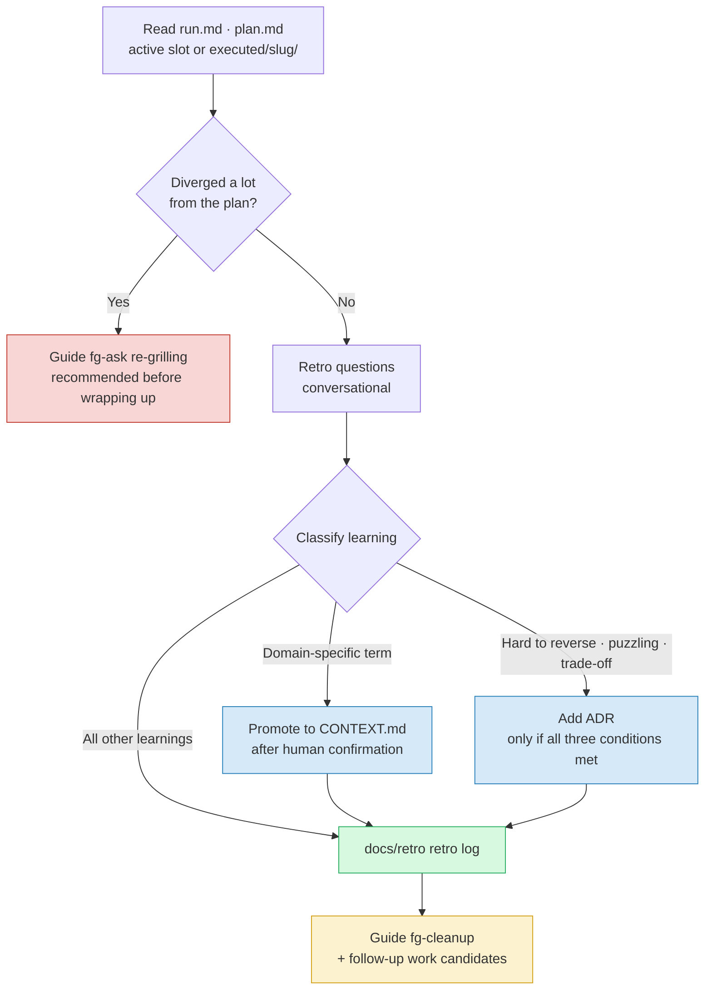

# fg-learn — ③ Retro (reflect into docs)

This is the third turn of the forge loop. It classifies the learnings gained during execution, routes them to the right doc, and surfaces the next inquiry. The reason to run a retro is simple — if you don't write down what you learned during execution right then, the next person (or future you) hits the same wall again. But if you push every learning into permanent docs, the docs get polluted with noise. So the core of this skill is **classification and promotion discipline**.

**Language**: This skill file is authored in English, but always converse with the user in the user's language. All documents this skill generates for the user's project (plan, run notes, retros, CONTEXT.md entries, ADRs, handoff messages) are written in the user's language. Section headings defined in the format docs are canonical English names — when writing a document, render headings in the user's language; consumers match sections by meaning and position, not exact strings.

This retro **always runs conversationally.** It does not auto-generate a retro draft via a workflow. Deciding what is worth learning and which doc each learning belongs in requires human judgment, so extracting it mechanically only breaks the discipline.

## Input

It reads `.forge/run.md` (the run record: plan vs actual) and `.forge/plan.md` (the plan = the source of truth for execution). You have to put these side by side to pinpoint "where did the plan and reality diverge."

Also consult the completion markers **`.forge/done/*/STATUS.md`** before picking what to retro — a task whose slug already has a sealed STATUS.md (`status: done`) is out of scope (retroing it again would be a state error worth surfacing, not silently doing). The companion marker **`.forge/executed/<slug>/STATUS.md`** (`status: executed`), by contrast, confirms execution finished and the work is awaiting retro — exactly the candidates this step picks from.

Besides the active slot, **`.forge/executed/<slug>/`** (work parked by fg-execute "Run all" that is awaiting retro, each carrying a `STATUS.md` with `status: executed`) is also an input — in this case plan/run are read **inside each `executed/<slug>/` directory**, not the active slot (when parked, the active slot is empty). Work whose retro is already done (a `docs/retro/*-<slug>.md` exists) is dropped from the candidates, and if two or more remain, first ask "which work should we retro first," and retro **each work separately and conversationally** — do not lump multiple works into one retro. Each work's slug is taken from the `<!-- forge-slug: ... -->` comment on the first line of the plan and used verbatim in the retro filename (`docs/retro/YYYY-MM-DD-<slug>.md`) — fg-cleanup judges retro completion by this slug.

If the input files are missing, point to the prior step. If `run.md` is missing (and `executed/` is also empty), execution hasn't finished yet, so tell them to run `fg-execute` first. If even `plan.md` is missing, guide them through the order `fg-ask` → `fg-execute`. If the active `.forge/` is empty, it means there's no work in progress, so recommend opening new work with `fg-ask` first.

## Behavior

### 1. Ask retro questions

Work through the following with the human. Don't dump it all at once — draw it out in conversation.

- Did the plan match reality? Ask grounded in the divergence points in `run.md`.
- Which terms/assumptions broke? Were there concepts that newly appeared or shifted meaning during execution.
- What to do differently next time? Among process, tooling, and order of approach, what would you change.

If nothing notable happened, things went per plan, and there's nothing learned, don't stretch it out. A retro is not a ritual. Record it in one line and move on.

### 2. Classify learnings into three kinds

Split what you learned into three branches by nature and route each to its doc. Learnings that don't clear the promotion bar **all go to the retro log** — that's the reason the retro log exists.

| Nature of the learning | Destination | Promotion bar |
| --- | --- | --- |
| New/changed domain term | `CONTEXT.md` | Only if it's a context-specific concept. General concepts and implementation details are excluded |
| A decision that is hard to reverse, puzzling, and a real trade-off | `docs/adr/NNNN-slug.md` | Only when **all three** conditions are met |
| Process/session learning | `docs/retro/YYYY-MM-DD-slug.md` | If it's worth recording |

### 3. Respect the promotion discipline

Don't push everything that came out of the retro into `CONTEXT.md` or an ADR. The reason is clear — `CONTEXT.md` is a glossary, and if implementation details and one-off noise get mixed in, the next reader stops trusting it. The same goes for ADRs: if you record even trivial decisions, the truly important ones get buried.

So learnings that don't clear the bar go to the retro log without hesitation. And **the judgment of what to promote is not made automatically.** Reflect into `CONTEXT.md`/ADR only after presenting candidates and getting the human's confirmation.

### 4. Write the docs

- The retro log always lands in `docs/retro/YYYY-MM-DD-slug.md` (one file per session, lazily created). For the format, read [RETRO-FORMAT.md](./RETRO-FORMAT.md) in the same directory as this skill and follow it.
- If you promote a term, reflect it into `CONTEXT.md`. Follow the format in `${CLAUDE_PLUGIN_ROOT}/skills/fg-ask/CONTEXT-FORMAT.md` (skill-relative path `../fg-ask/CONTEXT-FORMAT.md`).
- If you promote a decision, add `docs/adr/NNNN-slug.md`. Follow the format in `${CLAUDE_PLUGIN_ROOT}/skills/fg-ask/ADR-FORMAT.md` (`../fg-ask/ADR-FORMAT.md`).

In the "Doc updates" field of the retro log, record what was promoted to where (or none) to leave traceability.

The following diagram shows the learning classification and re-grilling branch at a glance.

## Next-flow guidance (handoff)

When the retro is done, deliver the following at the end in natural conversational tone. Don't print a fixed template mechanically — speak as if pointing out what you just did.

- **What you just did** — you left a retro at `docs/retro/...`, and summarize in one line what was promoted to `CONTEXT.md`/ADR (or that nothing was promoted).
- **Next step** — it's time to tidy up this work. Guide them that they can seal the work with `fg-cleanup`, and if any follow-up work candidates surfaced during the retro, present them too. But if more retro-awaiting work remains in `.forge/executed/`, recommend **retroing the next work first** over sealing — it's better to batch retros while memory is fresh.
- **How to start** — ask whether to go straight into tidying up, and if the user agrees, call the `fg-cleanup` skill right there to continue. If they want to do it later, tell them the trigger — the utterance "forge cleanup" / "작업 정리", or `/forge:fg-cleanup`.

Exception — if execution diverged a lot from the plan, guide them that it's better to re-grill with `fg-ask` before going straight to wrapping up. Sealing while the plan and the actual are too far apart blurs the starting point of the next work.

## Doc impact

- Creates `docs/retro/YYYY-MM-DD-slug.md` (always, lazy).
- When the promotion conditions are met, updates `CONTEXT.md` / adds `docs/adr/NNNN-slug.md` (after human confirmation).
- `.forge/` is gitignored volatile state, so it is not tracked — the only persistent artifacts are the permanent docs above.
