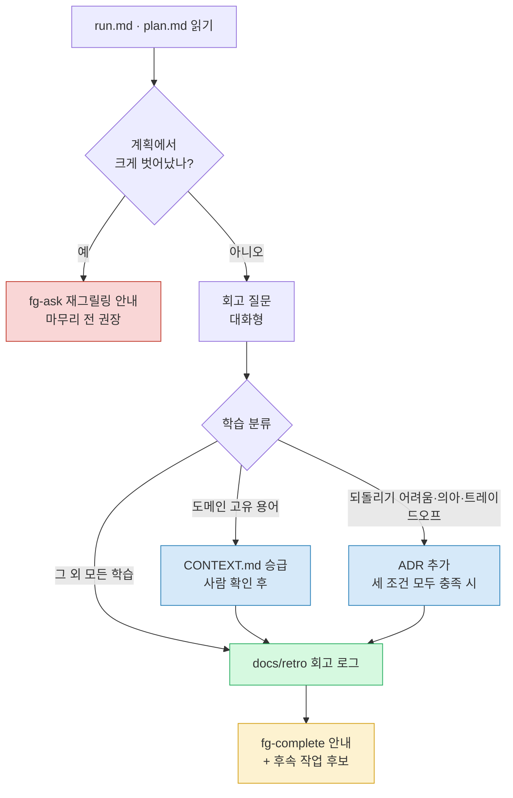

# fg-learn — ③ 회고 (문서 반영)

forge 루프의 세 번째 바퀴다. 실행에서 얻은 학습을 분류해 알맞은 문서로 보내고, 다음 질의를 끌어낸다. 회고를 거치는 이유는 단순하다 — 실행하며 배운 것을 그 자리에서 적어두지 않으면 다음 사람(혹은 미래의 당신)이 같은 벽에 다시 부딪힌다. 다만 배운 걸 전부 영속 문서로 밀어 넣으면 문서가 노이즈로 오염된다. 그래서 이 스킬의 핵심은 **분류와 승급 규율**이다.

이 회고는 **항상 대화형으로 진행한다.** 회고 초안을 워크플로우로 자동 생성하지 않는다. 무엇이 배울 가치가 있고 무엇을 어느 문서로 올릴지는 사람의 판단이 필요한 일이라, 기계적으로 뽑아내면 오히려 규율이 무너진다.

## 입력

`.forge/run.md`(실행 기록: 계획 vs 실제)와 `.forge/plan.md`(계획 = 실행의 정답 기준)를 읽는다. 이 둘을 나란히 놓아야 "계획과 현실이 어디서 갈라졌나"를 짚을 수 있다.

입력 파일이 없으면 앞 단계를 안내한다. `run.md`가 없으면 아직 실행을 마치지 않은 것이니 `fg-execute`로 먼저 실행하라고 알린다. `plan.md`까지 없으면 `fg-ask` → `fg-execute` 순서를 안내한다. 활성 `.forge/`가 비어 있으면 진행 중인 작업이 없다는 뜻이므로 `fg-ask`로 작업을 새로 여는 것부터 권한다.

## 동작

### 1. 회고 질문을 던진다

사람과 함께 다음을 짚는다. 한 번에 쏟아내지 말고 대화로 끌어낸다.

- 계획과 현실이 일치했나? `run.md`의 갈라진 지점을 근거로 묻는다.
- 어떤 용어·가정이 깨졌나? 실행 중 새로 등장했거나 의미가 바뀐 개념이 있나.
- 다음에 다르게 할 것은? 프로세스, 도구, 접근 순서 중 무엇을 바꾸겠나.

별일 없이 계획대로 흘렀고 배운 게 없으면 길게 늘이지 않는다. 회고는 의례가 아니다. 한 줄로 기록하고 넘어간다.

### 2. 학습을 세 종류로 분류한다

배운 것을 성격에 따라 세 갈래로 나눠 각 문서로 보낸다. 승급 기준을 넘지 못하는 학습은 **전부 회고 로그**로 간다 — 그게 회고 로그의 존재 이유다.

| 학습의 성격 | 목적지 | 승급 기준 |
| --- | --- | --- |
| 새/변경된 도메인 용어 | `CONTEXT.md` | 컨텍스트 고유 개념일 때만. 일반 개념·구현 세부는 제외 |
| 되돌리기 어렵고 의아하고 트레이드오프인 결정 | `docs/adr/NNNN-slug.md` | 세 조건을 **모두** 충족할 때만 |
| 프로세스·세션 학습 | `docs/retro/YYYY-MM-DD-slug.md` | 기록할 가치가 있으면 |

### 3. 승급 규율을 지킨다

회고에서 나온 모든 걸 `CONTEXT.md`나 ADR에 밀어 넣지 않는다. 이유는 명확하다 — `CONTEXT.md`는 글로서리이고, 구현 세부와 일회성 잡음이 섞이면 다음 독자가 신뢰하지 않게 된다. ADR도 마찬가지로, 사소한 결정까지 기록하면 진짜 중요한 결정이 묻힌다.

그래서 바를 못 넘는 학습은 망설임 없이 회고 로그로 보낸다. 그리고 **무엇을 승급할지의 판단은 자동으로 하지 않는다.** 후보를 제시하고 사람의 확인을 받은 뒤에만 `CONTEXT.md`/ADR에 반영한다.

### 4. 문서를 쓴다

- 회고 로그는 `docs/retro/YYYY-MM-DD-slug.md`에 항상 남긴다(세션별 1파일, lazy 생성). 형식은 `${CLAUDE_PLUGIN_ROOT}/references/RETRO-FORMAT.md`(스킬 기준 상대경로 `../../references/RETRO-FORMAT.md`)를 읽어 따른다.
- 용어를 승급하면 `CONTEXT.md`에 반영한다. 형식은 `${CLAUDE_PLUGIN_ROOT}/references/CONTEXT-FORMAT.md`(`../../references/CONTEXT-FORMAT.md`)를 따른다.
- 결정을 승급하면 `docs/adr/NNNN-slug.md`를 추가한다. 형식은 `${CLAUDE_PLUGIN_ROOT}/references/ADR-FORMAT.md`(`../../references/ADR-FORMAT.md`)를 따른다.

회고 로그의 "문서 반영" 칸에 무엇을 어디로 승급했는지(또는 없음)를 적어 추적성을 남긴다.

다음은 학습 분류와 재그릴링 분기를 한눈에 본 흐름이다.

## 다음 흐름 안내 (핸드오프)

회고를 마치면 끝에서 다음을 자연스러운 대화체로 전한다. 정해진 양식을 사무적으로 출력하지 말고, 방금 한 일을 짚어주듯 말한다.

- **방금 한 것** — `docs/retro/...`에 회고를 남겼고, 무엇을 `CONTEXT.md`/ADR로 승급했는지(또는 아무것도 안 올렸는지) 한 줄로 요약한다.
- **다음 단계** — 이 작업을 마무리할 때다. `fg-complete`로 작업을 봉인하면 된다고 안내하고, 회고에서 떠오른 후속 작업 후보가 있으면 함께 제시한다.
- **시작하는 법** — 그대로 마무리로 이어갈지 묻거나, `forge complete` 트리거 문구를 알려준다.

예외 — 실행이 계획에서 크게 벗어났다면, 마무리로 직행하기 전에 `fg-ask`로 다시 그릴링하는 게 낫다고 안내한다. 계획과 실제가 너무 어긋난 채로 봉인하면 다음 작업의 출발점이 흐려지기 때문이다.

## 문서 영향

- `docs/retro/YYYY-MM-DD-slug.md` 생성(항상, lazy).
- 승급 조건 충족 시 `CONTEXT.md` 갱신 / `docs/adr/NNNN-slug.md` 추가(사람 확인 후).
- `.forge/`는 gitignore된 휘발 상태이므로 추적하지 않는다 — 영속 산출물은 위 영속 문서뿐이다.
