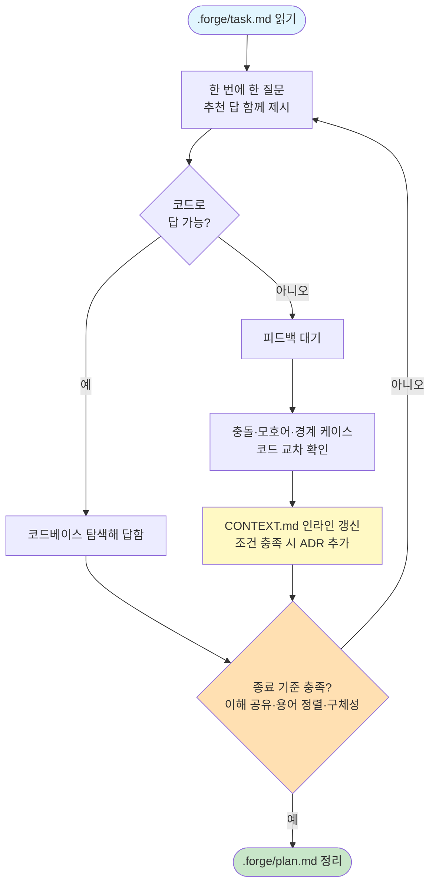

# fg-plan — ② 계획(그릴링)

forge 루프의 두 번째 단계다. fg-ask가 정리한 작업을, 실행에 넘길 수 있을 만큼 날카로운 계획으로 다듬는다.

## 목적

계획을 **도메인 모델·기존 용어·문서화된 결정**에 대고 집요하게 검증해, Dynamic Workflow에 넘길 만큼 구체적으로 만든다.

핵심은 **반드시 본 세션 대화로 진행**한다는 점이다. Dynamic Workflow(실행 단계)는 돌기 시작하면 중간에 사용자 입력을 받지 못한다. 그래서 흔들리는 부분, 애매한 용어, 검증 안 된 가정은 *여기서 전부 태워 없애야 한다*. 그릴링을 워크플로우 안으로 미루면 실행 중에 막히고, 잘못된 가정 위에서 코드가 쌓인다.

이 단계 산출물의 품질이 실행의 성패를 가른다. Dynamic Workflow는 흔들리는 계획을 빠르게 태우는 도구가 아니라, *날카로운 계획을 빠르게 검증·실행*할 때 가치가 있다.

## 입력

`.forge/task.md`를 읽어 무엇을 하려는지 파악한다. 파일이 없으면 — 아직 작업이 정의되지 않은 것이므로 — 그릴링할 대상이 없다. 이때는 fg-ask를 먼저 돌려 작업을 정의하라고 안내하고 멈춘다.

## 동작 (grill-with-docs 계승)

그릴링은 한 번에 끝나지 않는다. 질문하고, 답을 받고, 그 자리에서 문서를 갱신하고, 다시 검증하는 루프다. 다음 원칙으로 돈다.

- **한 번에 한 질문.** 매번 추천 답을 함께 제시하고 피드백을 기다린다. 질문 폭격은 사용자를 지치게 하고 답을 얕게 만든다. 하나씩 깊게 판다.
- **코드로 답할 수 있으면 묻지 않는다.** 코드베이스를 탐색하면 알 수 있는 건 직접 찾아서 답한다. 사용자에게 "코드를 보면 아는 것"을 묻는 건 시간 낭비이고, 답이 코드와 어긋날 위험만 키운다.
- **글로서리 충돌을 즉시 지적한다.** 사용자가 쓴 용어가 CONTEXT.md 정의와 어긋나면 그 자리에서 표면화한다. 용어 불일치를 방치하면 계획과 코드가 서로 다른 것을 가리키게 된다.
- **모호어를 날카롭게 벼린다.** 과부하된 단어("처리한다", "동기화한다", "관리한다")가 나오면 정식 용어를 제안한다. 모호한 단어는 모호한 구현을 낳는다.
- **구체 시나리오로 스트레스 테스트한다.** 경계 케이스를 던져 개념의 경계를 강제한다. "그럼 주문이 없는 고객은?", "재고가 0이면?" 추상적 합의는 경계에서 깨진다.
- **코드와 교차 확인한다.** 사용자의 동작 설명이 실제 코드와 어긋나면 그 자리에서 드러낸다. 계획은 코드 위에 서야 한다.
- **CONTEXT.md를 인라인으로 갱신한다.** 용어가 정리되는 *즉시* 반영한다 — 모아서 나중에 하지 않는다. 그 자리에서 쓰지 않으면 합의가 휘발하고, 다음 질문이 정리되지 않은 용어 위에서 진행된다. 형식은 `${CLAUDE_PLUGIN_ROOT}/references/CONTEXT-FORMAT.md`(스킬 디렉터리 기준 `../../references/CONTEXT-FORMAT.md`)를 읽어 따른다.
- **ADR은 아껴 쓴다.** 세 조건 — 되돌리기 어렵다 / 맥락 없이 의아하다 / 진짜 트레이드오프의 결과 — 이 **모두** 충족될 때만 ADR을 제안한다. 남발하면 신호가 잡음에 묻힌다. 형식과 판단 기준은 `${CLAUDE_PLUGIN_ROOT}/references/ADR-FORMAT.md`(스킬 디렉터리 기준 `../../references/ADR-FORMAT.md`)를 읽어 따른다.

루프의 한 바퀴는 다음과 같다. 질문을 던지고, 피드백을 받고, 정리된 용어·결정을 즉시 문서에 반영한 뒤, 종료 기준을 점검한다. 충족되지 않으면 다음 질문으로 다시 돈다.

## 종료 기준

다음 셋이 모두 갖춰지면 그릴링을 멈춘다.

- **공유된 이해** — 무엇을, 왜 하는지에 사용자와 내가 합의했다.
- **용어 정렬** — 계획에 쓰인 용어가 CONTEXT.md와 일치한다.
- **충분한 구체성** — Dynamic Workflow에 넘겨도 입력 없이 진행할 만큼 계획이 명확하다.

이 상태를 `.forge/plan.md`에 정리해 적는다. 이 파일이 실행 단계의 정답 기준이 된다.

## 다음 흐름 안내

그릴링을 마치면 다음 세 가지를 대화체로 자연스럽게 전한다(양식을 사무적으로 출력하지 말 것).

1. **방금 한 것** — 계획을 `.forge/plan.md`에 정리했고, 정리된 용어를 CONTEXT.md에 반영했음을(필요했다면 ADR도 추가했음을) 한 줄로 요약한다.
2. **다음 단계** — 다음은 fg-execute로 실행한다고 알린다.
3. **시작하는 법** — Dynamic Workflow로 돌릴 만큼 큰 작업인지, 아니면 바로 처리할 만큼 작은지 묻는다. 그 답에 따라 fg-execute가 실행 방식을 고른다.

그릴링 도중 계획이 근본부터 흔들린다고 판단되면, 억지로 종료 기준으로 밀지 말고 재그릴링한다 — 흔들리는 계획을 실행에 넘기는 것이 가장 비싼 실수다.

## 문서 영향

- **CONTEXT.md** — 용어가 정리될 때마다 인라인 갱신(lazy 생성). 멀티 컨텍스트면 CONTEXT-MAP.md를 읽어 해당 컨텍스트를 찾는다.
- **docs/adr/** — 세 조건 모두 충족 시에만 ADR 추가(lazy 생성, 순차 번호).
- **.forge/plan.md** — 그릴링 산출물. 실행의 정답 기준으로 생성한다.
