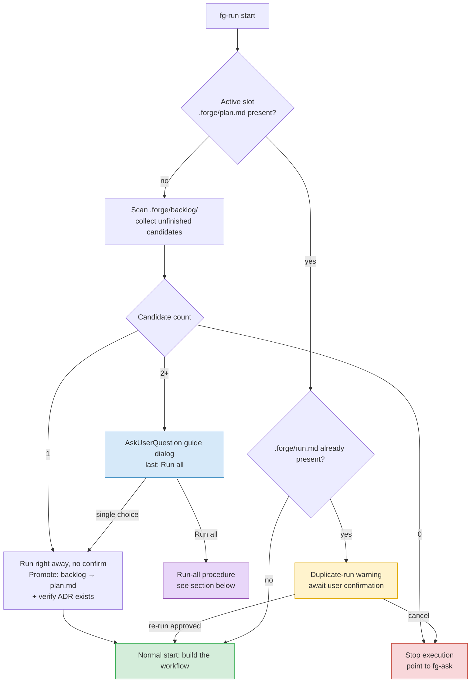

# fg-run — ② Execute (Dynamic Workflow)

The second turn of the forge loop. It takes the `.forge/plan.md` that fg-ask refined and applies it to real code/changes as a Claude Code Dynamic Workflow. This is the stage where large jobs — migrations, full audits, mass refactors — that need many subagents working in parallel run in the background, and their results are verified against the plan.

**Language**: This skill file is authored in English, but always converse with the user in the user's language. All documents this skill generates for the user's project (plan, run notes, retros, CONTEXT.md entries, ADRs, handoff messages) are written in the user's language. Section headings defined in the format docs are canonical English names — when writing a document, render headings in the user's language; consumers match sections by meaning and position, not exact strings.

## Purpose

`.forge/plan.md` is the "source of truth." This skill enforces that source of truth through a workflow, and records where the plan and the actual results diverged in `.forge/run.md`. That note becomes the retro input for the next stage, fg-learn. The point is not to touch the plan itself again, but to run it as planned and record the divergences.

## Before starting: task selection and the re-run guard

A workflow spins up many subagents, so it burns a lot of tokens. Running the same plan twice by mistake is costly and has side effects (duplicate commits, duplicate migrations, etc.). So before entering execution, check the state first, and when the backlog holds several tasks, the user picks what to run.

**1) Check the active slot.** If `.forge/plan.md` (the active slot) already exists, there is a task in progress — skip the backlog and go straight to the re-run guard below (only one task is active at a time).

**2) If the active slot is empty, scan the backlog.** Gather unfinished candidates from `.forge/backlog/*.md` (= plans with no matching slug seal in `.forge/done/` — a seal is a `done/<date-slug>/STATUS.md` marker with `status: done`, written when fg-cleanup archives the task). Before presenting anything, give the user a one-line status summary derived from the file layout: "done X (from `done/*/STATUS.md` with `status: done`) · awaiting retro Y (`executed/`, `status: executed`) · unexecuted Z (`backlog/`)" — so they see at a glance what has finished and what remains. Read each STATUS.md's `status` field to confirm the count (done = `done/*/STATUS.md` at `status: done`). Then, depending on the candidate count:

- **0** — There is no plan to execute. Point to fg-ask and stop (the stage that defines the task, grills it, and produces a plan). Do not guess a plan into existence and run it.
- **1** — **No menu, no confirmation question: promote and run it right away.** Announce in one line what is being run ("Running the only unexecuted plan from fg-ask: <title>") and proceed — the orchestration-script approval in step 2 of the main body still gates the actual workflow, so this skips only the redundant pre-confirmation.
- **2 or more** — Show a guide dialog via `AskUserQuestion`, framed as "these are the plans fg-ask produced that haven't run yet — which one shall I execute?". **Sort the options by priority**: read each plan's `<!-- priority: high|medium|low -->` marker (see PLAN-FORMAT.md) and order them `high → medium → low`; a plan with no marker is treated as `medium`; ties within the same priority break by slug alphabetical. The options = each unfinished plan in that order (label: `#<task> [<priority>] <title>` — prefix the plan's stable `task:` number, or `#—` if it has none; description: one-line goal + slice count), and **the last option, at the very bottom, is "Run all (N sequential)"**. This is a sort of the menu only — there is **no auto-selection**; the user still picks. The user may also refer to a task by its number (e.g. "run #7") — match it against the plans' `task:` markers. The `#<task>` number is a stable identifier for selection, not the sort key (sort stays priority → part → slug). Show the dialog in conversation, outside the workflow.

**Part-plans (split tasks).** If plans carry a `<!-- part: N/M -->` marker (a big task fg-ask split into an ordered series — see PLAN-FORMAT.md), append `(part N/M)` to their label and keep them in sequence order (their `<base>-NofM` slugs already line them up under the slug tiebreak). Recommend completing them one at a time, in order, each as its own full `execute → learn → cleanup` loop. This is a **soft order** — do not block a later part because an earlier one isn't sealed; the user may still pick any item.

**3) Promotion and ADR check.** Move (promote) the chosen backlog file to `.forge/plan.md` — from this point it is in the normal starting state of "active plan present, no run," and joins the main body below. Right before starting, check that the `.forge/adr/NNNN-*` referenced by the plan's "Source of truth" actually exists — if not, it is a stale-plan signal, so warn and ask once: "shall I supplement it via fg-ask, or proceed as is?" (this does not block).

**4) Re-run guard.** **If `.forge/run.md` already exists**, this plan has run once. Before running it again, announce the duplicate run and get user confirmation. Distinguish whether the user wants to "continue/retry" or merely wants to see the results. Do not overwrite without confirmation. However, **if this is a re-run after plan.md was updated through an fg-ask re-grilling, this warning is the normal path** — once the user approves, proceed with the updated plan and write a fresh `run.md`.



## Behavior

### 1. Start the workflow

Right before starting, if `.forge/retro/` exists, pick **only the most recent 3–5** retros **from the same area as this plan's slug (overlapping slug stem/domain)** and skim their "Do differently next time" and "Divergences" (same selection rule as fg-ask — do not read them all) — so the same traps (e.g. "this migration breaks if run in parallel") are folded into slice decomposition, wave layout, and cost estimation up front. If there are no relevant retros, skip this. Retros are only a **reference** for building the workflow, not the source of truth for cross-verification (the source of truth is plan/CONTEXT.md/ADR, unchanged — see section 3 below).

Prompt Claude to build a Dynamic Workflow. Put the `workflow` keyword in the prompt, or raise effort to `ultracode`. Do not improvise the tasks to run — the **"Work slices" list in `.forge/plan.md` is the primary unit of work** (format: [PLAN-FORMAT.md](./PLAN-FORMAT.md)). It is fine for the workflow to split slices finer for execution convenience, but it must not drop a slice or trespass on the plan's "Non-goals." Where a dependency is noted (`depends: S1`), bundle into a serial wave; where there is none, bundle as parallelizable, and write the orchestration script accordingly. If the slices section is missing entirely (only a goal, no work decomposition), do not invent one and run it — point to fg-ask.

### 2. Script approval → parallel execution

Once the orchestration script is ready, **get user approval first**. After approval, run it as background parallel subagents while this session keeps responding and receives progress. Observe progress with `/workflows`.

### 3. Cross-verify against the plan

`.forge/plan.md`, `CONTEXT.md`, and the ADRs in `.forge/adr/` are the source of truth. The workflow cross-verifies its output against this source of truth — it **judges each slice's "completion criterion" against the actual output** for satisfaction, rather than stopping at "it ran."

### 4. Record divergences in run.md, then mark execution complete

When execution finishes, note "the divergences between plan and reality" in `.forge/run.md`. Write down what went as planned, what missed, the on-the-spot decisions made along the way, and where it got stuck. This is the raw material for the fg-learn retro.

Right after writing `run.md`, write a companion `STATUS.md` (in the user's language) to mark the run as executed — it travels alongside the plan/run files as a status marker, not a second ledger (the source of truth for state is still file location). In the single-task path, write it to `.forge/STATUS.md` (the active slot, next to plan.md/run.md). Content:

```
# STATUS — {title}
slug: {slug}
status: executed
executed: {YYYY-MM-DD}
retro: pending
```

The `retro:` field tracks the retro state of this task: `pending` at execution time, later either the retro path (`.forge/retro/YYYY-MM-DD-<slug>.md`, filled by fg-cleanup when sealing a retro'd task) or `skipped (<reason>)` when the retro was intentionally skipped (see the handoff below). fg-learn reads `status: executed` to confirm a parked task is awaiting retro, and skips a task already marked `retro: skipped`; fg-cleanup later flips `status` to `done` and archives plan/run/STATUS together, accepting either a retro file or `retro: skipped` as satisfying its no-seal-without-retro guard. (For the "Run all" path, the STATUS.md is written into the per-task `executed/<slug>/` folder — see that section.)

Flow: build the workflow → approve the script → background parallel execution → cross-verify against the plan → record `.forge/run.md` → write `.forge/STATUS.md` (status: executed)

## "Run all" — execute-only batch

If you pick "Run all" from the selection menu, the backlog's unfinished plans are **executed only, in sequence**. Retro and sealing are not auto-inserted — fg-learn is always conversational, and barreling past it just piles up un-retro'd heaps with nothing learned. Run all is not unattended automation; it is a declaration of "I'll do the execute stage in one batch."

1. **Confirm the order.** Snapshot and freeze the current N unfinished candidates, and show the user the execution order once (default: **priority order** — `high → medium → low`, no marker = `medium`, ties by slug alphabetical, same as the selection menu) — "shall I run them in this order? If there are dependencies between tasks, reorder now."
2. **Per-task sequential execution.** For each task i: promote `backlog/<slug>.md` → `.forge/plan.md` → run the main body above exactly once (build the workflow → approve → cross-verify → record `run.md` → write `STATUS.md` at `status: executed`) → without sealing, **move plan+run+STATUS to `.forge/executed/<slug>/` (park)** → the active slot is now empty so the next task can be promoted. In this batch path write the `STATUS.md` directly into `.forge/executed/<slug>/` alongside plan+run (not into the active slot), since each task parks immediately.
   - `executed/` is the explicit expression of the intermediate state "executed but not yet retro'd." Putting an un-retro'd task into `done/` would bypass fg-cleanup's no-seal-without-retro guard, so never send it to `done/` before the retro.
   - Each task gets its own run. Do not merge several tasks into one run.
3. **Failure/abort.** If task i fails, stop there — the i-1 already parked remain awaiting retro, and i's plan/run stay in the active slot so the next fg-run's re-run guard catches them. The not-yet-started ones stay in the backlog and reappear in the next menu. Partial progress is reflected honestly in the file state.
4. **Handoff.** When everything is done, point: "I ran all N, and each has plan+run+STATUS (status: executed) in `.forge/executed/` — now let's retro each one via fg-learn, which first?"

## Constraints

- **If a mid-run sign-off is needed**, that is a signal the task was actually two — split it into separate **tasks** (finish and seal everything up to the checkpoint as one loop, and open a new fg-ask for the rest as an fg-cleanup follow-up). A Dynamic Workflow cannot take human input mid-runtime. Do not split one plan into phases and accumulate them into `run.md` — that conflicts with the re-run guard. Determine the split per the split rules in [PLAN-FORMAT.md](./PLAN-FORMAT.md).
- **Estimate cost first.** For a big job, trial a small slice to gauge token cost before scaling to the whole. If the scale is small enough for a single agent, skip the workflow and just handle it directly — that is cheaper and faster.
- **If the job will recur**, save the execution script as a `/command` (slash command) for reuse.
- Environment requirements: research preview · Claude Code v2.1.154+ · paid plan.

## Next-flow handoff

When execution finishes, convey the following three in a conversational tone. (Do not stamp out a form mechanically.)

1. **What I just did** — summarize in one line what the workflow changed, and that the divergences from the plan were written to `.forge/run.md`.
2. **Next step** — next is fg-learn, the stage that folds the lessons surfaced in execution into permanent docs (CONTEXT.md, ADR, retro); right after execution is the right time, while memory is fresh.
3. **How to start** — ask whether to go straight into the retro, and if the user agrees, invoke the `fg-learn` skill right there to continue. If they'd rather do it later, give the trigger — "forge learn" / "회고" utterance, or `/forge:fg-learn`.

**Retro is the default. The skip path is offered only when the run had no or negligible divergence** (plan ≈ actual in `run.md`). In that low-divergence case, present an explicit choice at the handoff — never auto-skip:
- **Retro via fg-learn** (default) — fold the lessons into the docs.
- **Skip the retro** — for a trivial task with nothing to learn. Record `retro: skipped (<one-line reason>)` in `.forge/STATUS.md` and point straight to fg-cleanup; no retro file is created. fg-cleanup accepts this marker as satisfying its no-seal-without-retro guard.

If the plan carries a `<!-- retro-hint: optional -->` marker comment (fg-ask flagged it as likely-trivial; see PLAN-FORMAT.md), lead with the skip option — but still ask; the hint is not binding. If there is no such hint, lead with the retro.

Exception handling:
- If the result diverged greatly from the plan, **do not offer the skip** — recommend **re-grilling via fg-ask** (refining the plan again) before going to fg-learn. Significant divergence is exactly the signal that there is something to learn.
- For odd jobs that crept in mid-run, point the user to handle them directly on the spot rather than cramming them into the workflow.

## Document impact

- Creates `.forge/run.md` — the note of plan-vs-actual divergences (retro input). Lazy creation.
- Creates `.forge/STATUS.md` (`status: executed`) right after `run.md` — a companion marker fg-learn/fg-cleanup read; fg-cleanup later flips it to `status: done` and archives it with plan/run.
- On backlog promotion, moves `.forge/backlog/<slug>.md` → `.forge/plan.md`. On "Run all," creates per-task `.forge/executed/<slug>/{plan,run,STATUS}.md` (awaiting retro).
- (Optional) a saved workflow `/command` if the job recurs.
- Does not modify the `.forge/plan.md` it reads as input (the plan is fg-ask's property).

Format reference: when you need to handle permanent docs, read `${CLAUDE_PLUGIN_ROOT}/skills/fg-ask/CONTEXT-FORMAT.md`, `${CLAUDE_PLUGIN_ROOT}/skills/fg-ask/ADR-FORMAT.md` (plugin environment), or the same files at the skill-relative path `../fg-ask/` to match the format. The source of the format docs is the single fg-ask copy; this skill does not copy them itself.
